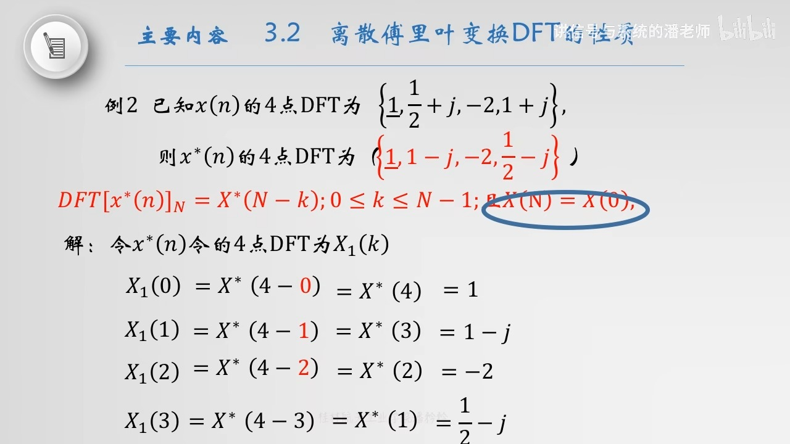
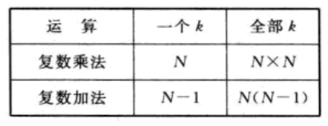

alias:: DFT, 离散傅里叶变换, N 点离散傅里叶变换

- 设 $$x(n)$$ 为 $M$ 点有限长序列, 即在 $$0 \leqslant n \leqslant M-1$$ 内有值, 则可定义 $$x(n)$$ 的 $N$ 点 $$(N \geqslant M$$ 当 $$N>M$$ 时, 补 $$N-M$$ 个零值点), ^^N 点离散傅里叶变换^^定义为
  $$X(k)=\operatorname{DFT}[x(n)]=\sum_{n=0}^{N-1} x(n) \mathrm{e}^{-j\frac{2 \pi}{N} n k}=\sum_{n=0}^{N-1} x(n) W_{N}^{n k}, \quad k=0,1,2, \cdots, N-1\tag{1}$$
  而 $$X(k)$$ 的[[N 点离散傅里叶反变换]]定义为
  $$x(n)=\operatorname{IDFT}[X(k)]=\frac{1}{N} \sum_{k=0}^{N-1} X(k) \mathrm{e}^{j \frac{2 \pi}{N}{nk}}=\frac{1}{N} \sum_{k=0}^{N-1} X(k) W_{N}^{n k}, \quad n=0,1,2, \cdots, N-1 \tag{2}$$
- $W_N^{nk}$ 称为[[单位周期复指数序列]]：
  \begin{array}{l}
  W_{N}^{n k}=e^{-j \frac{2 \pi}{N} n k} \\
  W_{N}=e^{-j \frac{2 \pi}{N}}
  \end{array}
- ## DFT 的性质
  collapsed:: true
	- ### 线性
	  logseq.order-list-type:: number
	  如果 $$x_{1}(n)$$ 和 $$x_{2}(n)$$ 是两个有限长序列, 长度分别为 $$N_{1}$$ 和 $$N_{2} ,$$ 且
	  $$y(n)=a x_{1}(n)+b x_{2}(n)$$ 
	  式中 $$a$$ 、 $$b$$ 为常数，取变换区间长度 $$\mathrm{N}=\left[N_{1}, N_{2}\right]_{\text {max }}$$ ：
	  $$X_{1}(k)=\operatorname{DFT}\left[x_{1}(n)\right]_{N} ; X_{2}(k)=\operatorname{DFT}\left[x_{2}(n)\right]_{N}$$
	  则 $$y(n)$$ 的 $N$ 点DFT为:
	  $$Y(k)=D F T[y(n)]_{N}=a X_{1}(k)+b X_{2}(k)$$
	- ### [[循环移位]]性质
	  logseq.order-list-type:: number
		- #### 序列的循环移位
		  logseq.order-list-type:: number
		  设 $$x(n)$$ 为有限长序列, 长度为 $M$ , 则 $$x(n)$$ 的循环移位定义为:
		  $$y(n)=x((n+m))_{N} R_{N}(n)$$
		  相当于 $$\tilde{x}(n)$$ 左移 $m$ 得到 $$x((n+m))_{N} ,$$ 即 $$\tilde{x}(n+m)$$ ，最后取 $$\tilde{x}(n+m)$$ 的[[主值序列]] $$y(n)$$ 。
		- #### 时域循环移位性质
		  logseq.order-list-type:: number
		  设 $$x(n)$$ 为有限长序列, 长度为 $M$ , 则 $$y(n)$$ 为 $$x(n)$$ 的偱环移位, 即:
		  $$y(n)=x((n+m))_{N} R_{N}(n)$$
		  $$Y(k)=D F T[y(n)]_{N}=W_{N}^{-m k} X(k)$$
		  此处的的 $W_{N}^{-m k}$ 称为[[频移因子]]。
		- #### 频域循环移位性质
		  logseq.order-list-type:: number
		  如果 $$X(k)=\operatorname{DFT}[X(k)]_{N}$$ ，
		  $$Y(k)=X((k+l))_{N} R_{N}(n)$$
		  则 
		  $$y(n)=I D F T[Y(k)]_{N} R_{N}(n)=W_{N}^{l k} x(n)$$
	- ### [[循环卷积定理]]
	  logseq.order-list-type:: number
	- ### [[复共轭]]的DFT
	  logseq.order-list-type:: number
	  设 $$x^{*}(n)$$ 是 $$x(n)$$ 的复共轭序列, 长度为 $$\mathrm{N}$$ ,
	  $ \operatorname{DFT}[x(n)]_{N}=X(k)$，则
	  $$\operatorname{D F T}\left[x^{*}(n)\right]_{N}=X^{*}(N-k) ; 0 \leq k \leq N-1$$
	  且 
	  $$X(\mathrm{~N})=X(0)$$
		- #### 例子
		  
	- ### DFT的共轭对称性
	  logseq.order-list-type:: number
	  设 $$x(n)$$ 是长度为 $N$ 的[[实序列]], 且 $$X(k)=D F T[x(n)]_{N} ,$$
	  则 $$X(k)$$ 满足如下对称性:
		- $X(k)$ ^^共轭对称^^即 $$\quad X(k)=X^{*}(N-k) 
		  logseq.order-list-type:: number
		- 若 $$x(n)$$ [[实偶对称]], 即 $$x(n)=x(N-n)$$ ，则 $$X(k)=X(N-k)$$ 。
		  logseq.order-list-type:: number
		- 若 $$x(n)$$ [[实奇对称]], 即 $$x(n)=-x(N-n)$$，则 $$X(k)=-X(N-k)$$ 。
		  logseq.order-list-type:: number
- ## [[频域采样定理]]
- ## $N$ 点 DFT 的运算量分析
	- 如果 $x(n)$ 为复数信号, 则根据式 $(1)$ 做 $N$ 点 DFT 需要 $N^{2}$ 次复数乘法和 $N(N-1)$ 次复数加法。
	  id:: 660a8f99-ec94-4688-b9c3-3343b0ae2d7c
	  另外我们知道, 复数运算也同样要通过实数运算来实现, 并且每一个复数乘法包括 $4$ 次实数乘法和 $2$ 次实数加法, 每一个复数加法包括 $2$ 次实数加法。
	  于是, 对于某一个 $k$ 值,计算 $X(k)$ 需要 $4N$ 次实数乘法和 $2 N+2(N-1)=2(2 N-1)$ 次实数加法。一个完整的 $N$ 点 DFT 共需要 $4 N^{2}$ 次实数乘法和 $2 N(2 N-1)$ 次实数加法。 $N$ 点 DFT 的运算次数如表 1 所列。
	  