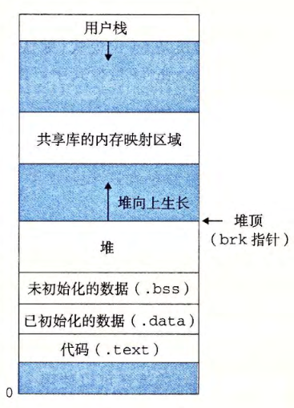

alias:: 动态内存分配器, 分配器

- [[动态内存分配器]]**维护**着一个进程的[[虚拟内存区域]]，称为[[堆]]。
	- 系统之间细节不同，但是不失通用性，假设 堆 是一个[[请求二进制零的区域]]，它紧接在[[未初始化的数据区域]]后开始，并向上生长（向**更高的**地址）。
	- 对于每个 进程 ，[[内核]]维护着一个变量[[brk]](读做"break"),它指向 堆的顶部 。
	- 
- [[分配器]]将堆视为一组不同大小的[[块]]的集合来维护。
  每个[[块]]就是一个连续的[[虚拟内存片]], 要么是[[已分配块]]，要么是[[空闲块]]。
	- [[已分配块]]显式地保留为供[[应用程序]]使用。
	- [[空闲块]]可用来分配。空闲块保持空闲，直到它显式地被应用所 分配 。一个已分配的块保持已分配状态，直到它被释放，这种释放要么是应用程序显式执行的，要么是内存分配器自身隐式执行的。分配器有两种基本风格。两种风格都要求应用显°式地分配块。它们的不同之处在于由哪个实体来负责释放已分配的块。