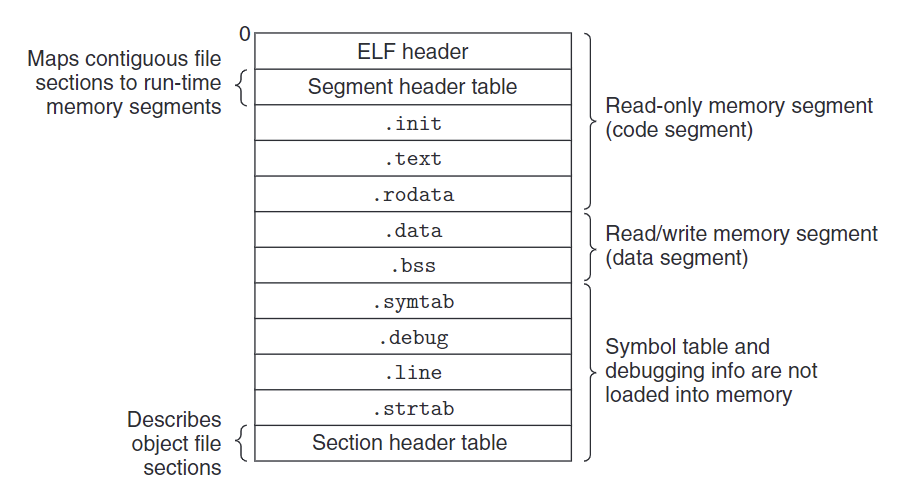
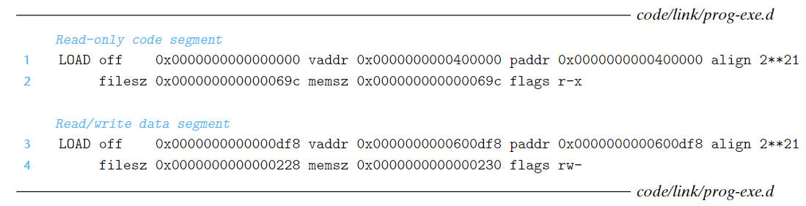
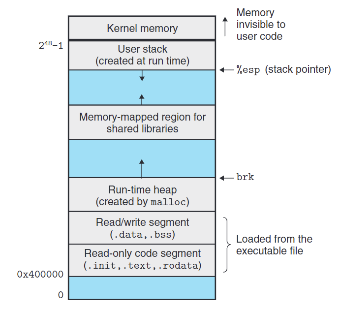

alias:: 可执行目标文件, .prog, executable file, 可执行文件

- #Linux
- # 可执行目标文件
	- [[可执行目标文件]]包含二进制代码和数据，其形式可以被直接复制到[[内存]]并执行。
	- 下图概括了一个典型的[[ELF 可执行文件]]中的各类信息：
	  
	- 可执行目标文件的格式类似于[[可重定位目标文件]]的格式。
	- [[ELF 头]]描述文件的总体格式。
	  id:: 6533d627-b943-4717-9c4a-88bbf651abfd
	  它还包括程序的[[entry point]], 也就是当程序运行时要执行的第一条指令的地址。
	- [[.text]]、[[.rodata]]和[[.data]]节与可重定位目标文件中的节是相似的，除了这些节**已经**被
	  [[重定位]]到它们最终的运行时内存地址以外。
	- [[.init]]节定义了一个小函数，叫做[[_init]]，程序的 *初始化代码* 会调用它。因为可执行文件是 *完全链接* 的（已被重定位）， 所以它不再需要[[.rel]]节。
	- ELF 可执行文件被设计得很容易加载到[[内存]]，可执行文件的连续的[[chunk]]被映射到连续的[[内存段]]。[[program header table]]描述了这种映射关系。下图展示了可执行文件`prog`的程序头部表，是由[[OBJDUMP]]显示的。
	  
	  `off`：目标文件中的偏移；
	  `vaddr/paddr`: 内存地址； 
	  `align`: 对齐要求；
	  `filesz`: 目标文件中的段大小；
	  `memsz`：内存中的段大小；
	  `flags`: 运行时访问权限。
	- 从程序头部表，我们会看到根据可执行目标文件的内容初始化两个[[内存段]]。第 1 行和第 2 行告诉我们第一个段（[[code segment]]）有 *读/执行* 权限，开始于 *内存地址* `0x400000`处，总共的内存大小是 0x69c 字节，并且被初始化为可执行目标文件的头 0x69c 个字节，其中包括[[ELF 头]]、[[程序头部表]]以及[[.init]]、[[.text]]和[[.rodata]]节。
	  id:: 6533dcc5-c465-4f0b-a203-8cb9ea1cb0da
	- 第 3 行和第 4 行告诉我们第二个段（[[data segment]]）有 *读/写* 权限，开始于 *内存地址`0x600df8`处，总的内存大小为 0x230 字节，并用从目标文件中偏移 0xdf8 处开始的[[.data]]节中的 0x228 个字节初始化。该段中剩下的 8 个字节对应于运行时将被初始化为 0 的[[.bss]]数据。
	  id:: 6533e121-5a7d-4205-aeac-d4233f0a7d8a
- # 加载可执行目标文件
	- 要运行可执行目标文件`prog`, 我们可以在 Linux shell 的命令行中输入它的名字：
	- ``` shell
	  linux> ./prog
	  ```
	- shell 会认为`prog`是一个可执行目标文件，通过调用某个驻留在[[内存]]中称为[[加载器]]的[[操作系统代码]]来运行它。任何 Linux 程序都可以通过调用[[execve]]函数来调用[[加载器]]。
	  id:: 6533cff4-d6f2-426d-9d45-e162bce4f408
	  [[加载器]]将可执行目标文件中的代码和数据从[[磁盘]][[复制]]到[[内存]]中，然后通过跳转到程序的第一条指令或[[入口点]]来运行该程序。
	  这个将程序复制到内存并运行的过程叫做[[加载]]。
	- 每个 Linux 程序都有一个[[运行时内存映像]]，类似于下图中所示。
	  id:: 6533e8a2-2615-4a9e-85f2-f04a863dfada
	  #+BEGIN_CENTER
	  {:width 691/2, :height 634/2}
	  #+END_CENTER 
	  在 Linux X86-64 系统中，[[代码段]]总是从地址 0x400000 处开始，后面是[[数据段]]。运行时[[堆]]在[[数据段]]之后，通过调用[[malloc]]库往上增长。
	  [[堆]]后面的区域是为[[共享模块]]保留的。
	  [[用户栈]]总是从**最大的**[[合法用户地址]] `2^{48}-1` 开始，**向较小内存地址增长**。栈上的区域，从地址 `2^48` 开始，是为[[内核]]中的 *代码* 和 *数据* 保留的。
	- 为了简洁，我们把堆、数据和代码段画得彼此相邻，并且把 *栈顶* 放在了 *最大的合法用户地址* 处。
	  实际上，由于[[.data]]段有对齐要求， 所以[[代码段]]和[[数据段]]之间是有间隙的。
	  同时，在分配[[栈]]、[[共享库]]和[[堆]]段运行时地址的时候，[[链接器]]还会使用地[[址空间布局随机化]]。虽然每次程序运行时这些区域的地址都会改变，它们
	  的**相对位置是不变的**。
	- 在[[程序头部表]]的引导下, 加载器将可执行文件的[[片]]复制到代码段和数据段。接下来，加载器跳转到程序的[[入口点]]，也就[[_start]]函数的地址。这个函数是在[[系统目标文件]] ctrl.〇 中定义的，对所
	  有的 C 程序都是一样的。_start 函数调用系统启动函数__1化〇_31代_1111，
	  该函数定
	  义在 libc.so 中。它初始化执行环境，调用用户层的 main 函数，处理 main 函数的返回
	  值，并且在需要的时候把控制返回给内核。