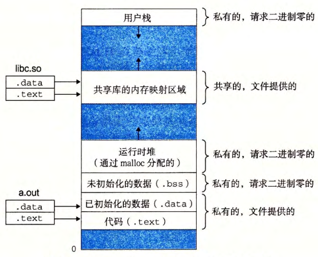

- 假设运行在当前进程中的程序执行了如下的 execve 调用： 
  ``` c
  execve("a.out", NULL, NULL);
  ```
  execve 函数在当前[[进程]]中[[加载]]并[[运行]]包含在[[可执行目标文件]] `a.out` 中的程序，用 a.out 程序有效地**替代**了当前程序。
  加载并运行 `a.out` 需要以下几个步骤：
	- 删除已存在的[[用户区域]]
	  logseq.order-list-type:: number
		- 删除当前进程[[虚拟地址]]的[[用户]]部分中的已存在的[[区域结构]]。
	- [映射]([[内存映射]])[[私有区域]]
	  logseq.order-list-type:: number
		- 为新程序的代码、数据、 bss 和栈区域创建**新的区域结构**。所有这些新的区域都是[[私有的]][[写时复制]]的。
		  [[代码区域]]和[[数据区域]]被映射为 `a.out` 文件中的[[.text]]和[[.data]]区。[[bss 区域]]是[[请求二进制 0 的]]，映射到[[匿名文件]]，其 *大小* 包含在 `a.out` 中 。[[栈区域]]和[[堆区域]]也是[[请求二进制 0 的]]，*初始长度* 为 0 。下图概括了私有区域的不同映射。
		  {:width 624/2, :height 505/2}
	- [映射]([[内存映射]])[[共享区域]]
	  logseq.order-list-type:: number
		- 如果 `a.out` 程序与[[共享目标]][[链接]]，比如 标准C库`libc.so` , 那么这些对象都是[[动态链接]]到这个程序的，然后再映射到[[用户虚拟地址空间]]中的[[共享区域]]内。
	- 设置[[程序计数器]] (PC)
	  logseq.order-list-type:: number
		- `execve` 做的最后一件事情就是设置当前进程上下文中的程序计数器，使之指向[[代码区域]]的[[入口点]] 。下一次调度这个进程时，它将从这个入口点开始执行 。 Linux 将根据需要换入代码和数据页面。