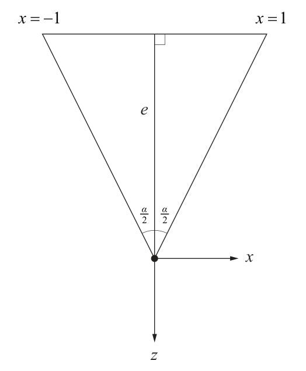
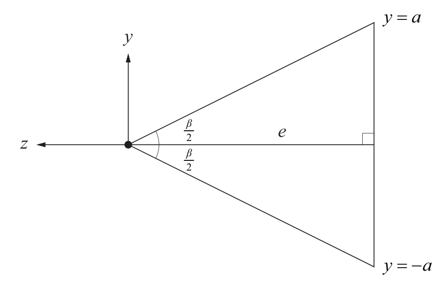
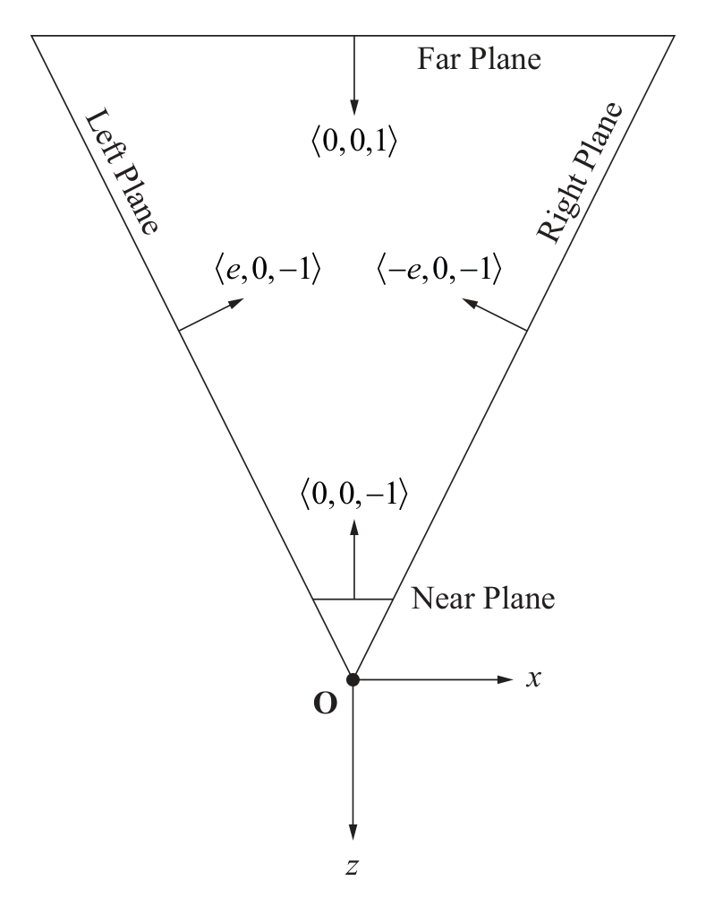

alias:: 视场, FOV, filed of view angle, 视场角

- # Definition
	- [[透视投影]]中，[[投影平面]]是一个与[[摄像机]]的[[view direction]][[垂直]]的[[平面]]，该平面与摄像机的 *距离* 为 $e$，[[view frustum]]的 *left plane* 与 *right plane* 分别与该 *平面* 在 $x=-1和 $x=1$ 处相交。如下图所示：
	  logseq.order-list-type:: number
	  {:height 643/2, :width 524/2}
	- 距离 $e$ 有时也被称为[[摄像机]]的[[焦距]]，与 *left plane* 和 *right plane* 之间的[[夹角]] $α$ 有关，夹角 $α$ 被称为[[horizontal field of view]] . 两者关系如下：
	  logseq.order-list-type:: number
	  id:: 6503b823-2aa5-4448-a60a-dda801cc8084
	  $$e=\frac{1}{\tan\frac{\alpha}{2}}$$
	  > [[焦距]]越短，则[[FOV]]越大（[[zoom out]]），画面越变形（*distorted*）。
	  *FOV* 逐渐缩小，而[[焦距]]越大（[[zoom in]]），透视效果越不明显。
	- $,  *top plane* 和 *bottom plane* 与[[投影平面]]相交于 $y=\pm a$ . $a$ 表示[[显示器]]的[[aspect ratio]] , 如下图所示
	  logseq.order-list-type:: number
	  {:height 556/2, :width 873/2}
	  则[[vertical field of view]] $\beta$ 可表示为
	  $$\beta=2\arctan\frac{a}{e}$$
- # [[View Frustum Plane]]
	- [[右手坐标系]]的[[view space]]中[[view frustum]]平面的[[法线]]如下图所示：
	  {:height 780/2, :width 608/2}
	- [[view frustum plane]] 的 *点法式* 表示如下表所示：
	- id:: 6503e090-da20-439b-971e-091c16ace94f
	  |Plane|${\bold N, D}$|
	  |--|--|
	  |near|${0,0,-1,-n}$|
	  |far|${0,0,1,f}$|
	  |left| $\left\{\frac{e}{\sqrt{e^{2}+1}},0,-\frac{1}{\sqrt{e^{2}+1}},0\right\}$|
	  |right|$\left\{-\frac{e}{\sqrt{e^{2}+1}},0,-\frac{1}{\sqrt{e^{2}+1}},0\right\}$|
	  |bottom|$\left\{0,\frac{e}{\sqrt{e^{2}+a^2}},-\frac{a}{\sqrt{e^{2}+a^2}},0\right\}$|
	  |top|$\left\{0,-\frac{e}{\sqrt{e^{2}+a^2}},-\frac{a}{\sqrt{e^{2}+a^2}},0\right\}$|
	- 法线都是[[单位化]]后的。
-
	-
	-
	-
	- $$
	  \phi=2\arctan \frac{w}{2d}
	  $$
-