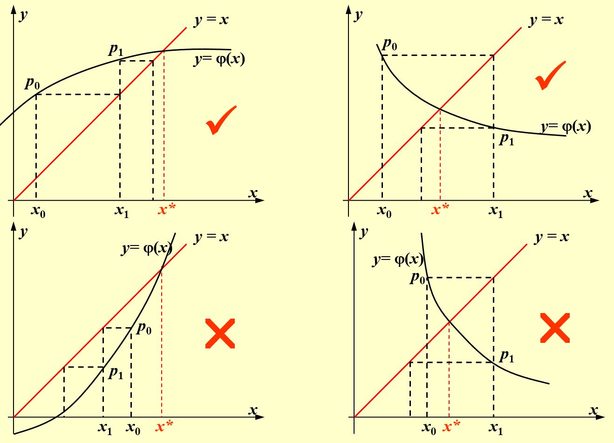
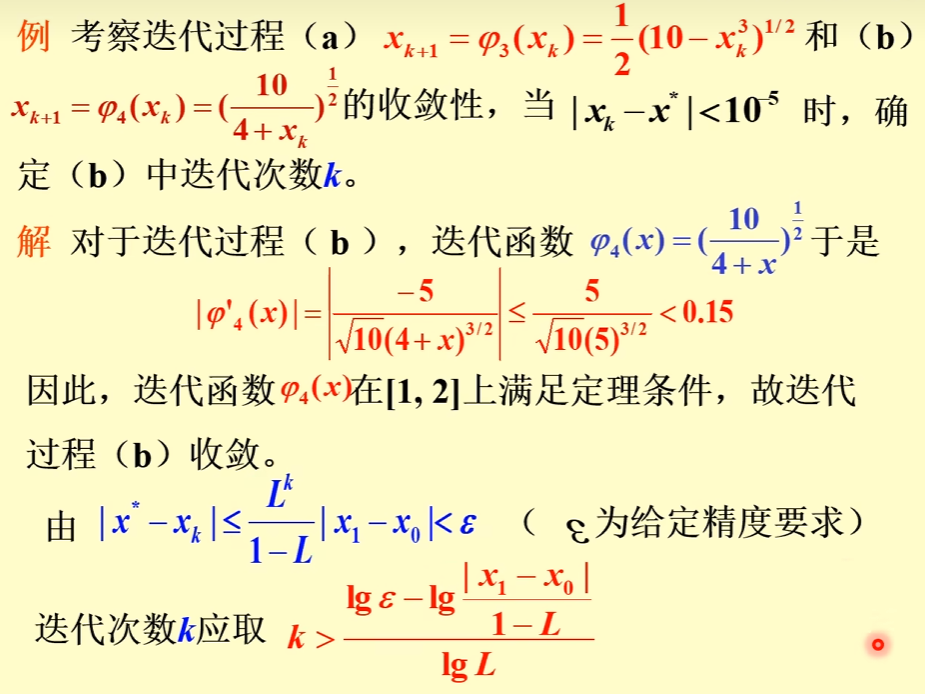
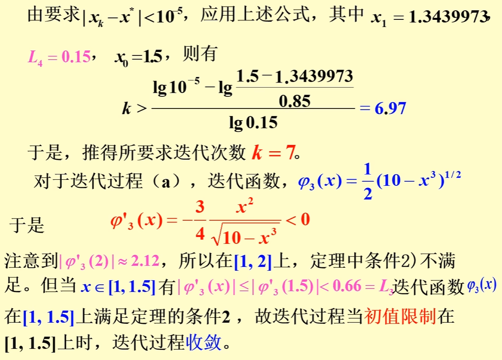

alias:: 不动点迭代法, 简单迭代法, 皮卡迭代法

- 通常, 用[[迭代法]]求  $f(x)=0$  的[[近似根]]时, 需要将它转化为等价方程
  $$x=\varphi(x) .\tag{1}$$
  由于方程是[[隐式方程]], 其右端含有未知的  $x$ , 因而不能直接求解, 如果给出根的某个猜测值  $x_{0}$ , 将它代人方程的右端, 即转化为显式的计算公式
  $$x_{1}=\varphi\left(x_{0}\right),$$
  再取  $x_{1}$  作为新的猜测值, 又有
  $$x_{2}=\varphi\left(x_{1}\right),$$
  如此反复计算, 迭代公式为
  $$x_{k+1}=\varphi\left(x_{k}\right), \quad k=0,1,2, \cdots .\tag{2}$$
- 如果迭代值  $x_{k}$  有[[极限]], 则称[[迭代收敛]]; 若  $\varphi(x)$  是[[连续函数]], 这时**极限值**  $x^{*}=\lim _{k \rightarrow \infty} x_{k}$  显然就是方程 $(1)$ 的[[根]].
- 称式 $(2)$ 为求解方程  $x=\varphi(x)$  的[[简单迭代法]], 其中  $\varphi(x)$  为[[迭代函数]], 因  $x^{*}=   \varphi\left(x^{*}\right)$ , 故  $x^{*}$  是[[迭代函数的不动点]]. 简单迭代法 $(2)$ 又称为[[不动点迭代法]].
- >我们看到, 迭代法的基本思想是, 将隐式方程  $x=\varphi(x)$  的求根问题归结为计算一组显式  $x_{k+1}=\varphi\left(x_{k}\right)$ , 也就是说, 迭代过程实质上是一个**逐步显式化**的过程.
- > 根据 $x=\varphi(x)$ ，下图是几种迭代过程：
  {:height 519, :width 708}
- ## 定理
	- （充分条件）设  $\varphi(x)$  在  $[a, b]$  上满足：
		- 对任意  $x \in[a, b]$ , 总有  $\varphi(x) \in[a, b]$ ;
		  logseq.order-list-type:: number
		- 存在 $0 \leqslant L<1$ , 使对任意  $x \in[a, b],\left|\varphi^{\prime}(x)\right| \leqslant L$  成立([[利普希茨条件]]),
		  logseq.order-list-type:: number
		- 则  $x=\varphi(x)$  在  $(a, b)$  上有**唯一解**  $x^{*}$ , 且[[选代过程]]  $x_{k+1}=\varphi\left(x_{k}\right)$  对**任意初值**  $x_{0} \in[a, b]$  均[收敛]([[迭代收敛]])于方程  $x=\varphi(x)$ 的根（[[迭代函数的不动点]]）, 其[误差估计式]([[迭代法误差估计式]])为
		  $$
		  \left|x^{*}-x_{k}\right| \leqslant \frac{1}{1-L}\left|x_{k+1}-x_{k}\right|; 
		  $$
		  （[[事后误差估计]]）
		  $$
		  \left|x^{*}-x_{k}\right| \leqslant \frac{L^{k}}{1-L}\left|x_{1}-x_{0}\right|.
		  $$
		  （[[事前误差估计]]）
		  且存在[[极限]] 
		  $$\lim _{k \rightarrow \infty} \frac{x^{*}-x_{k+1}}{x^{*}-x_{k}}=\varphi^{\prime}\left(x^{*}\right)$$
		- ### 证明
			- $\varphi(x)$  在  $[a, b]$  上存在不动点?
			  logseq.order-list-type:: number
			  令 $f(x)=\varphi(x)-x$
			   $\because a \leq \varphi(x) \leq b$
			  $\therefore f(a)=\varphi(a)-a \geq 0$, 
			  $f(b)=\varphi(b)-b \leq 0$
			  $\Rightarrow f(x)$  有根 .
			- 不动点唯一?
			  logseq.order-list-type:: number
				- 反证: 若不然，设还有  $\tilde{x}=\varphi(\tilde{x})$  ，则  $x^{*}-\widetilde{x}=\varphi\left(x^{*}\right)-\varphi(\tilde{x})=\varphi^{\prime}(\xi)\left(x^{*}-\tilde{x}\right)$, $\xi$  在  $x^{*}$  和  $\tilde{x}$  之间。
				  $\Rightarrow\left(x^{*}-\tilde{x}\right)\left(1-\varphi^{\prime}(\xi)\right)=0$ 而 $\left|\varphi^{\prime}(\xi)\right|<1$ 
				  $\therefore x^{*}=\tilde{x}$
			- 当  $k \rightarrow \infty$  时，  $x_{k}$  收敛到  $x^{*}$  ?
			  logseq.order-list-type:: number
				- \begin{aligned}
				  \left|x^{*}-x_{k}\right| & =\left|\varphi\left(x^{*}\right)-\varphi\left(x_{k-1}\right)\right|=\left|\varphi^{\prime}\left(\xi_{k-1}\right)\right| \cdot\left|x^{*}-x_{k-1}\right| \\
				  & \leq L\left|x^{*}-x_{k-1}\right| \leq \ldots \ldots \leq L^{k}\left|x^{*}-x_{0}\right| \rightarrow 0
				  \end{aligned}
			- $\left|x^{*}-x_{k}\right| \leq \frac{1}{1-L}\left|x_{k+1}-x_{k}\right|$ ? 
			  logseq.order-list-type:: number
				- $\left|x_{k+1}-x_{k}\right| \geq\left|x^{*}-x_{k}\right|-\left|x^{*}-x_{k+1}\right| \geq\left|x^{*}-x_{k}\right|-L\left|x^{*}-x_{k}\right|$
				- >可用  $\left|x_{k+1}-x_{k}\right|$  来控制[[收敛精度]]。
			- $\left|x^{*}-x_{k}\right| \leq \frac{L^{k}}{1-L}\left|x_{1}-x_{0}\right|$ ?
			  logseq.order-list-type:: number
				- \begin{aligned}
				  \left|x_{k+1}-x_{k}\right| & =\left|\varphi\left(x_{k}\right)-\varphi\left(x_{k-1}\right)\right|=\left|\varphi^{\prime}\left(\xi_{k}\right)\left(x_{k}-x_{k-1}\right)\right| \\
				  & \leq L\left|x_{k}-x_{k-1}\right| \leq \ldots \ldots \leq L^{k}\left|x_{1}-x_{0}\right|
				  \end{aligned}
				- > $L$ 越小[[收敛速度]]越快
			- $\lim _{k \rightarrow \infty} \frac{x^{*}-x_{k+1}}{x^{*}-x_{k}}=\varphi^{\prime}\left(x^{*}\right)$ ? 
			  logseq.order-list-type:: number
				- $\lim _{k \rightarrow \infty} \frac{x^{*}-x_{k+1}}{x^{*}-x_{k}}=\lim _{k \rightarrow \infty} \frac{\varphi^{\prime}\left(\xi_{k}\right)\left(x^{*}-x_{k}\right)}{x^{*}-x_{k}}=\varphi^{\prime}\left(x^{*}\right)$
	- ## 例子
		- 
		- 
- ## [[局部收敛性]]
- ## [[迭代法的收敛速度]]
  id:: 65c8c7bd-c886-47d9-92c6-0472571124db
- ## [[迭代过程的加速]]