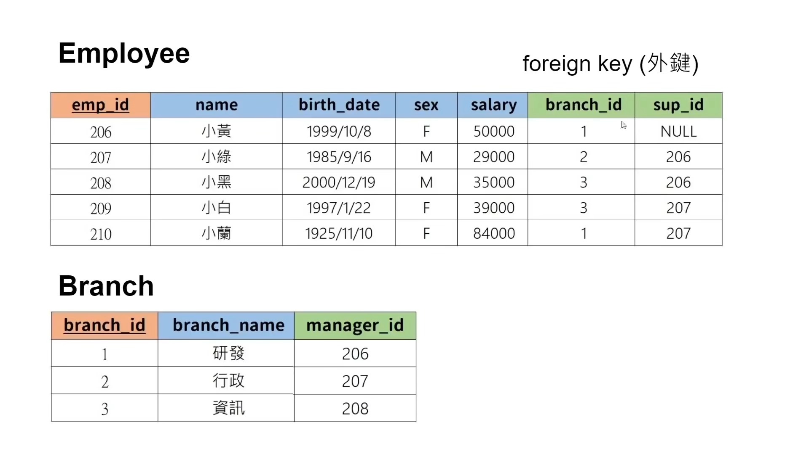
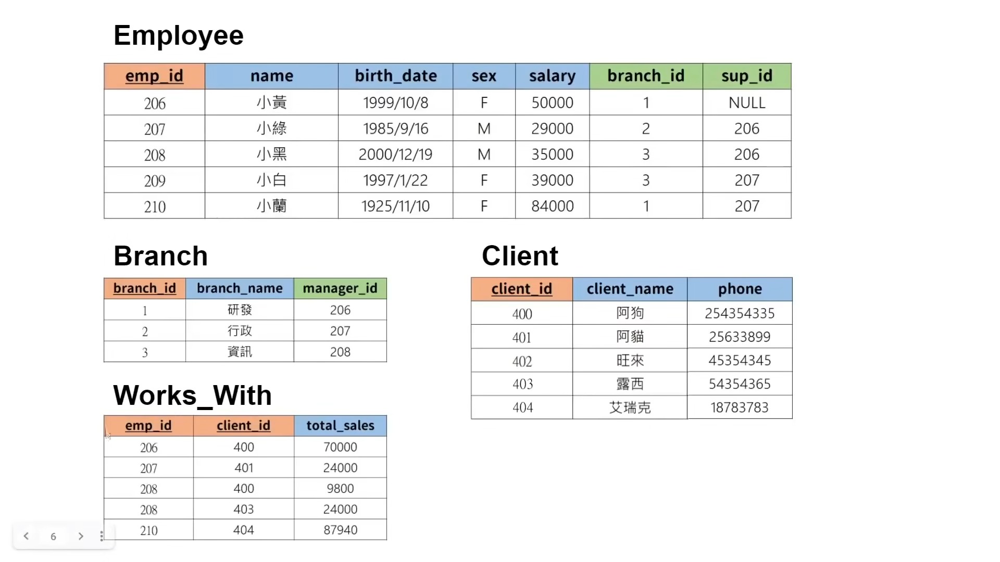

alias:: 外键

- 在关系数据库中，外键（Foreign Key）是一个或多个字段（列），它们用于建立和维护两个表之间的关系。外键在一个表中定义，指向另一个表的[[主键]]，用于确保数据之间的参照完整性。通过使用外键，可以强制实施数据库中数据之间的一致性和关联性。
- ### 外键的主要功能和作用
	- **维护数据完整性**：
	  logseq.order-list-type:: number
	- 外键约束确保只能在关联表中插入存在的、有效的数据值。这防止了在引用数据不存在时在外键表中插入数据行。
	- **实现关系**：
	  logseq.order-list-type:: number
	- 外键用于连接两个表，常用于实现一对一或一对多的关系。例如，在一个订单系统中，每个订单可能有多个订单项，订单项表的外键指向订单表的主键。
	- **级联操作**：
	  logseq.order-list-type:: number
	- 可以配置外键以执行级联更新和删除操作。如果主表中的记录被更新或删除，外键约束可以自动更新或删除依赖的记录以保持数据一致性。
- ### 外键的例子
  假设有两个表：`Customers` 和 `Orders`。`Customers` 表有一个 `CustomerID` 字段作为主键，而 `Orders` 表中有一个 `CustomerID` 字段作为外键，用来指向 `Customers` 表中相应的记录。
	- **Customers 表**：
	- CustomerID (主键)
	- Name
	- Address
	- **Orders 表**：
	- OrderID
	- OrderDate
	- CustomerID (外键)
- ### SQL 创建外键
  使用 SQL 语句创建外键的示例：
  ```sql
  CREATE TABLE Orders (
  OrderID int NOT NULL,
  OrderDate date NOT NULL,
  CustomerID int,
  PRIMARY KEY (OrderID),
  FOREIGN KEY (CustomerID) REFERENCES Customers(CustomerID)
  );
  ```
  在这个例子中，`Orders` 表的 `CustomerID` 列被定义为外键，它引用了 `Customers` 表的 `CustomerID` 列。这意味着 `Orders` 表中的每一个 `CustomerID` 值都必须在 `Customers` 表的 `CustomerID` 列中有对应的值。
- 外键是关系型数据库设计的核心元素之一，它们帮助保持数据的结构化和准确性，是实现复杂数据模型和确保数据质量的重要工具。
  <!--Converted by ToLogseq-->
- 
- 
-