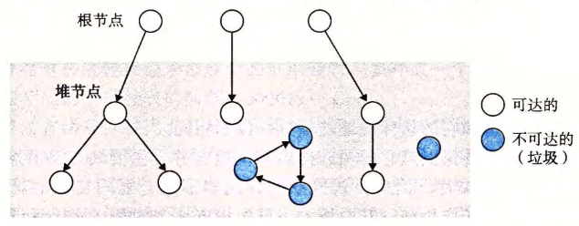

alias:: 垃圾收集器

- [[垃圾收集器]]是一种[[动态内存分配器]]，它自动释放程序不再需要的[[已分配块]]。这些块被称为[[垃圾]] 。
- ## 垃圾收集器的基本知识
	- 垃圾收集器将内存视为一张 *有向[[可达图]]* , 其形式如图所示。该图的 *节点* 被分成一组[[根节点]] 和一组[[堆节点]]。
		- {:height 256, :width 634}
		- 每个[[堆节点]]对应于[[堆]]中的一个[[已分配块]]。
		- [[有向边]] $p\to q$ 意味着块 $p$ 中的某个位置指向块 $q$ 中的某个位置。
		- *根节点* 对应于这样一种不在 堆 中的位置，它们中包含指向堆中的 *指针* 。这些位置可以是 *寄存器* 、*栈里的变量* ，或者是 *虚拟内存中读写数据区域内的全局变量* 。
		- 当存在一条从任意 *根节点* 出发并到达 $p$ 的[[有向路径]]时，我们说节点 $p$ 是[[可达的]]。在任何时刻，不可达节点对应于[[垃圾]]，是不能被应用再次使用的。垃圾收集器的角色是维护可达图的某种表示，并通过释放不可达节点且将它们返回给空闲链表，来定期地回收它们。
	-