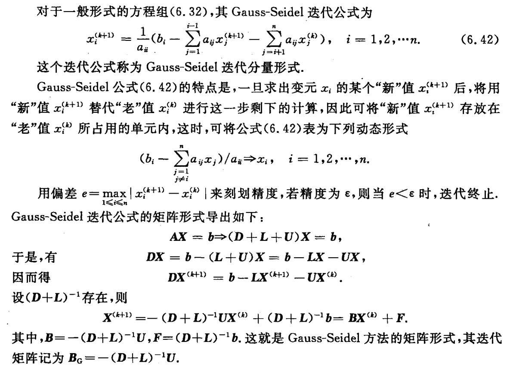

alias:: 高斯-赛德尔迭代法, gauss-seidel 迭代法, 高斯-赛德尔方法,  高斯-赛德尔

- 给定线性方程组 \( A\mathbf{x} = \mathbf{b} \)，其中 \( A \) 是一个 \( n \times n \) 的矩阵，\( \mathbf{x} \) 和 \( \mathbf{b} \) 是向量。高斯-赛德尔方法通过以下迭代公式来更新解向量的每个分量：
  id:: 658710b0-a3e4-40aa-ad86-1136d2d94651
  
  \[ x_i^{(k+1)} = \frac{1}{a_{ii}} \left( b_i - \sum_{j=1}^{i-1} a_{ij}x_j^{(k+1)} - \sum_{j=i+1}^{n} a_{ij}x_j^{(k)} \right) \]
  其中：
	- \( x_i^{(k+1)} \) 是第 \( k+1 \) 次迭代时第 \( i \) 个变量的值。
	- \( a_{ij} \) 是矩阵 \( A \) 的元素。
	- \( b_i \) 是向量 \( \mathbf{b} \) 的第 \( i \) 个元素。
- ### 特点和应用
	- **适用性**：适用于大型稀疏矩阵，尤其是当矩阵是对角占优或正定时。
	- **收敛速度**：通常比[[雅可比迭代法]]快，但收敛速度依赖于矩阵的性质和初始近似解。
		- 一般地说，Gauss-Seidel 迭代法 要比 Jacobi 迭代法 好（即取 $x^{(0)}$ 相同，达到同样精度所需迭代次数较少），但情况并不总是这样，有时 Gauss-Seidel 迭代比 Jacobi 迭代收敛得慢，甚至可以举出 Jacobi 迭代收敛，但 Gauss-Seidel 迭代反而发散的例子.
	- **并行性**：与雅可比方法相比，高斯-赛德尔方法在并行计算上有一定的限制，因为每个迭代步骤都依赖于前一个步骤的结果。
- {:height 507, :width 689}