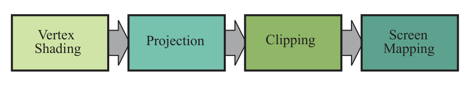

alias:: geometry processing stage, 几何处理阶段, 几何阶段

- #RenderingPipelineStage
- The [[geometry processing stage]] deals with [[transforms]], [projections]([[projection stage]]),
  and all other types of [[geometry handling]]. 
  This stage computes **what is to be drawn, how it should be drawn, and where it should be drawn**. The geometry stage is typically performed on a [[graphics processing unit]].
- The *geometry processing* stage on the *GPU* is responsible for most of the *per-triangle* and *per-vertex* operations. 
  This stage is further divided into the following functional stages: 
  [[vertex shading]], [projection]([[projection stage]]), [[clipping]], and [[screen mapping]].
  
-