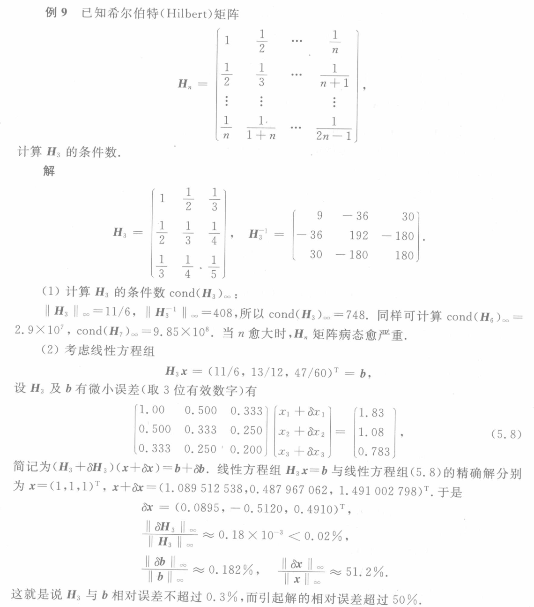

alias:: 希尔伯特矩阵

- # Definition
	- 给定正整数 \( n \)，\( n \times n \) 阶的希尔伯特矩阵 \(\boldsymbol H_n \) 的元素由以下公式给出：
	  logseq.order-list-type:: number
	  $$ H_{ij} = \frac{1}{i + j - 1} $$
	  其中 \( i \) 和 \( j \) 分别表示矩阵的行和列索引，索引从1开始。
	  $$ H_n = \begin{bmatrix} 
	  1 & \frac{1}{2} & \frac{1}{3} & \cdots & \frac{1}{n} \\
	  \frac{1}{2} & \frac{1}{3} & \frac{1}{4} & \cdots & \frac{1}{n+1} \\
	  \frac{1}{3} & \frac{1}{4} & \frac{1}{5} & \cdots & \frac{1}{n+2} \\
	  \vdots & \vdots & \vdots & \ddots & \vdots \\
	  \frac{1}{n} & \frac{1}{n+1} & \frac{1}{n+2} & \cdots & \frac{1}{2n-1}
	  \end{bmatrix} $$
- ## 性质
	- 希尔伯特矩阵是[[对称正定矩阵]]。
	  logseq.order-list-type:: number
	- **条件数：** 希尔伯特矩阵的条件数随着阶数 \( n \) 的增加而迅速增大。这使得在数值计算中使用希尔伯特矩阵时需要特别小心，因为矩阵的条件数大可能导致数值稳定性的问题。
	  logseq.order-list-type:: number
	  #+BEGIN_PINNED
	   
	  #+END_PINNED
	- **插值性质：** 希尔伯特矩阵在插值问题中具有重要应用。对于给定的函数值，通过求解线性方程组 \( H_n \mathbf{c} = \mathbf{f} \)，其中 \( \mathbf{c} \) 是待定系数向量，可以得到一个多项式插值。
	  logseq.order-list-type:: number
	- **逆矩阵：** 希尔伯特矩阵的逆矩阵也可以通过分析表达式给出，但由于其特殊结构，逆矩阵的元素包含大量的整数和分数，因此通常不直接用于计算。
	  logseq.order-list-type:: number