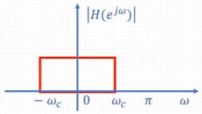
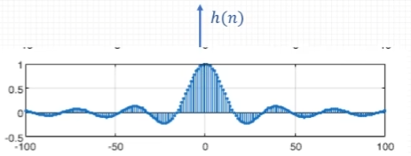

alias:: 理想低通滤波器, ILPF

- ^^理想低通滤波器^^具有一种完美的频率选择特性，它能完全通过其[[截止频率]]\(\omega_c\)以下的所有频率成分，并完全阻止高于截止频率的频率成分。其幅度响应函数定义为：
  $$
  \left|H\left(e^{j \omega}\right)\right|=\left\{\begin{array}{ll}
  1, & |\omega| \leq \omega_{c} \\
  0, & \omega_{c}<|\omega| \leq \pi
  \end{array}\right.
  $$
  
- 在理想情况下，低通滤波器的单位脉冲响应 \( h(n) \) 可通过[[逆傅里叶变换]]得到，结果为：
  $$
  h(n)=\frac{\omega_{c}}{\pi} \text{Sa}\left(\omega_{c} n\right)
  $$
  其中 
  $$\text{Sa}(x) = \frac{\sin(x)}{x}$$ 
  是[[取样函数]]（Sinc函数）。
  