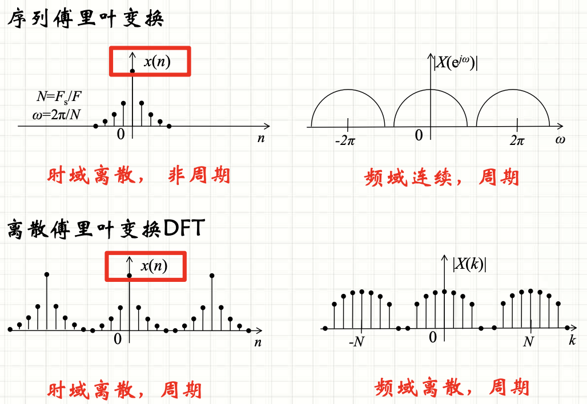

alias:: 隐含周期性, 隐含周期, DFT 隐含的周期性

- 由于 $$\tilde{X}(k)$$ 是对[[离散时间傅里叶级数]] $$\tilde{x}(n)$$ 的一个周期 $$x(n)$$ 的频谱 $$X\left(\mathrm{e}^{\mathrm{j} \omega}\right)$$ 的[[抽样]]，$$ X\left(\mathrm{e}^{\mathrm{j} \omega}\right)$$ 是周期性的频谱, 周期为 $$2 \pi$$ 。
  
- $X(k)$ 是 $$\tilde{X}(k)$$ 的[[主值区间]]上的值, 即是 $$X\left(\mathrm{e}^{\mathrm{j} \omega}\right)$$ 在 $$[0,2 \pi)$$ 这一主值区间上的 $N$ 点等间隔抽样值, 因而当 $k$ 超出主值区间 $$(k=0,1,2, \cdots, N-1)$$ 时, 就相当于对 $$\omega$$ 在 $$[0,2 \pi)$$ 以外区间对 $$X\left(\mathrm{e}^{\mathrm{j} \omega}\right)$$ 的抽样, 它是以 $N$ 为周期而重复的, 即有 $$\tilde{X}(k)=X((k))_{N} ,$$ 因而[[DFT]]是^^隐含周期性^^的。
- 其次, 从 $$W_{N}^{k n}$$ 的周期性 $$W_{N}^{(k+m N) n}=W_{N}^{k n}$$ 也可证明 $$X(k)$$ 隐含周期性, 其周期为 $N$ 。即
  $$X(k+m N)=\sum_{n=0}^{N-1} x(n) W_{N}^{(k+m N) n}=\sum_{n=0}^{N-1} x(n) W_{N}^{k n}=X(k)$$
  由于 $$\tilde{x}(n)$$ 和 $$\tilde{X}(k)$$ 是一对变换关系$$, \tilde{X}(k)$$ 是 $$\tilde{x}(n)$$ 的频谱, 取 $$\tilde{x}(n)$$ 及 $$\tilde{X}(k)$$ 的主值序列 $$x(n)=\tilde{x}(n) R_{N}(n), X(k)=\tilde{X}(k) R_{N}(k)$$ 作为一对变换时, 显然是合理的, 因为它们符合一对一的唯一变换关系。
- 因而, **对[[离散傅里叶变换]]而言, [[有限长序列]]都是作为[[周期序列]]的一个周期表示的, 都隐含有周期性意义**。