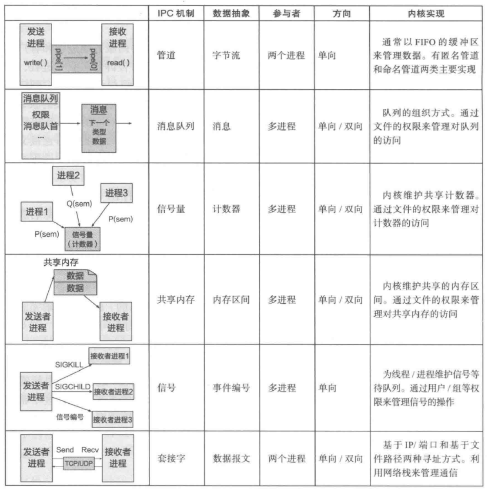
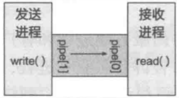
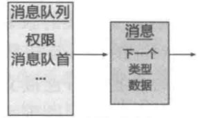
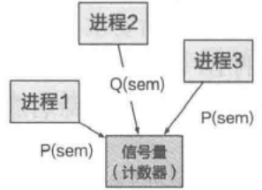
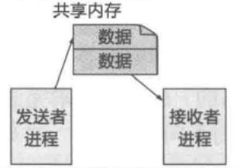
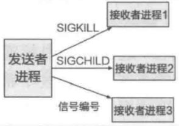
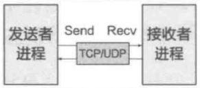

alias:: 进程间通信, IPC

- [[进程]]间通信（Inter-Process Communication，IPC）是指在同一台计算机上运行的不同进程之间进行数据交换的机制。这是操作系统多任务处理的一个重要方面，允许进程协调工作，共享数据，并提高应用程序的效率和功能。
  collapsed:: true
	- ### IPC的主要方法包括：
	  collapsed:: true
		- 1. **管道（Pipes）**:
			- 管道是最早的IPC机制之一，允许一个进程的输出成为另一个进程的输入。
			- 有名管道（Named Pipes）又称FIFO，允许无关的进程通信。
		- 2. **消息队列（Message Queues）**:
			- 消息队列允许进程以消息的形式交换数据。
			- 这些消息存储在队列中，直到被接收进程取出。
		- 3. **信号量（Semaphores）**:
			- 信号量主要用于同步多个进程的活动，不是用来交换大量数据，而是用来协调各个进程之间的执行顺序。
		- 4. **共享内存（[[Shared Memory]]）**:
			- 允许多个进程访问同一块内存空间，是最快的IPC方法，因为数据不需要在进程间传输。
		- 5. **套接字（Sockets）**:
			- 套接字允许运行在同一台机器上的进程或不同机器上的进程间进行数据交换。
			- 支持TCP（面向连接的）和UDP（无连接的）协议。
		- 6. **远程过程调用（Remote Procedure Calls，RPC）**:
			- 允许一个进程调用另一个进程的函数或过程，就像调用本地函数一样。
			- RPC可以隐藏底层的通信细节。
		- 7. **内存映射文件（Memory-mapped Files）**:
			- 通过将文件或设备直接映射到进程的地址空间来实现进程间的数据共享。
		- ### IPC的使用场景
			- **数据共享**：不同进程需要访问和修改共同的数据集。
			- **任务分配**：将大任务分解成小部分，由不同的进程并行处理以提高效率。
			- **服务协作**：多个进程各自提供不同的服务，但需要协同工作以提供完整的功能。
			- **状态同步**：确保多个进程有一致的视图，特别是在多用户或多任务环境中。
		- ### IPC的重要性
		  进程间通信对于现代操作系统和并发应用程序至关重要。它支持应用程序的模块化，使得系统更加健壮和灵活。通过IPC，可以将大型、复杂的任务分解成多个小的、管理得当的进程，这些进程可以在多核处理器上并行运行，从而提高了应用程序的性能和效率。
		-
- 一般而言，进程间通信至少需要两方（如两个[[进程]]）参与。根据信息流动的方向，这两方通常被称为[[发送者]]和[[接收者]]。在实际使用中，IPC 经常被用于服务[[调用]]，因此参与 IPC 的两方又被称为[[调用者]]和被[[调用者]]，或者[[客户端]]和[[服务端]]。后文会根据具体场景使用不同的术语。
- 在具体的系统中，通常还会存在多方通信的情况，如多个发送者单个接收者(N:1)、单个发送者多个接收者(1:M)或多个发送者多个接收者(N:M)。
- ## [[进程间通信接口]]
- ## [[数据传递]]
- ## [[通知机制]]
- ## [[进程的方向性]]
- ## [[同步 IPC]]和[[异步 IPC]]
- ## [[超时机制]]
- ## [[通信连接]]
- ## [[权限检查]]
- ## [[权限的分发]]
- 
- |IPC 机制|数据抽象|参与者|方向|内核实现||
  |--|--|--|--|--|--|
  |[[管道]]|[[字节流]]|两个进程|[单向]([[单向 IPC]])|通常以FIFO的缓冲区来管理数据。有匿名管道和命名管道两类主要实现|  |
  |[[消息队列]]|[[消息]]|多进程|单向/双向|队列的组织方式。通过类型文件的权限来管理对队列数据的访问|  |
  |[[信号量]]|计数器|多进程|单向/双向|内核维护共享计数器。通过文件的权限来管理对计数器的访问|  |
  |[[共享内存]]|内存区间|多进程|单向/双向|内核维护共享的内存区间。通过文件的权限来管发送者接收者理对共享内存的访问|  |
  |[[信号]]|[[事件编号]]|多进程|单向|为线程/进程维护信号等待队列。通过用户/组等权限来管理信号的操作|  |
  |[[套接字]]|[[数据报文]]|两个进程|单向/双向|基于IP/端口和基于文件路径两种寻址方式。利用网络栈来管理通信|  |