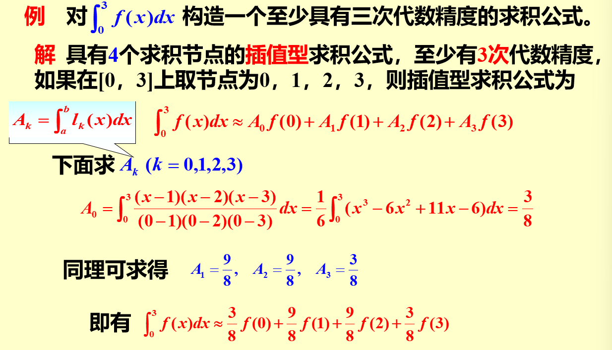

alias:: 插值型的求积公式, 插值型求积公式

- ## 定理
  id:: 65a4e326-39d2-4ef0-bd27-b435406e7c2b
  在区间$[a,b]$上，对于给定的 $(n+1)$ 个互异节点
  $$
  a\leqslant x_0<x_1<\cdots<x_n\leqslant b,
  $$
  总存在求积系数 $A_0,A_1,...,A_n$, 使[[求积公式]]至少具有 $n$ 次[[代数精度]]。
- ## 插值型的求积公式
	- 设已给出 $f(x)$在节点 $x_k(k=0,1,2,\cdotp\cdotp\cdotp,n)$ 的函数值，作[[插值多项式]]
	  $$
	  L_{n}(x)=\sum_{k=0}^{n}f(x_{k})l_{k}(x)\:,
	  $$
	  式中 
	  $$
	  l_{k}(x)=\prod_{j=0\atop j\neq k}^{n}\frac{x-x_{j}}{x_{k}-x_{j}}.
	  $$
	  由于多项式 $L_n(x)$ 的求积是容易的，我们取 $\int _a^bL_n( x)\mathrm dx$ 作为 $\int _a^bf( x)\mathrm dx$ 的**近似值**，即令
	  $$
	  \int_{a}^{b}f(x)\:\mathrm{d}x\approx\int_{a}^{b}L_{n}(x)\:\mathrm{d}x=\sum_{k=0}^{n}A_{k}\:f(x_{k})\:,
	  $$
	  因而这类求积公式具有[[求积公式]]的形式，而其 求积系数
	  $$
	  A_{k}\:=\int_{a}^{b}l_{k}\left(x\right)\mathrm{d}x.
	  $$
	   若[[求积公式]]的求积系数$A_k$ 由上式确定，则称求积公式是[插值型]([[插值型求积公式]])的.
		- 由公式可知，$A_k$ 由[节点]([[求积节点]])决定，与 $f(x)$ 无关。
	- ### 余项
	  由[[插值余项定理]]知，对于插值型求积式,其余项为
	  \begin{aligned}
	  R(f) &=\int_{a}^{b}f(x)\mathrm{d}x-\sum_{k=0}^{n}\int_{a}^{b}l_{k}(x)\:f(x_{k})\:\mathrm{d}x \\
	  &= \int _{a}^{b}\left [ f( x) - \sum _{k= 0}^{n}l_{k}( x) f( x_{k}) \right ]\mathrm dx \\
	  &= \int _{a}^{b}\frac {f^{( n+ 1) }( \xi) }{( n+ 1) ! }\prod _{j= 0}^{n}( x- x_{j})\mathrm d x
	  \end{aligned}
	  ( $x_i$ 与 $x$ 有关)
	  从 $R(f)$ 的表达式极易推得如下定理的充分性.
	- ### 定理
		- [[求积公式]]至少有 $n$ 次[[代数精度]]的**充分必要条件**为它是插值型的。
		  logseq.order-list-type:: number
		- 若求积公式的代数精度为 $m$ , 则余项为
		  logseq.order-list-type:: number
		  $$
		  R(f)\triangleq\int_a^bf(x)\mathrm{d}x-\sum_{n=0}^NA_nf(x_n)=K\cdot f^{(m+1)}(\eta)
		  $$
		  其中 $K$ 为待定系数，但与 $f(x)$ 无关。
			- 将$f(x)=x^{m+1}$ 代入可得 
			  id:: 65a4eea9-fd53-411d-8505-5347f4555aa0
			  $$\int_a^bx^{m+1}\mathrm dx -\sum_{n=0}^N A_nx_n^{m+1}=K\cdot (m+1)!$$
			  $$\Longrightarrow
			  K=\frac1{(m+1)!}\Bigg(\frac{b^{m+2}-a^{m+2}}{m+2}-\sum_{n=0}^NA_nx_n^{m+1}\Bigg)
			  $$
			-
- ### 例子
	- 