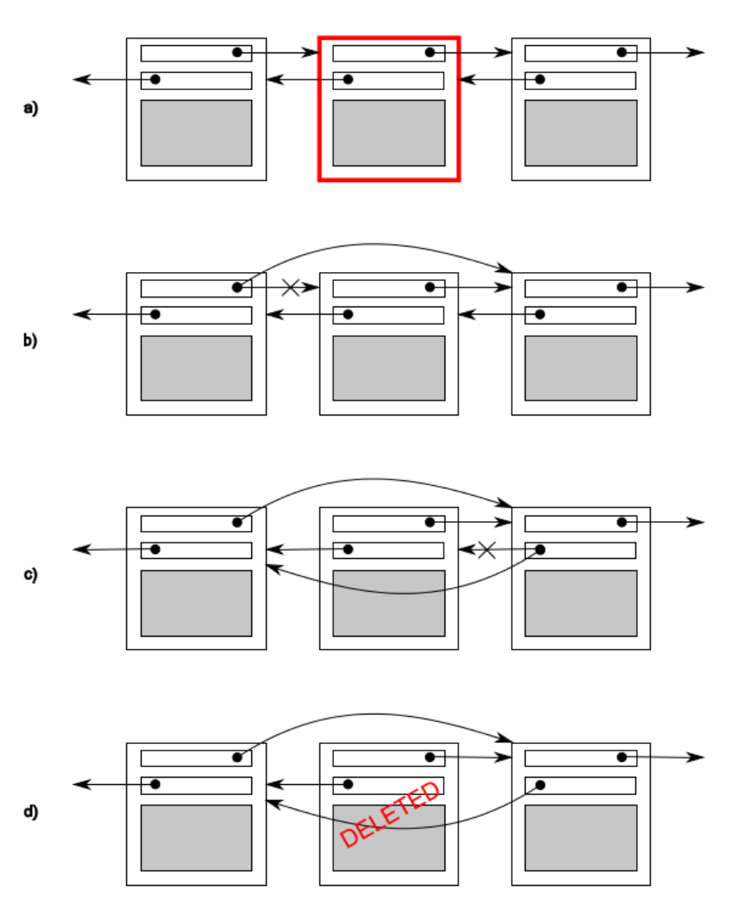

alias:: invariants, 不变性, 不变量

- [[invariant]]是计算机程序执行的某个阶段中始终为真的逻辑[[断言]]。例如，[[loop invariant]]是在每次循环迭代的开始和结束时都为真的条件。
- 不变式在推理计算机程序的正确性时特别有用。优化编译器的理论、设计协议的方法论以及确定程序正确性的形式方法都严重依赖[[invariant]]。
- > 程序员通常在其代码中使用 *断言* 来明确表示 invarinat 。
- ## 并发中的不变性
- >归根到底，线程间共享数据的问题都是由于修改数据所引起的后果。如果所有共享数据都是只读的，那么就没有问题，因为一个线程读取的数据不会受到另一个线程是否正在读取同一数据的影响。但是，如果数据在多个线程之间共享，并且一个或多个线程开始修改数据，就有很大的问题潜力。在这种情况下，你必须小心确保一切正常运作。
- 一个被广泛用来帮助程序员推理其代码的概念是[[不变性]]——关于**特定数据结构的始终为真**的声明，例如“这个变量包含列表中的项目数量”这样的声明。
  这些不变性在**更新过程中往往会被打破**，尤其是如果数据结构有任何复杂性或更新需要修改多个值的时候。
- ### 例子
	- 考虑一个双向链表，其中每个节点都持有指向列表中下一个节点和前一个节点的指针。其中一个不变性是，如果你从一个节点（A）通过“next”指针跟随到另一个节点（B），那么从那个节点（B）的“previous”指针应该指回第一个节点（A）。为了从列表中移除一个节点，两边的节点都需要更新以指向彼此。一旦一个节点被更新，不变性就被打破，直到另一边的节点也被更新；更新完成后，不变性再次成立。
	- 从这样的列表中删除一个条目的步骤如图所示：
	  collapsed:: true
		- 确定要删除的节点：N。
		  logseq.order-list-type:: number
		- 更新N节点前一个节点的链接，使其指向N节点后的节点。
		  logseq.order-list-type:: number
		- 更新N节点后一个节点的链接，使其指向N节点前的节点。
		  logseq.order-list-type:: number
		- 删除节点N。
		  logseq.order-list-type:: number
	- 如图所示，在步骤b和c之间，一个方向的链接与另一个方向的链接不一致，**不变性被打破**。
	- 
	- 修改线程间共享的数据**最简单的潜在问题是不变性的破坏**。
		- 如果你不采取特殊措施以确保其他情况，当一个线程正在读取双向链表时另一个线程正在移除一个节点，读取线程很可能会看到一个只被部分移除的节点（因为只有一个链接被改变了，正如图的步骤b所示），因此不变性被破坏了。
		- 这种破坏不变性的后果可能会有所不同；如果另一个线程按图中从左到右读取列表项，它将跳过正在被删除的节点。
		- 另一方面，如果第二个线程试图删除图中最右边的节点，它可能最终永久损坏数据结构并最终导致程序崩溃。无论结果如何，这都是并发代码中最常见的bug原因之一：[[竞态条件]]。
-