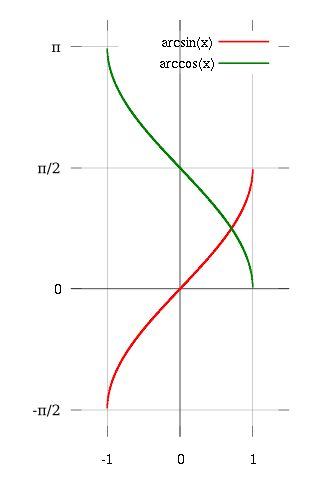
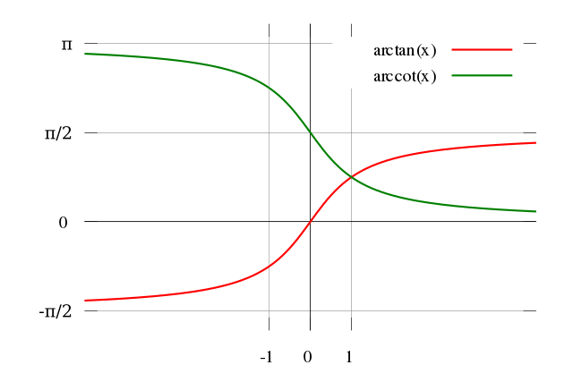
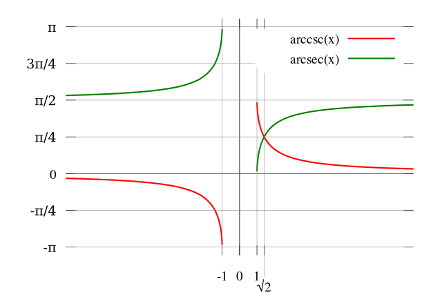

alias:: 反三角函数

- |Name|Symbol|definition domain||图像|
  |--|--|--|--|--|
  |[[反正弦]]|$\arcsin$|$[-1,1]$|$\left[-\frac{\pi}{2}, \frac{\pi}{2}\right]$|{:height 373, :width 243} |
  |[[反余弦]]|$\arccos$|$[-1,1]$|$(0,\pi)$|
  |[[反正切]]|$\arctan$|$\mathbb{R}$|$(-\frac{\pi}{2}, \frac{\pi}{2})$||
  |[[反余切]]|$\mathrm{arccot}$|$\mathbb{R}$|(0,\pi)|
  |[[反正割]]|$\\mathrm{arcsec}$|$(-\infty, -1]\cup[1,\infty)$|$[0,\frac{\pi}{2})\cup(\frac{\pi}{2}, \pi]$| |
  |[[反余割]]|$\mathrm{arccsc}$|$(-\infty, -1]\cup[1,\infty)$|$[-\frac{\pi}{2}, 0)\cup(0, \frac{\pi}{2}]$|
	-
	-