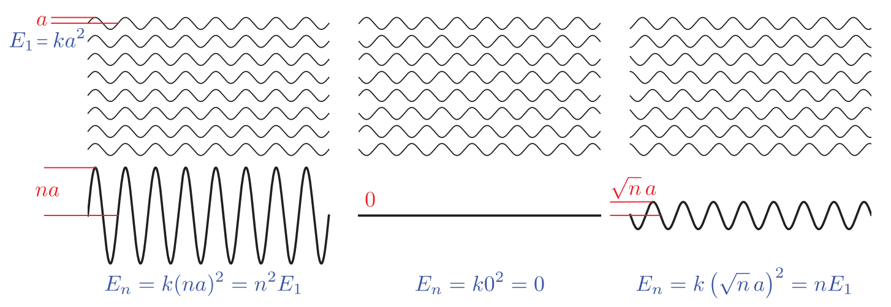

alias:: 辐照度, average energy flow density, wave irradiance

- Irradiance at surface is proportional to *cosine* of angle between [[light direction]] and [[surface normal]].
  $$
  dE(\mathrm{p},\omega)=L_{i}(\mathrm{p},\omega)\cos\theta\:\mathrm{d}\omega 
  $$
  $$
  E(\mathrm{p})=\int_{H^2}L_i(\mathrm{p},\omega)\cos\theta\:\mathrm{d}\omega 
  $$
- $H^2$ 代表 Unit Hemisphere
- # Energy and Irradiance in Physics
  [[Light waves]] carry [[energy]]. The *density of energy flow* is equal to the *product* of
  the magnitudes of the [electric]([[electric field]]) and [[magnetic fields]], which is—since the magnitudes
  are proportional to each other—proportional to the *squared magnitude* of the [[electric
  field]]. We focus on the electric field since it affects matter much more strongly than
  the magnetic field. 
  In rendering, we are concerned with the average energy flow over time, which is *proportional* to the *squared* [[wave amplitude]]. This [[average energy flow density]] is the [[irradiance]], denoted with the letter $E$.
- Image shows scenarios where $n$ monochromatic waves with the same [[frequency]], [[polarization]], and
  [[amplitude]] are added together.
  {:height 277, :width 778}
- On the left, the waves all line up with the **same** [[phase]] and reinforce each other. The combined [[wave irradiance]] is $n^2$ times that of a *single wave*, which is $n$ times greater than the *sum of the irradiance
  values of the individual waves*. This situation is called [[constructive interference]].
- In the center of the figure, each pair of waves is in [[opposing phase]], canceling each other out. The combined wave has $0$ *amplitude* and $0$ [[irradiance]]. This scenario is [[destructive interference]].
- [[Constructive]] and [[destructive interference]] are two **special cases** of [[coherent addition]], where the [[peaks]] and [[troughs]] of the waves line up in some consistent way. Depending on the relative [[phase]] relationships, coherent addition of $n$ identical waves can result in a wave with [[irradiance]] anywhere between $0$ and $n^2$ times that of an individual wave.
- > It shows the wave interaction at only **one location**. As waves propagate through space, **the phase relationship between them changes from one location to another**.
  So this does not violate [[the law of conservation of energy]], since the energy gained via [[constructive interference]] and the energy lost via [[destructive interference]] always *cancel out*.
-