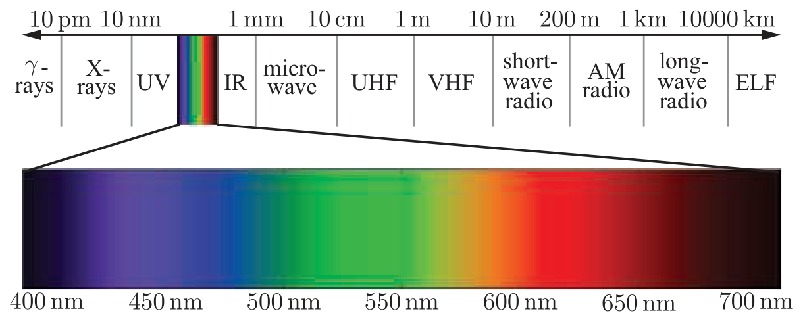
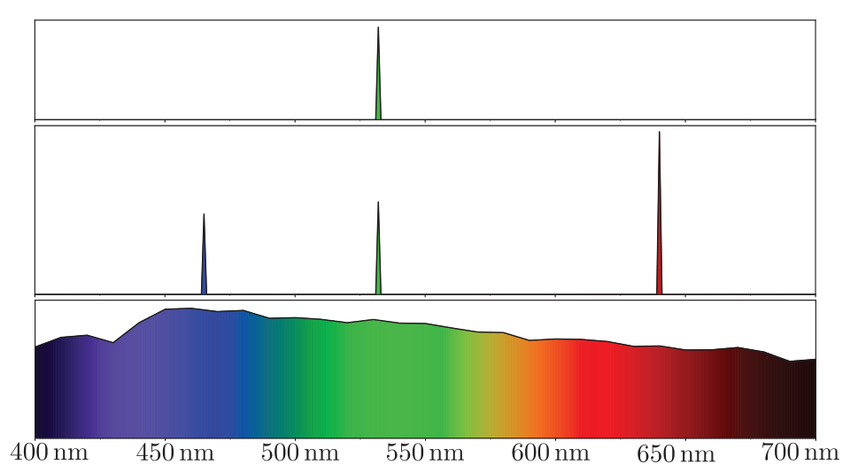

alias:: wavelength, wavelengths, 波长, 光波长

- The range of [[wavelengths]] for [[visible light]], shown in context within the full electromagnetic spectrum.
  {:height 253, :width 608}
- Most [[light waves]] contain a mixture of many different [[wavelengths]]. This is typically visualized as a [[spectral power distribution]], which is a plot showing how
  the light’s energy is *distributed* across different *wavelengths*.
- 
  id:: 650a4d13-4590-42ab-9882-c1623c56a2d3
  Figure shows three examples.
	- The top SPD is for a green [[laser]], which has an extremely narrow spectral distribution. Its waveform is similar to the simple [[sine wave]].
	- The middle SPD is for light comprised of the same green laser plus two additional lasers, one red and one blue. The wavelengths and relative [[intensities]] of these lasers correspond to an [[RGB]] *laser projection display* showing a [[neutral white color]].
	- The bottom SPD is for the standard *D65 illuminant*, which is a typical [[neutral white]] reference intended to represent outdoor lighting. Such SPDs, with energy *continuously* spread across the visible spectrum,
	  are typical for [[natural lighting]].
	  > despite the dramatic differences between the middle and bottom SPDs, they are perceived as the **same** color by human eyes.
-