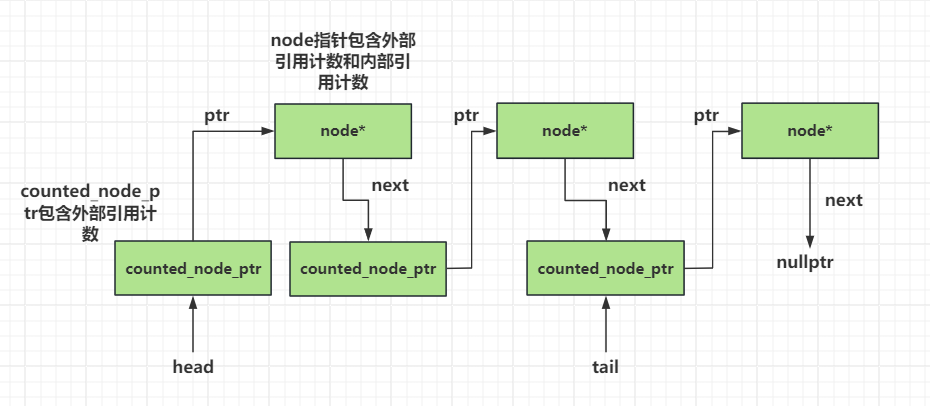

alias:: 无锁队列, 无锁线程安全队列

- 队列比栈面临略有不同的挑战，因为 `push()` 和 `pop()` 操作访问队列中数据结构的不同部分，而它们在栈中访问相同的头节点。因此，队列的同步需求不同。你需要确保在一端所做的更改在另一端访问时能够正确显示。让我们看看如何实现。
- 你需要两个节点指针：一个用于列表的头部，另一个用于尾部。你将从多个线程中访问它们，因此最好让它们是原子的，以便可以摆脱相应的互斥锁。让我们从这个小的改变开始，看看它会带来什么结果。以下是代码的结果。
- ```cpp
  // List 1
  template<typename T>
  class lock_free_queue
  {
  private:
      struct node
      {
          std::shared_ptr<T> data;
          node* next;
          node():
              next(nullptr)
          {}
      };
      std::atomic<node*> head;
      std::atomic<node*> tail;
  
      node* pop_head()
      {
          node* const old_head = head.load();
          if(old_head == tail.load()) // 1
          {
              return nullptr;
          }
          head.store(old_head->next);
          return old_head;
      }
  
  public:
      lock_free_queue():
          head(new node), tail(head.load())
      {}
  
      lock_free_queue(const lock_free_queue& other) = delete;
      lock_free_queue& operator=(const lock_free_queue& other) = delete;
  
      ~lock_free_queue()
      {
          while(node* const old_head = head.load())
          {
              head.store(old_head->next);
              delete old_head;
          }
      }
  
      std::shared_ptr<T> pop()
      {
          node* old_head = pop_head();
          if(!old_head)
          {
              return std::shared_ptr<T>();
          }
          std::shared_ptr<T> const res(old_head->data); // 2
          delete old_head;
          return res;
      }
  
      void push(T new_value)
      {
          std::shared_ptr<T> new_data(std::make_shared<T>(new_value));
          node* p = new node; // 3
          node* const old_tail = tail.load(); // 4
          old_tail->data.swap(new_data); // 5
          old_tail->next = p; // 6
          tail.store(p); // 7
      }
  };
  ```
- 乍一看，这似乎还不错，如果一次只有一个线程调用 `push()`，只有一个线程调用 `pop()`，那么这是完全可以的。在这种情况下，重要的是 `push()` 和 `pop()` 之间的先发生关系，以确保可以安全地检索数据。对 `tail` 的存储⑦与从 `tail` 的加载①同步；对前一个节点的数据指针的存储⑤在对 `tail` 的存储之前排序；而对 `tail` 的加载在对数据指针的加载之前排序②，所以对数据的存储在加载之前发生，一切都很好。因此，这是一个完全可以使用的单生产者、单消费者（SPSC）队列。
- 问题出现在多个线程同时调用 `push()` 或多个线程同时调用 `pop()` 时。让我们先看 `push()`。如果有两个线程同时调用 `push()`，它们都会分配新节点作为新的空节点③，都会读取相同的 `tail` 值④，因此在设置数据和 `next` 指针时⑤和⑥，都会更新相同节点的数据成员。这是一个数据竞争！
- 在 `pop_head()` 中存在类似的问题。如果两个线程同时调用，它们都会读取相同的 `head` 值，然后都会用相同的 `next` 指针覆盖旧值。现在两个线程都会认为它们已经检索到了相同的节点——这是灾难的预兆。不仅要确保每个线程只能在一个给定项上使用 `pop()`，而且还需要确保其他线程可以安全地访问从 `head` 读取的节点的 `next` 成员。这正是你在无锁栈的 `pop()` 中看到的问题，因此任何解决方案都可以在这里使用。
- 那么，如果 `pop()` 是一个“解决的问题”，那么 `push()` 怎么办？问题在于，为了在 `push()` 和 `pop()` 之间获得所需的先发生关系，必须在更新 `tail` 之前设置空节点上的数据项。但这意味着同时调用 `push()` 会在相同的数据项上产生竞争，因为它们都读取了相同的 `tail` 指针。
- ### 在 `push()` 中处理多个线程
	- >一种选择是增加一个 dummy 节点在实际节点之间。这样，当前 `tail` 节点中唯一需要更新的部分是 `next` 指针，因此它可以是原子的。如果一个线程成功将 `next` 指针从 `nullptr` 改为其新节点，那么它就成功添加了指针；否则，它必须重新开始并重新读取 `tail`。这将需要对 `pop()` 进行一些小的更改，以丢弃数据指针为 `null` 的节点并再次循环。这里的缺点是每次 `pop()` 通常需要移除两个节点，而且内存分配的次数加倍。
	- 第二种选择是将 `data` 指针设置为原子，并通过调用 `compare/exchange` 设置它。如果调用成功，这就是你的 `tail` 节点（因为此时`data`为空），你可以安全地将 `next` 指针设置为你的新节点，然后更新 `tail`。如果 `compare/exchange` 失败，因为另一个线程已经存储了数据，那么你就循环，重新读取 `tail` 并重新开始。
	  如果 `std::shared_ptr<>` 上的原子操作是无锁的，那么你就没问题了。如果不是，则需要一个替代方案。一个可能的方案是让 `pop()` 返回 `std::unique_ptr<>`（毕竟这是唯一对该对象的引用），并将数据存储为队列中的普通指针。这将允许你将其存储为 `std::atomic<T*>`，这样就可以支持必要的 `compare_exchange_strong()` 调用。如果你使用[[引用计数]]方案来处理 `pop()` 中的多个线程，`push()` 现在看起来像这样。
	- ```cpp
	  //List 2
	  //A (broken) first attempt at revising push()
	  void push(T new_value) {
	    std::unique_ptr<T> new_data(new T(new_value));
	    counted_node_ptr new_next;
	    new_next.ptr = new node;
	    new_next.external_count = 1;
	    for (;;) {
	        node* const old_tail = tail.load(); // 1
	        T* old_data = nullptr;
	        if (old_tail->data.compare_exchange_strong(old_data, new_data.get())) // 2
	        {
	            old_tail->next = new_next;
	            tail.store(new_next.ptr); // 3
	            new_data.release();
	            break;
	        }
	    }
	  }
	  ```
	- 使用引用计数方案避免了这个特定的竞态，但这不是 `push()` 中唯一的竞态。如果查看这个 `push()` 的修订版本，你会看到在栈中见过的模式：加载一个原子指针①，然后解引用该指针②。在此期间，另一个线程可能会更新指针③，最终可能导致在 `pop()` 中节点被释放。如果节点在你解引用指针之前被释放，那么将导致未定义行为。太糟糕了！
	- 很容易想到在 `tail` 中添加与 `head` 相同的外部计数，但每个节点在队列中前一个节点的 `next` 指针中已经有一个外部计数。为同一个节点设置两个外部计数需要修改引用计数方案，以避免过早删除节点。你可以通过在节点结构中也计算外部计数器的数量，并在每个外部计数器销毁时减少这个数字（以及将对应的外部计数添加到内部计数）来解决这个问题。如果内部计数是零，并且没有外部计数器，那么你就知道可以安全地删除节点。
		- >参考[Atomic Ptr Plus Project](http://atomic-ptr-plus.sourceforge.net/) 。
	- 下面的列表显示了在这个方案下 `push()` 的样子。
	  <!--Converted by ToLogseq-->
	- ```cpp
	  //List 3
	  template<typename T>
	  class lock_free_queue
	  {
	  private:
	      struct node;
	      struct counted_node_ptr
	      {
	          int external_count;
	          node* ptr;
	      };
	      std::atomic<counted_node_ptr> head;
	      std::atomic<counted_node_ptr> tail; // 1
	      struct node_counter
	      {
	          unsigned internal_count:30;
	          unsigned external_counters:2; // 2
	      };
	      struct node
	      {
	          std::atomic<T*> data;
	          std::atomic<node_counter> count; // 3
	          counted_node_ptr next;
	          node()
	          {
	              node_counter new_count;
	              new_count.internal_count=0;
	              new_count.external_counters=2; // 4
	              count.store(new_count);
	              next.ptr=nullptr;
	              next.external_count=0;
	          }
	      };
	  public:
	      void push(T new_value)
	      {
	          std::unique_ptr<T> new_data(new T(new_value));
	          counted_node_ptr new_next;
	          new_next.ptr = new node;
	          new_next.external_count = 1;
	          counted_node_ptr old_tail = tail.load();
	          for(;;)
	          {
	              increase_external_count(tail,old_tail); // 5
	              T* old_data=nullptr;
	              if(old_tail.ptr->data.compare_exchange_strong( // 6
	                  old_data, new_data.get()))
	              {
	                  old_tail.ptr->next=new_next;
	                  old_tail=tail.exchange(new_next);
	                  free_external_counter(old_tail); // 7
	                  new_data.release();
	                  break;
	              }
	              old_tail.ptr->release_ref();
	          }
	      }
	  };
	  ```
	- 在上述代码中，`tail` 现在是 `atomic<counted_node_ptr>`，与 `head` 相同①，而 `node` 结构有一个 `count` 成员来代替之前的 `internal_count` ③。这个 `count` 是一个包含 `internal_count` 和额外的 `external_counters` 成员的结构②。
		- 注意，你只需要 2  bits 来表示 `external_counters`，因为最多只有两个这样的计数器（被前一个计数节点的 node 和 tail 指向）。通过为此使用位域并指定 `internal_count` 为 30 位值，你将总计数器大小保持在 32 位。这为较大的内部计数值提供了充分的范围，同时确保整个结构适合在 32 位和 64 位机器上。
		- 在稍后看到的情况下，重要的是要一起更新这些计数，以避免竞态。将结构保持在一个机器字以内，使得在许多平台上原子操作更有可能是无锁的。
	- `node` 以 `internal_count` 设置为 0 ，`external_counters` 设置为 2 ④ 初始化，因为当新节点加入队列中时，都会被 ``tail`` 和上一个节点的 `next` 指针所指向。
	- `push()` 本身与之前的相似，不同之处在于在 解引用从 `tail` 加载的值 来 在其 `node` 的 `data` 上调用 `compare_exchange_strong()`⑥ 之前，你调用一个新的函数 `increase_external_count()` 来增加计数⑤，之后再调用 `free_external_counter()` 来释放旧的 `tail` 值⑦。
	- {:height 304, :width 678}
	- `push()` 部分处理完毕后，让我们看看 `pop()`。这在下面的列表中显示，并将引用计数逻辑与队列 `pop()` 逻辑相结合。
- ### Pop()
	- 在看 `Pop()` 操作之前先看一眼 `increase_external_count` 函数：
	- ```cpp
	  //list 4
	  static void increase_external_count(
	    std::atomic<counted_node_ptr>& counter,
	    counted_node_ptr& old_counter)
	  {
	    counted_node_ptr new_counter;
	    do
	    {
	      new_counter = old_counter;
	      ++new_counter.external_count;
	    } while (!counter.compare_exchange_strong(
	      old_counter, new_counter,
	      std::memory_order_acquire, std::memory_order_relaxed));
	    old_counter.external_count = new_counter.external_count;
	  }
	  ```
	- 节点的弹出操作从加载 ``old_head`` 指针开始①，接着进入一个无限循环，并且令已加载好的指针上的 外部计数器 的值自增②。若头节点正巧就是尾节点，即表明队列内没有数据，我们便释放引用③（调用`releaseref()`不一定执行释放，在大多情况下，该函数的作用是根据释放意图而调整引用计数），并返回空指针。否则表明队列中存在数据，因此当前线程试图调用 `compare_exchange_strong()`将其收归已有④。这里的处理方法与无锁栈相同，以上调用会对比结构体 `head` 和 `old_head`，其成员都包括外部计数器和指针，但均被视作一个整体。无论哪个成员发生了变化而导致不匹配，代码即释放引用⑥并重新循环。如果比较-交换操作成功，当前线程就顺利地将节点所属的数据收归己有，故我们随即释放弹出节点的外部计数器⑤，再将数据返回给`pop()`的调用者。若两个外部计数器都被释放，且内部计数器值变 0 ，则节点本身可被删除。
	- ```cpp
	  //list 5
	  template<typename T>
	  class lock_free_queue
	  {
	  private:
	      struct node {
	          void release_ref();
	      };
	  public:
	      std::unique_ptr<T> pop()
	      {
	          counted_node_ptr old_head=head.load(std::memory_order_relaxed);  // 1
	          for(;;)
	          {
	              increase_external_count(head,old_head);  // 2
	              node* const ptr=old_head.ptr;
	              if(ptr==tail.load().ptr)
	              {
	                  ptr->release_ref();  // 3
	                  return std::unique_ptr<T>();
	              }
	              if(head.compare_exchange_strong(old_head,ptr->next))  // 4
	              {
	                  T* const res=ptr->data.exchange(nullptr);
	                  free_external_counter(old_head);  // 5
	                  return std::unique_ptr<T>(res);
	              }
	              ptr->release_ref();  // 6
	          }
	      }
	  };
	  ```
- ### 处理引用计数
	- 有几个函数负责处理引用计数，其代码分别由下述代码清单列出。
	- ```cpp
	  //list 6
	  template<typename T>
	  class lock_free_queue
	  {
	  private:
	      struct node {
	          void release_ref()
	          {
	              node_counter old_counter =
	                  count.load(std::memory_order_relaxed);
	              node_counter new_counter;
	              do
	              {
	                  new_counter = old_counter;
	                  --new_counter.internal_count;  // 1
	              }
	              while (!count.compare_exchange_strong(  // 2
	                  old_counter, new_counter,
	                  std::memory_order_acquire, std::memory_order_relaxed));
	              if (!new_counter.internal_count &&
	                  !new_counter.external_counters)
	              {
	                  delete this;  // 3
	              }
	          }
	      };
	  };
	  ```
	- 若要得到以上的 `node:release_ref()` 实现，只需参照`lock_free_stack:pop()` 的相应代码，稍加修改即可写出。不同之处在于，`lock_free_stack:pop()` 仅需处理一个外部计数器，故采用了简单的 `fetch_sub()` 操作，而尽管我们在这里只改动位域成员 `internal_count` ①，也必须按原子化方式更新整个计数器结构体。所以更新操作要用比较-交换函数配合循环实现②。
	  id:: 662f6f1b-1e29-41e8-905f-8848e501f190
	  当计数器`internal_count`完成自减后，如果内外两个计数器的值均为0，就表明调用`release_ref()` 的是最后一个指涉目标节点的指针（代码清单5 中③⑥两处的`ptr`），我们应当删除节点③。
	- ```cpp
	  //list 7 
	  template<typename T>
	  class lock_free_queue
	  {
	  private:
	      static void increase_external_count(
	          std::atomic<counted_node_ptr>& counter,
	          counted_node_ptr& old_counter)
	      {
	          counted_node_ptr new_counter;
	          do
	          {
	              new_counter=old_counter;
	              ++new_counter.external_count;
	          }
	          while(!counter.compare_exchange_strong(
	              old_counter,new_counter,
	              std::memory_order_acquire,std::memory_order_relaxed));
	          old_counter.external_count=new_counter.external_count;
	      }
	  };
	  ```
	- 代码清单 7 与代码清单 6 有别，属于另一种情况。这次我们获取一个新引用，而非释放引用，还要令外部计数器自增。`increase_external_count()`与无锁栈中的`increase_head count()`类似，但前者已改成了静态成员函数，需要更新的目标不再是自身固有的成员计数器，而是一个外部计数器，它通过第一个参数传入函数以进行更新。
	- ```cpp
	  //list 8
	  template<typename T>
	  class lock_free_queue
	  {
	  private:
	      static void free_external_counter(counted_node_ptr &old_node_ptr)
	      {
	          node* const ptr=old_node_ptr.ptr;
	          int const count_increase=old_node_ptr.external_count-2;
	          node_counter old_counter=
	              ptr->count.load(std::memory_order_relaxed);
	          node_counter new_counter;
	          do
	          {
	              new_counter=old_counter;
	              --new_counter.external_counters;  // 1
	              new_counter.internal_count+=count_increase;  // 2
	          }
	          while(!ptr->count.compare_exchange_strong(  // 3
	                  old_counter,new_counter,
	                  std::memory_order_acquire,std::memory_order_relaxed));
	          if(!new_counter.internal_count &&
	              !new_counter.external_counters)
	          {
	              delete ptr;  // 4
	          }
	      }
	  };
	  ```
	- 与`increase_external_counter()`对应的是`free_external_count()`函数，它与`lock_free_stack::pop()`中的部分代码类似，不过为了处理 `external_counters` 计数器而有所改动。该函数对整个计数器结构体仅执行一次 `compare_exchange_strong()`，便合并更新了其中的两个计数器③，这与`release_ref()`中更新`internal_count`的自减操作类似。计数器`internal_count`按照`lock_free_stack::pop()`的方式更新②，计数器`external_counters`则同时自减①。如果这两个值均变为 0 ，就表明目标节点再也没有被指涉，遂可以安全删除④。
	- 为了避免条件竞争，上述更新行为需要整合成单一操作完成，因此需要用比较-交换函数配合循环运行。若两项更新分别独立进行，万一有两个线程同时调用该函数，则它们可能都会认为自己是最后的执行者，所以都删除节点，结果产生未定义行为。
- ### 线程协助
	- 虽然上述代码尚可工作，也无条件竞争，但依然存在**性能问题**。在代码清单 5 中，一旦某线程开始执行 `push()` 操作，针对 `old_tail.ptr->data` 成功完成了 `compare_exchange_strong()` 调用⑥，就没有其他线程可以同时运行 `push()`。若有其他任何线程试图同时压入数据，便始终看不到 `nullptr`，而仅能看到上述线程执行`push()`传入的新值，导致`compare_exchange_strong()`调用失败，最后只能重新循环。这实际上是[[忙等]]，消耗 CPU 周期却一事无成，结果形成了**实质的锁**。第 一个`push()`调用令其他线程发生阻塞，直到执行完毕才解除，所以这段代码不是无锁实现。
	- 问题不止这一个。若别的线程被阻塞， 则**操作系统会提高对互斥[[持锁的线程]]的优先级**，好让它尽快完成，但本例却无法依此处理，被阻塞的线程将一直消耗 CPU 周期，等到最初调用`push()`的线程执行完毕才停止。 
	  这个问题带出了下一条妙计：让等待的线程协助正在执行`push()`的线程 ，以实现无锁队列。
	- 借另一线程的**协助**来实现无锁队列是为了让代码恢复无锁性质。我们需要找出一种方法，即便有线程因执行`push()`而被阻塞，也要让它继续运行下去。其中一种方法是，帮受阻线程分担工作，借此提供协助。我们很清楚应该在这种方法中具体做什么：先设定尾节点上的`next`指针，使之指向一个新的空节点，且必须随即更新`tail`指针。由于空节点全都等价，因此这里所用空节点的起源并不重要，其创建者既可以是成功压入数据的线程，也可以是等待压入数据的线程。如果将节点内的`next`指针原子化，代码就能借`compare_exchange_strong()`设置其值。只要设置好了`next`指针，便可使用`compare_exchange _weak()`配合循环设定`tail`指针， 借此令它依然指向原来的尾节点。若`tail`指针有变，则说明它已同时被别的线程更新过， 因此我们停止循环，不再重试。`Pop()`需要稍微改动才可以载入原子化的`next`指针，如 代码清单 9 所示。
	- ```cpp
	  //list 9
	  template<typename T>
	  class lock_free_queue
	  {
	  private:
	      struct node {
	          std::atomic<T*> data;
	          std::atomic<node_counter> count;
	          std::atomic<counted_node_ptr> next;  // 1
	      }; 
	  public:
	      std::unique_ptr<T> pop()
	      {
	          counted_node_ptr old_head=head.load(std::memory_order_relaxed);
	          for(;;)
	          {
	              increase_external_count(head,old_head);
	              node* const ptr=old_head.ptr;
	              if(ptr==tail.load().ptr)
	              {
	                  return std::unique_ptr<T>();
	              }
	              counted_node_ptr next=ptr->next.load();  // 2
	              if(head.compare_exchange_strong(old_head, next))
	              {
	                  T* const res=ptr->data.exchange(nullptr);
	                  free_external_counter(old_head);
	                  return std::unique_ptr<T>(res);
	              }
	              ptr->release_ref();
	          }
	      } 
	  };
	  ```
	- 前文提到过，上面的代码进行了简单改动：`next` 指针现在采用了原子变量①，并且②处的载入操作也成了原子操作。本例使用了默认的 `memory_order_seq_cst` 次序，而 `ptr->next` 指针原本属于 `std::atomic<counted_node_ptr>`型别，在②处隐式转化成 `counted_node_ptr` 型别，这将触发原子化的载入操作，故无须显式调用`load()`。不过我们还是进行了显式调用，目的是提醒自己，在以后优化时此处应该**显式设定内存次序**。
	- 新版本的`push()`相对更复杂，如代码清单 10 所示。
	  id:: 662fab5a-ea4b-4966-8036-b68dbe610254
	  ```cpp
	  // list 10 无锁队列中的push()范例，它能够接受另一线程的协助
	  template<typename T>
	  class lock_free_queue
	  {
	  private:
	      void set_new_tail(counted_node_ptr &old_tail,  // 1
	                        counted_node_ptr const &new_tail)
	      {
	          node* const current_tail_ptr=old_tail.ptr;
	          while(!tail.compare_exchange_weak(old_tail,new_tail) &&  // 2
	                old_tail.ptr==current_tail_ptr);
	          if(old_tail.ptr==current_tail_ptr)  // 3
	              free_external_counter(old_tail);  // 4
	          else
	              current_tail_ptr->release_ref();  // 5
	      }
	  public:
	      void push(T new_value)
	      {
	          std::unique_ptr<T> new_data(new T(new_value));
	          counted_node_ptr new_next;
	          new_next.ptr=new node;
	          new_next.external_count = 1;
	          counted_node_ptr old_tail = tail.load();
	          for(;;) {
	              increase_external_count(tail,old_tail);
	              T* old_data = nullptr;
	              if(old_tail.ptr->data.compare_exchange_strong(  // 6
	                 old_data,new_data.get()))
	              {
	                  counted_node_ptr old_next={0};
	                  if(!old_tail.ptr->next.compare_exchange_strong(  // 7
	                     old_next,new_next))
	                  {
	                      delete new_next.ptr;  // 8
	                      new_next=old_next;  // 9
	                  }
	                  set_new_tail(old_tail, new_next);
	                  new_data.release();
	                  break;
	              }
	              else // 10
	              {
	                  counted_node_ptr old_next={0};
	                  if(old_tail.ptr->next.compare_exchange_strong(  // 11
	                     old_next,new_next))
	                  {
	                      old_next=new_next;  // 12
	                      new_next.ptr=new node;  // 13
	                  }
	                  set_new_tail(old_tail, old_next);  // 14
	              }
	          }
	      }
	  };
	  ```
	- 代码清单 10 中的`push()`实现与代码清单 4 中的原版 `push()`类似，但存在一些重要区别。由于我们确实想在⑥处设置 `data` 指针，而且还需接受另一线程的协助，因此引入了 `else` 分支以处理该情形⑩。
	- 上述新版本的 `push()`先在⑥处设置好节点内的 `data` 指针，然后通过 `compare_exchange_strong()`更新 `next` 指针⑦，从而避免了循环。若交换操作失败，我们便知道另一线程同时抢先设定了 `next` 指针，遂无须保留函数中最初分配的新节点，可以将它删除⑧。虽然 `next` 指针是由别的线程设定的，但代码依然持有其值，留待后面更新 `tail` 指针⑨。
	- 更新 `tail` 指针的代码被提取出来，写成 `set_new_tail()` 函数①。它通过 `compare_exchange_weak()` 配合循环来更新 `tail`指针②。如果其他线程试图通过 `push()` 压入新节点，计数器 `external_count` 就会发生变化，而上述新函数正是为了防止错失这一变化。但我们也要注意，若另一线程成功更新了`tail`指针，其值便不得再次改变。若当前线程重复更新 `tail` 指针，便会导致控制流程在队列内部不断循环，这种做法完全错误。相应地，如果比较-交换操作失败，所载入的 `ptr` 指针也需要保持不变。在脱离循环时，假如 `ptr` 指针的原值和新值保持一致③，就说明 `tail` 指针的值肯定已经设置好，原有的外部计数器则需要释放④。若 `ptr` 指针前后有所变化，则另一线程将释放计数器，而当前线程要释放它持有的唯一一个 `tail` 指针⑤。
	- 这里，若多个线程同时调用 `push()` ，那么只有一个线程能成功地在循环中设置 `data` 指针，失败的线程则转去协助成功的线程完成更新。当前线程一进入 `push()` 就分配了一个新节点，我们先更新 `next` 指针，使之指向该节点⑪。假定操作成功，该节点就充当新的尾节点⑫，而我们还需另行分配一个新节点，为下一个压入队列的数据预先做好准备⑬。接着，代码尝试调用 `set_new _tail()` 以设置尾节点⑭，再重新循环。
	- 读者可能还注意到，这一小段代码中存在大量 `new` 和 `delete` 操作，原因是 `push()` 会分配新节点，而 `pop` 则会销毁弹出的节点。所以，内存分配器的效率大大影响了这段代码的性能。对于类似本例的无锁容器，其可扩展性**可能被低效的内存分配器完全抵消**。
		- >如何选择内存分配器，以及它们如何实现，都超出了本书的范畴，但我们必须牢记于心，要评判哪个内存分配器相对更优，唯一的方法就是进行测试，对比前后版本的代码性能。
		- 常见的内存分配优化技术包括为每个线程配备独立的内存分配器，引入空闲内存列表循环使用节点（即[[free list]]，又称自由列表，是[[内存池]]的一种实现方式，主要用于管理小片内存的动态分配和回收），而不是把它们交回内存分配器处理。