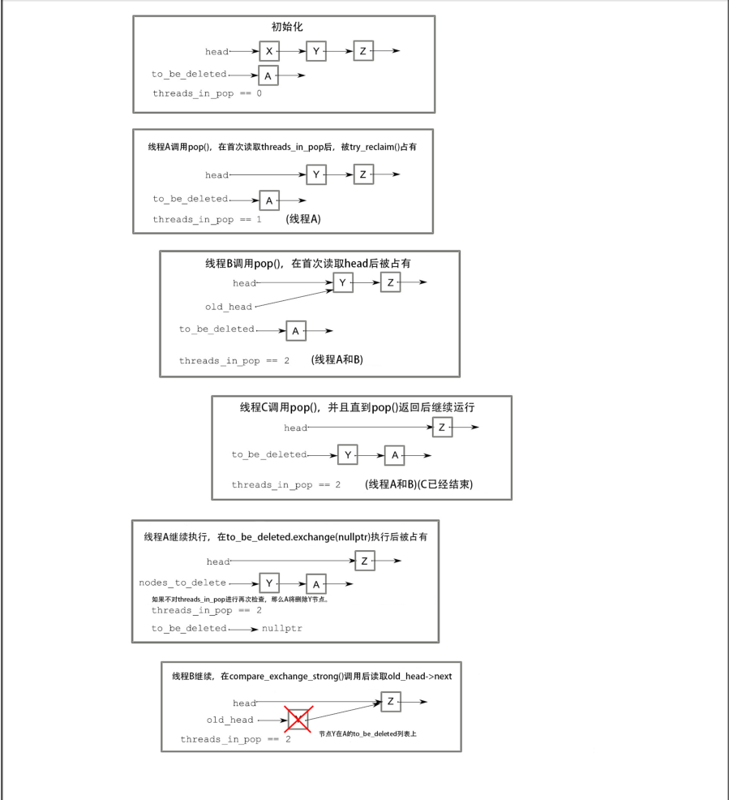

alias:: 无锁的线程安全栈, 无锁栈

- 栈的基本前提相对简单：节点以与添加它们相反的顺序被检索 —— 后进先出（LIFO）。因此，**确保一旦将值添加到栈中，就可以立即由另一个线程安全地检索它很重要**，也重要的是确保只有一个线程返回给定值。
- ## Push
  最简单的栈是[[链表]]；头指针标识第一个节点（这将是下一个要检索的），然后每个节点依次指向下一个节点。
  在这种方案下，添加节点相对简单：
	- 创建一个新节点。
	  logseq.order-list-type:: number
	- 将其`next`指针设置为当前`head`节点。
	  logseq.order-list-type:: number
	- 将头节点设置为指向它。
	  logseq.order-list-type:: number
	- >这在单线程上下文中运行得很好，但如果两个线程正在添加节点，第2步和第3步之间会存在竞态条件：第二个线程可能在 你的线程在第2步中读取`head`的值 和 你在第3步中更新它 之间修改头的值。这将导致该其他线程所做的更改被丢弃或更糟的情况。
	  在我们探讨解决这种竞态条件之前，还需要注意一旦头被更新为指向你的新节点，另一个线程就可以读取该节点。因此，在设置头指针指向它之前彻底准备好你的新节点是至关重要的；你不能在之后修改节点。
- 那么，你能做些什么来解决这个棘手的竞态条件呢？答案是在第3步使用原子[[比较交换操作]]来确保自你在第2步读取以来`head`没有被修改。如果有变化，你可以循环并再次尝试。以下列表展示了如何实现一个无锁的线程安全的 `push()` 操作。
- ``` cpp
  //lock_free_stack_1
  template<typename T>
  class lock_free_stack
  {
  private:
      struct node
      {
          T data;
          node* next;
          node(T const& data_): // 1
              data(data_)
          {}
      };
      std::atomic<node*> head;
  public:
      void push(T const& data)
      {
          node* const new_node=new node(data); // 2
          new_node->next=head.load(); // 3
        	//上一步中的赋值不是最终结构。如果失败，通过引用更新 new_node->next ，使其始终指向最新的head
          while(!head.compare_exchange_weak(new_node->next,new_node)); // 4 
      }
  };
  ```
- 这段代码恰好符合前面的三点计划：创建一个新节点（2），将节点的下一个指针设置为当前的头指针（3），然后将头指针设置为新节点（4）。
  通过在节点构造函数中填充节点结构的数据（1），你确保了一旦节点构造完成，它就准备就绪，这是个简单问题的解决方案。
  然后你使用 `compare_exchange_weak()` 来确保头指针仍然具有与你存储在 `new_node->next`（3）中相同的值，如果是这样，你就将其设置为 `new_node`。这部分代码还使用了比较交换功能的一个巧妙部分：如果它返回 `false` 来指示比较失败（例如，因为头指针被另一个线程修改），作为第一个参数的值（`new_node->next`）会更新为头指针的当前值。因此，你不必每次通过循环时都重新加载头指针，因为编译器会为你完成这一操作。此外，由于你直接在失败时循环，你可以使用 `compare_exchange_weak`，在某些架构上，这可能比 `compare_exchange_strong` 生成更优化的代码。
- 所以，你可能还没有一个 `pop()` 操作，但你可以快速检查 `push()` 是否符合指南。唯一可能抛出异常的地方是新节点的构造（1），但这将自行清理，并且列表尚未被修改，所以这是完全安全的。因为你构建的数据作为节点的一部分，并且使用 `compare_exchange_weak()` 来更新头指针，这里没有问题性的竞态条件。一旦比较/交换成功，节点就在列表上并准备被取走。没有锁，所以没有死锁的可能性，你的 `push()` 函数表现出色。
- ## Pop
- 现在你已经有了向栈中添加数据的方法，你需要一种方法来移除它。表面上看，这很简单：
	- 读取头指针的当前值。
	  logseq.order-list-type:: number
	- 读取 `head->next`。
	  logseq.order-list-type:: number
	- 将头设置为 `head->next`。
	  logseq.order-list-type:: number
	- 返回检索到的节点的数据。
	  logseq.order-list-type:: number
	- 删除检索到的节点。
	  logseq.order-list-type:: number
- ### 解决1-4步的问题
  但在多线程的情况下，这并不简单。如果有两个线程从栈中移除项目，它们都可能在第1步读取相同的头指针值。如果一个线程接着一直进行到第5步，而另一个还没进行到第2步，第二个线程将会解引用一个悬空指针。这是编写无锁代码时最大的问题之一，所以现在你将略过第5步并泄漏节点内存。
- 然而，这并不是所有问题。还有另一个问题：如果两个线程读取了相同的头指针值，它们将返回相同的节点。这违反了栈数据结构的意图，所以你需要避免这种情况。你可以用与 `push()` 中解决竞态的同样方式来解决这个问题：使用比较交换来更新头指针。如果比较交换失败，可能是有新节点被推入或另一个线程弹出了你试图弹出的节点。无论哪种方式，你都需要返回到第1步（尽管比较交换调用为你重新读取了头指针）。
  一旦比较/交换调用成功，你就知道你是唯一一个从栈中弹出给定节点的线程，所以你可以安全地执行第4步。这里是第一次尝试 `pop()`：
  
  ```cpp
  //lock_free_stack_2
  template<typename T>
  class lock_free_stack {
  public:
  void pop(T& result) {
      node* old_head = head.load();
        while (!head.compare_exchange_weak(old_head, old_head->next));
        result = old_head->data;
    }
  };
  ```
  尽管这样简洁明了，除了泄漏节点之外，仍然存在一些问题。首先，它在空列表上不起作用：如果头是空指针，它将尝试读取下一个指针，从而导致未定义行为。通过在 `while` 循环中检查 `nullptr` 并抛出一个空栈异常或返回一个布尔值来表示成功或失败，可以轻松修复这个问题。
- ### 解决第5步的问题
- 第二个问题是[[异常安全性]]问题。通过值返回对象时会留下了一个异常安全性问题：**如果在复制返回值时抛出异常，那么值就会丢失（参考[[返回值的异常安全性]]）**。在那种情况下，传入一个引用作为结果是一个可以接受的解决方案，因为你可以确保如果抛出异常，栈将保持不变。
  不幸的是，在这里你没有这种便利；你只能在确定你是唯一返回节点的线程后安全地复制数据，这意味着节点已经从队列中移除。因此，通过引用传入返回值的目标不再是一个优势：你可以直接通过值返回。如果你想安全地返回值，你必须使用另一个选项：返回一个（智能）指针指向数据值。
  如果你返回一个智能指针，你可以返回 `nullptr` 来表示没有值可返回，但这要求数据必须在堆上分配。如果你在 `pop()` 的过程中进行堆分配，你还是没有好转，因为堆分配可能抛出异常。相反，你可以在将数据 `push()` 到栈上时分配内存——你无论如何都需要为节点分配内存。返回 `std::shared_ptr<>` 不会抛出异常，所以现在 `pop()` 是安全的。综合这些给出以下代码示例。
- ``` cpp
  //lock_free_stack_3 带有节点泄露的无锁栈
  template<typename T>
  class lock_free_stack
  {
  private:
      struct node
      {
          std::shared_ptr<T> data; // 1 通过shared_ptr获取数据
          node* next;
          node(T const& data_):
              data(std::make_shared<T>(data_)) // 2 让 std::shared_ptr 指向新分配出来的 T
          {}
      };
      std::atomic<node*> head;
  public:
      void push(T const& data)
      {
          node* const new_node=new node(data);
          new_node->next=head.load();
          while(!head.compare_exchange_weak(new_node->next,new_node));
      }
      std::shared_ptr<T> pop()
      {
          node* old_head=head.load();
          while(old_head && // 3 在解引用前检查old_head是否为空指针
              !head.compare_exchange_weak(old_head,old_head->next));
          return old_head ? old_head->data : std::shared_ptr<T>(); // 4
      }
  };
  ```
- 数据现在由共享指针持有（1），所以你必须在节点构造函数中在堆上分配数据（2）。在 `compare_exchange_weak()` 循环中，你还必须在解引用 `old_head` 之前检查空指针（3）。最后，你要么返回与你的节点关联的数据（如果有的话），要么返回空指针（如果没有的话）（4）。请注意，虽然这是无锁的，但不是无等待的，因为如果 `compare_exchange_weak()` 持续失败的话，无论是 `push()` 还是 `pop()` 中的 `while` 循环理论上可能会无限循环。
  collapsed:: true
	- >如果你有一个垃圾收集器在你后面清理（如在 C# 或 Java 这样的托管语言中），你就完成了；一旦不再有线程访问旧节点，它将被收集并回收。但并不是很多 C++ 编译器附带垃圾收集器，所以你通常需要自己清理。
- ## 无锁数据结构中管理内存
- >当你第一次查看 `pop()` 时，你选择了泄漏节点以避免出现一个线程删除节点而另一个线程仍持有即将被解引用的节点指针的竞态条件。但在任何合理的 C++ 程序中，泄漏内存都是不可接受的，所以你必须对此采取措施。现在是时候看看问题并找出解决方案了。
- 如果你需要处理多个线程在同一栈实例上调用 `pop()` 的情况，你需要某种方式来跟踪何时可以安全地删除一个节点。这意味着你需要为节点编写一个特殊用途的垃圾收集器。但情况并不那么糟糕：你只是在检查节点，并且你只检查从 `pop()` 访问的节点。你不用担心 `push()` 中的节点，因为它们在被添加到栈上之前只能由一个线程访问，而在 `pop()` 中，多个线程可能正在访问同一个节点。
- 如果没有线程调用 `pop()`，完全可以安全地删除当前等待删除的所有节点。因此，如果在提取数据后将节点添加到^^待删除列表^^中，那么当没有线程调用 `pop()` 时，你可以删除它们所有。如果你在进入时递增一个计数器并在退出时递减该计数器，当计数器为零时删除“待删除”列表中的节点是安全的。它必须是一个原子计数器，以便可以从多个线程安全地访问。下面的代码显示了修改后的 `pop()` 函数，以及支持这一实现的函数。
- ``` cpp
  //lock_free_stack_4 没有线程使用pop()访问节点时，就对节点进行回收
  template<typename T>
  class lock_free_stack
  {
  private:
      std::atomic<unsigned> threads_in_pop; // 1 原子变量
      void try_reclaim(node* old_head); //会递减threads_in_pop();
  public:
      std::shared_ptr<T> pop()
      {
          ++threads_in_pop; // 2 在做其他事之前，计数值加1
          node* old_head=head.load();
          while(old_head &&
              !head.compare_exchange_weak(old_head, old_head->next));
          std::shared_ptr<T> res;
          if(old_head)
          {
              res.swap(old_head->data); // 3 回收删除的节点
          }
          try_reclaim(old_head); // 4 从节点中直接提取数据，而非拷贝指针
          return res;
      }
  };
  ```
- 原子变量 `threads_in_pop`（1）用于计算当前尝试从栈中弹出项目的线程数。它在 `pop()` 开始时递增（2），并在节点被移除后调用 `try_reclaim` 时递减（4）。
  因为你将潜在地延迟删除节点本身，**所以你可以使用 `swap()` 来移除节点中的数据（3），而不是复制指针，这样当你不再需要数据时数据将被自动删除**，而不是因为在尚未删除的节点中仍有引用而被保留。下一个列表显示了 `try_reclaim()` 中的内容。
- ``` cpp
  //lock_free_stack_5 使用引用计数的回收机制
  template<typename T>
  class lock_free_stack
  {
  private:
      std::atomic<node*> to_be_deleted;
  
      static void delete_nodes(node* nodes)
      {
          while(nodes)
          {
              node* next=nodes->next;
              delete nodes;
              nodes=next;
          }
      }
  
      void try_reclaim(node* old_head)
      {
          if(threads_in_pop==1) // 1
          {
              node* nodes_to_delete=to_be_deleted.exchange(nullptr); // 2 声明“待删除”列表，
              if(!--threads_in_pop) // 3 是否只有一个线程调用pop()?
              {
                  delete_nodes(nodes_to_delete); // 4
              }
              else if(nodes_to_delete) // 5
              {
                  chain_pending_nodes(nodes_to_delete); // 6
              }
              delete old_head; // 7
          }
          else
          {
              chain_pending_node(old_head); // 8
              --threads_in_pop;
          }
      }
  
      void chain_pending_nodes(node* nodes)
      {
          node* last=nodes;
          while(node* const next=last->next) // 9 让next指针指向链表的末尾
          {
              last=next;
          }
          chain_pending_nodes(nodes,last);
      }
  
      void chain_pending_nodes(node* first,node* last)
      {
          last->next=to_be_deleted; // 10
        	//当没有在处理新添加进待删除列表的节点时，将列表中的第一个节点设置为to_be_deleted节点
          while(!to_be_deleted.compare_exchange_weak(last->next,first)); // 11 用循环来保证last->next的正确性
          
      }
      void chain_pending_node(node* n)
      {
          chain_pending_nodes(n,n); // 12
      }
  };
  ```
- 如果在你尝试回收节点（1）时 `threads_in_pop` 的计数为 1，那么你就是当前在 `pop()` 中唯一的线程，这意味着可以安全地删除你刚刚移除的节点（7），并且也可能安全地删除等待中的节点。如果计数不为 1，那么删除任何节点都是不安全的，所以你必须将节点添加到待删除列表中（8）。
- 假设某一时刻`threads_in_pop` 为 1。你现在需要尝试回收待删除中的节点；如果不这样做，它们将一直等待直到你销毁栈。为此，你首先通过一个原子交换操作来自己认领**待删除列表**（2），然后减少 `threads_in_pop` 的计数（3）。如果在减少后计数为零，你就知道没有其他线程可以访问这个待删除节点的列表。可能有新的等待节点，但现在你不需要担心它们，只要你回收列表是安全的就行。然后你可以调用 `delete_nodes` 来遍历列表并删除它们（4）。
- 如果减少后计数不为零，回收节点是不安全的，所以如果有任何节点（5），你必须将它们重新链接回待删除节点的列表中（6）。这可能发生在多个线程并发访问数据结构时。其他线程可能在第一次测试 `threads_in_pop`（1）和“认领”列表（2）之间调用了 `pop()`，可能向列表中添加了新的仍被一个或多个其他线程访问的节点。在 图1 中，线程 C 将节点 Y 添加到 `to_be_deleted` 列表中，尽管线程 B 仍在引用它作为 `old_head`，并将尝试读取其 next 指针。因此，**线程 A 不能删除节点，否则可能会导致线程 B 出现未定义行为**。
  
- 为了将待删除的节点链接到待删除列表中，你**重用节点的 `next` 指针**将它们链接在一起。在将现有链 重新链接回列表的情况下，你遍历链以找到末端（9），将最后一个节点的 next 指针替换为当前的 `to_be_deleted` 指针（10），并将链中的第一个节点存储为新的 `to_be_deleted` 指针（11）。在这里你必须使用 `compare_exchange_weak` 在循环中以确保你没有泄漏任何由另一个线程添加的节点。这样做的好处是如果链末端的 next 指针已被更改，它会更新 next 指针。将单个节点添加到列表中是一个特殊情况，其中要添加的链的第一个节点与最后一个节点相同（12）。
- 这在低负载情况下运作得相当好，在这种情况下没有线程处于 `pop()` 中，会有适当的[[静止点]]。但这可能是一种短暂的情况，这就是为什么你在进行回收之前需要测试 `threads_in_pop` 计数减少到 0（3），并且为什么这个测试发生在你删除刚移除的节点（7）之前。删除节点可能是一个耗时的操作，你希望其他线程修改列表的时间窗口尽可能小。从线程首次发现 `threads_in_pop` 等于 1 到尝试删除节点之间的时间越长，其他线程调用 `pop()` 的机会就越大，且 `threads_in_pop` 不再等于 1，阻止了节点的删除。
- **在高负载情况下，可能永远不会有这种静止状态**，因为其他线程在所有最初在 `pop()` 中的线程离开之前就已经进入了 `pop()`。在这种情况下，`to_be_deleted` 列表会无限增长，你将再次泄漏内存。
- 如果不会有任何静止期，你需要找到一个替代机制来回收节点。关键是**确定没有更多线程访问特定节点时可以回收它**。到目前为止，最容易推理的机制是使用[[危险指针]]。
- ## 使用[[危险指针]]检测无法回收的节点
- ## 使用[引用计数]([[引用计数无锁栈]])检测使用中的节点
- ## [[应用内存排序的无锁栈]]