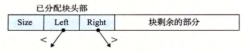

alias:: mark & sweep

- [[Mark&Sweep 垃圾收集器]]由 *标记* (mark) 阶段和 *清除* (sweep) 阶段组成，
	- 标记阶段 标记出 *根节点* 的所有 *可达的* 和 *已分配的后继* ，
	- 而后面的 清除阶段 释放每个 *未被标记的已分配块*。
- [[块头部]]中 空闲的低位中的一位 通常用来表示这个块 是否被标记了 。我们对 Mark&Sweep 的描述将假设使用下列函数，其中 `ptr` 定义为 `typedef void * ptr`:
	- `ptr isPtr (ptr p)`。如果 `p` 指向一个已分配块中的某个字，那么就返回一个指向这个块的起始位置的指针 `b` 。否则返回 `NULL` 。
	- `int blockMarked (ptr b)`。如果块 `b` 是已标记的，那么就返回 `true` 。
	- `int blockAllocated (ptr b)` 。如果块 `b` 是巳分配的，那么就返回 `true` 。
	- `void markBlock (ptr b)` 。标记块 `b` 。
	- `int length (b)` 。返回块 `b` 的以字为单位的长度（不包括[[块头部]]）。
	- `void unmarkBlock (ptr b)` 。 将块 `b` 的状态由己标记的改为未标记的。
	- `ptr nextBlock (ptr b)` 。返回堆中块 `b` 的后继。
- *标记阶段* 为每个 *根节点* 调用一次 `mark` 函数：
  ``` c
  void mark(ptrp)
  {
  	if((b=isPtr(p)) == NULL)
  		return;
  	if(blockMarked(b))
        	return;
  	markBlock(b);
  	len =length(b);
  	for(i=0；i<len；i++)
      {
  		mark(b[i]); //对块中的每个字递归地调用自身
      }
  	return;
  }
  ```
  每次对 `mark` 函数的调用都标记某个根节点的所有未标记并且可达的后继节点。
  在标记阶段的末尾，任何未标记的已分配块都被认定为是不可达的，是垃圾，可以在清除阶段回收。
- 清除阶段是对如下 `sweep` 函数的一次调用。 
  ``` c
  void sweep(ptr b, ptr end)
  {
  	while (b<end) 
  	{
  		if(blockMarked(b))
  			unmarkBlock(b);
  		else if (blockAllocated(b))
  			free(b);
  		b=nextBlock(b);
      }
  return;
  }
  ```
  `sweep` 函数在堆中每个块上反复循环，释放它所遇到的所有未标记的已分配块（也就是垃圾）。
- # C程序的保守 Mark & Sweep
	- Mark&Sweep 对 C程序的[[垃圾收集]]是一种合适的方法，因为它可以就地工作，而不需要移动任何块。然而， C语言为 `isPtr` 函数的实现造成了一些有趣的挑战。
		- C 不会用任何[[类型信息]]来标记 *内存位置* 。因此，对 `isPtr` 没有一种明显的方式来判断它的输入参数 `p` 是不是一个指针。
		  logseq.order-list-type:: number
		- 即使我们知道 `p` 是一个指针，对 `isPtr` 也没有明显的方式来判断 `p` 是否指向一个[[已分配块]]的[[有效载荷]]中的某个位置。
		  logseq.order-list-type:: number
		  id:: 6579d484-b7e0-404d-9c0c-17c3acab9ddb
	- 对后一问题的解决方法是将已分配块集合维护成一棵[[平衡二叉树]]，这棵树保持着这样一个属性：*左子树* 中的所有块都放在 较小的地址 处，而 *右子树* 中的所有块都放在 较大的地址 处。
	  如图所示，这就要求每个 *已分配块* 的头部里有两个附加字段(`left`和`right`)。每个字段指向某个已分配块的头部。
	  `isPtr (ptr p)`函数用树来执行对已分配块的[[二分查找]]。在每一步中，它依赖于[[块头部]]中的大小字段来判断`p` **是否落在这个块的范围之内**。
		- 
	- 平衡树方法保证会标记所有从根节点可达的节点，从这个意义上来说它是正确的 。 这是一个必要的保证，因为应用程序的用户当然不会喜欢把他们的已分配块过早地返回给空闲链表。
	  id:: 6579d719-f566-4ae8-86cc-0dae9042397a
	- 然而，这种方法从某种意义上而言又是保守的，因为它可能不正确地标记实际上不可达的块，因此它可能不会释放某些垃圾。虽然这并不影响应用程序的正确性，但是这可能导致不必要的外部碎片。 C 程序的 Mark & Sweep 收集器必须是保守的，其根本原因是 C 语 言 不会用类型信息来标记内存位置。因此，像 1 吐或者 float 这样的标量可以伪装成指针。例如，假设某个可达的已分配块在它的有效载荷中包含一个 int, 其值碰巧对应于某个其他已分配块 b的有效载荷中的 一 个地址。对收集器而 言 ，是没有办法推断出这个数据实际上是 int 而不是指针。因此，分配器必须保守地将块 b 标记为可达，尽管事实上它可能是不可达的。