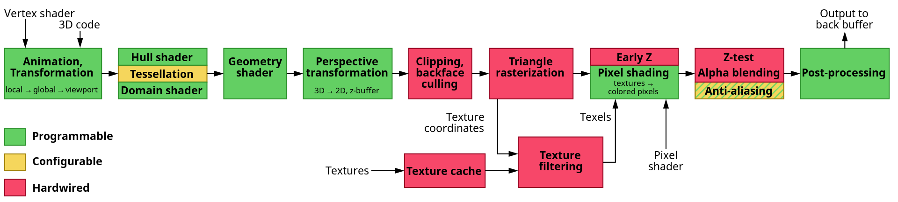

alias:: merging stage, ROP, raster operations, render output unit, 合并阶段

- #RenderingPipelineStage
- The information for each *pixel* is stored in the [[color buffer]], which is a *rectangular array* of [[colors]]. It is the responsibility of the [[merging stage]] to combine the *fragment color* produced by the [[pixel shading stage]] with the *color* currently stored in the *buffer*.
  Unlike the [[pixel shading stage]], the *GPU subunit* that performs this stage is typically **not fully programmable**. However, it is highly configurable, enabling various effects.
- 每个[[像素]]的[[颜色值]]信息存储在[[color buffer]]中。
  [[Merging Stage]]的主要责任是将[[像素着色阶段]]生成的 *fragment color* 与当前存储在[[color buffer]]中的 颜色值 相结合，称为[[颜色混合]]。
  在**大多数**传统的流水线中，该阶段也是[[Stencil Buffer]]和[[z-buffer]]操作发生的地方。
- 与 *像素着色阶段* 不同，执行此阶段的 *GPU子单元* 通常**不是完全可编程的**。然而，它是高度可配置的，能够实现各种效果。
  
	- ## [[z-buffer]]
		- This stage is also responsible for resolving [[visibility]]. 
		  This means that when the whole scene has been rendered, the [[color buffer]] should contain the *colors* of the *primitives* in the scene that are [[visible]] from the [[point of view]] of the [[camera]]. 
		  For most or even all *graphics hardware*, this is done with the [[z-buffer]] *algorithm*.
	- ## [[Stencil Buffer]]
		- The [[stencil buffer]] is an [[offscreen buffer]] used to *record* the *locations* of the rendered primitive. 
		  It typically contains $8$ *bits* per pixel. 
		  Primitives can be rendered into the [[stencil buffer]] using various functions, and the *buffer*’s contents can then be used to **control rendering into the [[color buffer]] and [[z-buffer]]**.
		- > As an example, assume that a filled circle has been drawn into the stencil buffer. This can be combined with an operator that allows rendering of subsequent primitives into the color buffer only where the circle is present. The stencil buffer can be a powerful tool for generating some special effects.
	- ## [[颜色混合]]
		- All these functions at the end of the *pipeline* are called [[raster operations]] or [[blend operations]]. 
		  As mentioned, [[blending]] is typically *configurable* using the *API* and not *fully programmable*.
		  However, some *APIs* have support for [[raster order views]], also called [[pixel shader ordering]], which enable *programmable blending* capabilities.
- ## [[Early-Z]]
	- 想象一下，通过光栅化生成的片元经过像素着色器处理，然后在应用[[z buffer]]时发现被先前渲染的某个片段隐藏。那么在像素着色器中进行的所有处理都是**不必要的**。
	  为了避免这种浪费，许多GPU在像素着色器执行**之前**执行一些 *合并测试* 。片段的[[z-depth]]（以及其他正在使用的内容，如[[模板缓冲]]或[[scissoring]]）用于 测试[[可见性]]。如果片段被隐藏，该片段将被剔除。这个功能被称为[[early-z]]。
	- [[像素着色器]]具有更改片元的z深度或完全丢弃片段的能力。如果在像素着色器程序中发现存在任何一种操作类型，则通常无法使用early-z，并且通常会关闭它，从而使流水线的效率降低。DirectX 11和OpenGL 4.2允许像素着色器强制启用early-z测试，但带有一些限制[530]。有关early-z和其他z缓冲优化的更多信息，请参见第23.7节。有效使用early-z对性能有很大的影响，这在第18.4.5节中有详细讨论。
- # Double Buffering
	- The screen displays the contents of the [[color buffer]]. To avoid allowing the human viewer to see the primitives as they are **being rasterized and sent to the screen**, [[double buffering]] is used. This means that the rendering of a scene **takes place** off screen, in a [[back buffer]].
	  Once the scene has been rendered in the [[back buffer]], the contents of the *back buffer* are **swapped with** the contents of the [[front buffer]] that was previously displayed on the screen. 
	  The *swapping* often occurs during [[vertical retrace]], a time when it is safe to do so.
-
-