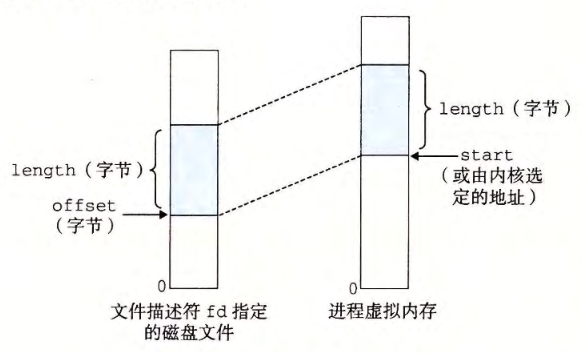

alias:: mmap 函数

- ## 用户级内存映射
- [[Linux]][[进程]]可以使用[[mmap 函数]]来创建新的[[虚拟内存区域]]，并将[[目标]][映射]([[内存映射]])到这些 区域 中。
- ``` c
  #include <unistd.h>
  #include <sys/mman.h> 
  
  //返回：若成功时则为指向映射区域的指针，若出错则为 MAP_FAILED(-1) 。
  void *mmap(void *start, size_t length, int prot, int flags, int fd, off_t offset);
  ```
- [[mmap]]函数要求[[内核]]创建一个新的[[虚拟内存区域]]，最好是从地址`start`开始的一个区域，并将[[文件描述符]] `fd` 指定的 目标 的一个连续的[[片]]映射到这个 新的区域 。连续的目标片大小为`length`字节，从 距文件开始处偏移量 为`offset`字节的地方开始。 `start`地址仅仅是一个提示，通常被定义为 `NULL` 。为了我们的目的，我们总是假设[[起始地址]]为 `NULL`。下图描述了这些参数的意义。
- 
- 参数 `prot` 包含描述新映射的虚拟内存区域的[[访问权限位]]（即在相应区域结构中的[[vm_ prot]]位）。•
	- `PROT_EXEC`: 这个区域内的页面由可以被 CPU 执行的[[指令]]组成。
	- `PROT_READ`: 这个区域内的页面[[可读]]。
	- `PROT _WRITE`: 这个区域内的页面[[可写]]。
	- `PROT _NONE`: 这个区域内的页面不能被访问。参数 flags由描述被映射对象类型的位组成。如果设置了 MAP_ANON标记位，那么被映射的对象就是一个匿名对象，而相应的虚拟页面是请求二进制零的。 MAP _PRIVATE表示被映射的对象是一个私有的、写时复制的对象，而 MAP_SHARED表示是一个共享对象。例如 bufp= Mmap(NULL, size, PROT_READ, MAP_PRIVATEIMAP_ANON,0, O);让内核创建一个新的包含 size字节的只读、私有、请求二进制零的虚拟内存区域。如果调用成功，那么 bufp包含新区域的地址。 munmap函数删除虚拟内存的区域：