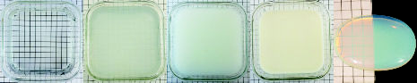

- [[nonhomogeneous media]] can often be modeled as [[homogeneous media]] with embedded *scattering particles*.
- > From left to right: water, water with a few drops of milk, water with about 10% milk, whole milk, and opalescent glass.
  Most of milk’s scattering particles are larger than visible light wavelengths, so its scattering is primarily colorless, with a faint blue tint apparent in the middle image. The scattering particles in the opalescent glass are all smaller than visible light wavelengths and thus scatter blue light more strongly than red light. Due to the split light and dark background, transmitted light is more visible on the left and scattered light is more visible on the right.
  
-