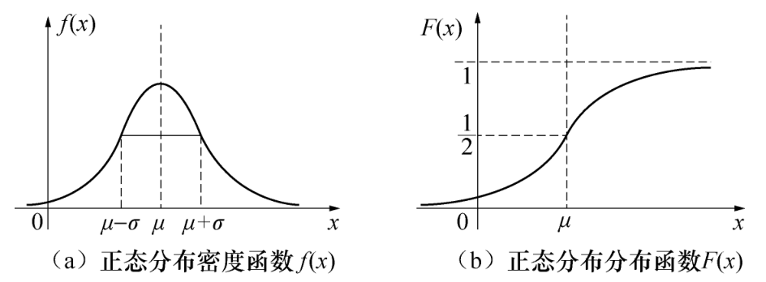
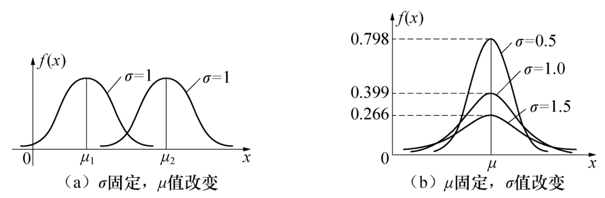

alias:: 正太分布, Gaussian distribution, 高斯分布

- # Definition
	- 设 $X$ 为[[随机变量]]，[[概率密度函数]]为
	  logseq.order-list-type:: number
	  $$f(x)=\frac{e^{-\frac{(x-\mu)^2}{2\sigma^2}}}{\sqrt{2\pi}\sigma},\quad -\infty<x<+\infty$$
	  则称 随机变量 $X$ 服从参数为 $μ(－∞ <μ<＋∞ )$ 和 $\sigma^2(\sigma>0)$ 的[[正态分布]]记为 $X\sim N(\mu, \sigma^2)$ .
	- 若 $X\sim N(\mu, \sigma^2)$ ，则相应的[[分布函数]]为
	  logseq.order-list-type:: number
	  $$
	  F(x)=\int_{-\infty}^{x}\frac{1}{\sqrt{2\pi}\sigma}\mathrm{e}^{-\frac{(t-\mu)^2}{2\sigma^2}}\mathrm{d}t.
	  $$
	  它是一条光滑上升的 Ｓ 形曲线.
	- [[正太分布密度函数]]和[[正太分布分布函数]]如图所示：
	  
- 正态分布概率密度函数有如下性质:
  (１) 正态分布密度函数曲线是一条对称的倒钟形曲线ꎬ 中间高ꎬ 两边低ꎬ 左右关于直
  线 ｘ ＝μ 对称ꎻ
  (２) 当 ｘ ＝μ 时ꎬ ｆ(ｘ)取最大值
  １
  ２π σ
  ꎬ 而这个值随 σ 增大而减小ꎻ
  (３) 固定 σꎬ 改变 μ 的值ꎬ 则曲线沿 ｘ 轴平移ꎬ 但不改变其形状ꎬ 所以参数 μ 又称为
  位置参数. 如图 ２􀆰 ７(ａ)所示ꎻ
  (４) 固定 μꎬ 改变 σ 的值ꎬ 则曲线的位置不变ꎬ 但随着 σ 的值越小ꎬ 曲线越陡峭ꎬ 所
  以参数 σ 又称为尺度参数ꎬ 如图 ２􀆰 ７(ｂ)所示.
- 
- 特别地ꎬ 当 μ＝ ０ꎬ σ ＝ １ 时ꎬ 相应的正态分布称为标准正态分布ꎬ 记为 Ｘ ~ Ｎ(０ꎬ １).
  其概率密度函数和分布函数分别为
- $$
  f(\:x\:)=\frac{1}{\sqrt{2\pi}}\mathrm{e}^{-\frac{x^{2}}{2}}\hat{=}\varphi(\:x\:)\:,\:-\infty<x<+\infty\:,
  $$
- $$
  F(\:x\:)=\int_{-\infty}^{x}\frac{1}{\sqrt{2\pi}}\mathrm{e}^{-\frac{i^{2}}{2}}\mathrm{d}t\hat{=}\Phi(\:x\:)\:,\:-\infty<x<+\infty\:.
  $$
- # Theorem
	- 定理 设随机变量$X{\sim}N(\mu,\:\sigma^2)$，则$\frac{X-\mu}{\sigma}{\sim}N(0,\:1).$
	  logseq.order-list-type:: number