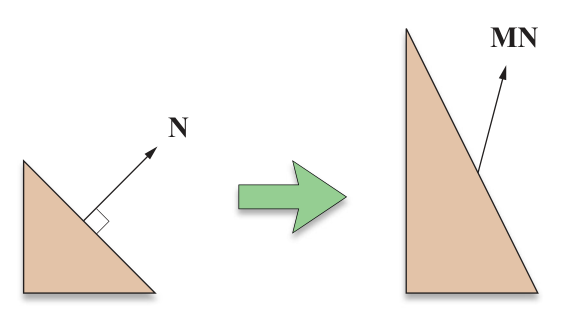

alias:: normals, 法线, up vector, up, 法向量

- ## 法线变换
	- 如下图所示，用[[非正交矩阵]] $\boldsymbol M$ 对[[法线]] $N$ 进行[[变换]]后，法线往往不再与其所在[[平面]][[垂直]]。 
	  {:width 570/2, :height 319/2}
	  所以我们需要寻找一个相应的 *变换矩阵* 来使 *法线* 也能被正确的变换。
	- 因为[[切线]] $\bold N$ 和[[法线]] $\bold T$ 一定是 *垂直* 的，所以 
	  $$\bold N\cdot \bold T=0$$ 
	  设 *变换* 后仍满足这个等式的 $\bold T$ 和 $\bold N$为 $\bold T'$ 和 $\bold N'$。
	  给定一个[[变换矩阵]] $\boldsymbol M$, 我们知道 
	  $$\bold T'=\boldsymbol m\bold T$$
	  设所求的 $\bold N$ 的[[变换矩阵]]为 $\boldsymbol G$, 则
	  $$
	  \mathbf{N}^{\prime}\cdot\mathbf{T}^{\prime}=(\boldsymbol{G}\bold{N})\cdot(\boldsymbol{M}\bold{T})=(\boldsymbol{G}\bold{N})^T(\boldsymbol{M}\bold{T})=\bold N^T\boldsymbol G^T\boldsymbol M\bold T=0
	  $$
	  因为 $\bold N\cdot \bold T=0$ , 所以 $\boldsymbol G^T\boldsymbol M=\boldsymbol I$, 即
	  $$\boldsymbol G=(\boldsymbol M^{-1})^T$$
-
- ## Transforming Normal Vectors
	- Since [[tangents]] and [[normals]] are perpendicular, the tangent vector $\bold T$ and the
	- normal vector N associated with a vertex must satisfy the equation $\mathbf{N}\cdot\mathbf{T}=0$ . We must also require that this equation be satisfied by the transformed tangent vector
	  $\text{T'}$and the transformed normal vector N’.Given a transformation matrix M, we know that T”=MT. We Would like to find the transformation matrix G with which the vector N should be transformed so that
	- $$
	  \mathbf{N}^{\prime}\cdot\mathbf{T}^{\prime}=(\mathbf{GN})\cdot(\mathbf{MT})=0.
	  $$
	- (4.30)
	- A little algebraic manipulation gives us
	- $$
	  \begin{aligned}(\mathbf{GN})\cdot(\mathbf{MT})&=(\mathbf{GN})^\mathrm{T}(\mathbf{MT})\\&=\mathbf{N}^\mathrm{T}\mathbf{G}^\mathrm{T}\mathbf{MT}.\end{aligned}
	  $$
	- (4.31)
	- Since $\mathbf{N}^{\mathrm{T}}\mathbf{T}=0$ , the equation $\mathbf{N}^{\mathrm{T}}\mathbf{G}^{\mathrm{T}}\mathbf{MT}=0$ is satisfied if $\mathbf{G}^{\mathrm{T}}\mathbf{M}=\mathbf{I}$ We therefore conclude that $\mathbf{G}=\left(\mathbf{M}^{-1}\right)^{\mathrm{T}}$ . This tells us that a normal vector is correctly trans-formed using the inverse transpose of the matrix used to transform points. Vec-tors that must be transformed in this way are called covariant vectors, and vec-tors that are transformed in the ordinary fashion using the matrix M（such as points and tangent vectors) are called contravariant vectors.
	  If the matrix M is orthogonal, then M- = M", and thus $\left(\mathbf{M}^{-1}\right)^{\mathrm{T}}=\mathbf{M}$ . There-
	- fore, the inverse transpose operation required to transform normal vectors can be avoided when M is known to be orthogonal, as is the case when M is equal to one of the rotation matrices R,,R,R,,or $\text{R}$ A presented earlier in this chapter.
-
-