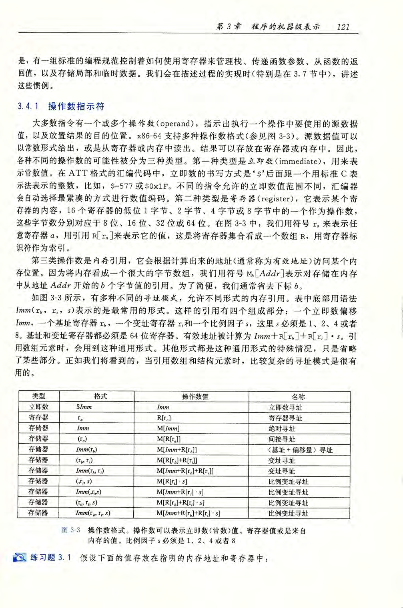

alias:: 操作数, 运算对象, 运算元, 运算子

- C语言数据类型在[[X86-64]]中的大小：
  |C 声明|Intel 数据类型|汇编代码后缀|大小(字节）|
  |--|--|--|--|
  |char|[[byte]]|b|1|
  |short|[[word]]|w|2|
  |int|[[double word]]|l|4|
  |long|[[quad word]]|q|8|
  |char *|quad word|q|8|
  |float|[[single precision]]|s|4|
  |double|[[double precision]]|l|8|
-
- 操作数有三种类型：
	- *立即数*（[[immediate]]）：常量整数数据
	  logseq.order-list-type:: number
		- 类似于 C语言中的常数，但以`$`为前缀。
		- 用1、2或4字节编码。
		- #+BEGIN_PINNED
		  `0x400`，`$-533`
		  #+END_PINNED
	- *寄存器*（[[register]]）：16个整数 寄存器 中的一个
	  logseq.order-list-type:: number
		- `%rsp` 保留作特殊用途；其他寄存器在特定指令中具有特殊用途。
		- #+BEGIN_PINNED
		  `%rax`，`%r13`
		  #+END_PINNED
	- 内存（[[memory]]）: x64中为由[[寄存器]]给出的[[地址]]上的 8 个连续字节的内存。
	  logseq.order-list-type:: number
		- 有多种不同的寻址模式
		- #+BEGIN_PINNED
		  `(%rax)`
		  #+END_PINNED
- {:height 1185, :width 780}