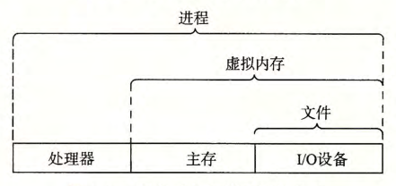

alias:: 操作系统, OS

- # Reference
	- [操作系统导论 (Remzi H. Arpaci-Dusseau etc.) (Z-Library).pdf](../assets/操作系统导论_(Remzi_H._Arpaci-Dusseau_etc.)_(Z-Library)_1699459834569_0.pdf)
	- [operating_systems_three_easy_pieces.pdf](../assets/operating_systems_three_easy_pieces_1699541971746_0.pdf)
	- [现代操作系统 (Andrew S. Tanenbaum, Herbert Bos) (Z-Library).pdf](../assets/现代操作系统_(Andrew_S._Tanenbaum,_Herbert_Bos)_(Z-Library)_1699540299178_0.pdf)
	- [操作系统：原理与实现 (陈海波，夏虞斌) (Z-Library).pdf](../assets/操作系统：原理与实现_(陈海波，夏虞斌)_(Z-Library)_1710089774126_0.pdf)
	- [现代操作系统原理与实现 (陈海波,夏虞斌) (Z-Library).pdf](../assets/现代操作系统原理与实现_(陈海波,夏虞斌)_(Z-Library)_1699540305359_0.pdf)
	- _(Z-Library)_1699540415753_0.pdf)
	- _(Robert_Love)_(Z-Library)_1699540426816_0.pdf)
	- _拉戈_(Stephen_A.Rago))_(Z-Library)_1699540435208_0.pdf)
	- [[csapp]]
- 可以把操作系统看成是[[应用程序]]和[[硬件]]之间插入的一层[[软件]]。
- 操作系统有两个基本功能：
	- 防止硬件被 失控的应用程序 滥用；
	  logseq.order-list-type:: number
	- 向应用程序提供简单一致的机制来控制复杂而又通常大不相同的 低级硬件设备 。 
	  logseq.order-list-type:: number
	- 操作系统通过几个基本的 *抽象* 概念来实现这两个功能 。
	  logseq.order-list-type:: number
		- [[文件]]是对[[I/O 设备]]的 *抽象表示* 。
		  logseq.order-list-type:: number
		- [[虚拟内存]]是对[[主存]]和[[磁盘]][[I/0 设备]]的抽象表示。
		  logseq.order-list-type:: number
		- [[进程]]是对[[处理器]]、[[主存]]和[[I/O 设备]]的抽象表示。
		  logseq.order-list-type:: number
		- 