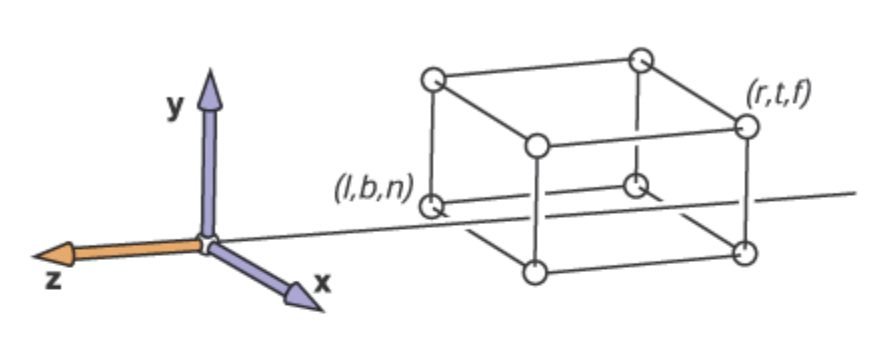
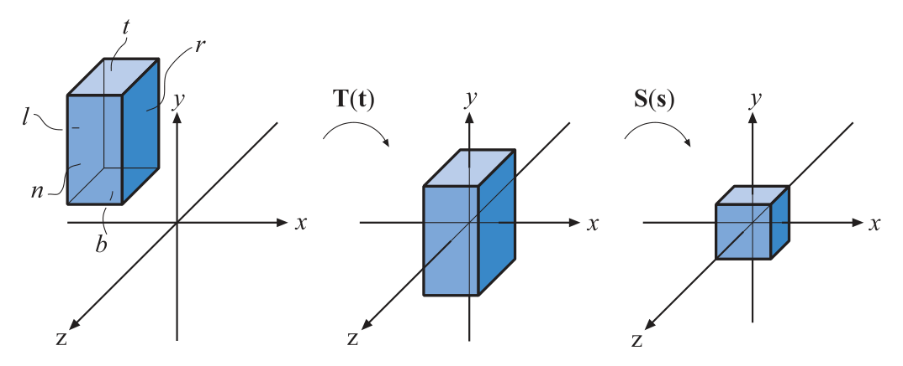

alias:: 正交投影, 正交投影变换, 正交投影矩阵

- [[Orthographic projection]] is just one type of [[parallel projection]].
  Several others find use, particularly in the field of architecture, such as [[oblique projection]] and [[axonometric projections]].
- The [[view volume]] of [[orthographic viewing]] is normally a [[rectangular box]], and the [[orthographic projection]] [[transforms]] this *view volume* into the [[unit cube]]. The main characteristic of *orthographic projection* is that [[parallel]] *lines* remain *parallel* after the *transform*. This *transformation* is a combination of a [[translation]] and a [[scaling]].
- 正交投影的 [[view volume]]是[[axis-aligned bounding box]]. 当假设[[view space]]为[[右手坐标系]]，*摄像机* [[模型空间]]为[[左手坐标系]]时, 各平面和 [[摄像机]][[模型空间]]各[[坐标轴]]对应关系如下图所示：
  {:height 354/2, :width 883/2}
  > $n > f$ 是因为 *摄像机* 位于 *原点* ，假设[[view space]]为[[右手坐标系]]，*摄像机* [[模型空间]]为[[左手坐标系]] 。 [[view space]]的 $+z$ *轴*, 即观察方向, 相当于摄像机[[模型空间]]中的 $-z$ *轴* .
- 把这个 *AABB* [[view volume]]变换到 [[canonical view volume]]的[[正交投影矩阵]]为
  \begin{aligned}
  \boldsymbol{P}_o=\boldsymbol{S}(\mathbf{s})\boldsymbol{T}(\mathbf{t}) &=\begin{pmatrix}\dfrac2{r-l}&0&0&0\\0&\dfrac2{t-b}&0&0\\0&0&\dfrac2{f-n}&0\\0&0&0&1\end{pmatrix}\begin{pmatrix}1&0&0&-\dfrac{l+r}2\\0&1&0&-\dfrac{t+b}2\\0&0&1&-\dfrac{f+n}2\\0&0&0&1\end{pmatrix} \\
  &=\left(\begin{array}{cccc}\dfrac{2}{r-l}&0&0&-\dfrac{r+l}{r-l}\\0&\dfrac{2}{t-b}&0&-\dfrac{t+b}{t-b}\\0&0&\dfrac{2}{f-n}&-\dfrac{f+n}{f-n}\\0&0&0&1\end{array}\right)
  \end{aligned}
  变换首先[[平移]][[AABB]]，使[[原点]]位于其 *中心*；然后再将$6$ 个[[平面]]内的点[[缩放]]到[[unit cube]]范围内(不适用于[[DirectX]])。如下图所示：
  {:width 1074/2, :height 437/2}
-