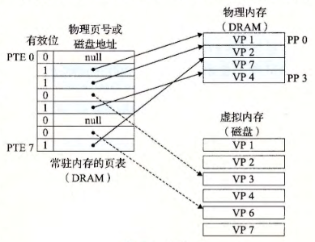
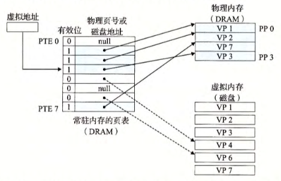
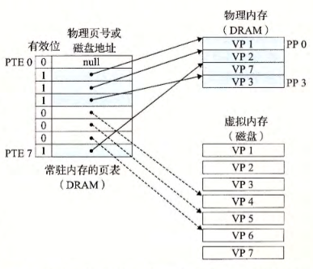

alias:: 页表

- 同任何[[缓存]]一样，虚拟内存系统必须有某种方法来判定一个[[虚拟页]]是否缓存在[[DRAM]]中的某个地方。
  如果是，系统还必须确定这个虚拟页存放在哪个[[物理页]]中。
  如果不命中，系统必须判断查找的这个虚拟页存放在[[磁盘]]的哪个位置，在[[物理内存]]中选择一个[[牺牲页]]，并将虚拟页从磁盘**复制**到 DRAM中，**替换**这个牺牲页。
- 这些功能是由软硬件联合提供的，包括[[操作系统]]软件、 [[MMU]]中的[[地址翻译硬件]]和一个存放在[[物理内存]]中叫做[[页表]]的数据结构。
  [[页表]]将[[虚拟页]]映射到[[物理页]]。
  每次 地址翻译硬件 将一个[[虚拟地址]]转换为[[物理地址]]时，都会**读取**页表。
  操作系统 负责维护 页表 的内容，以及在 磁盘 与 DRAM 之间来回**传送页**。
- 下图展示了一个页表的基本组织结构。页表 就是一个[[页表条目]](PTE)的[[数组]]。[[虚拟地址空间]]中的**每个 页 在页表中一个 固定偏移量 处都有一个[[PTE]]**。
	- 
	  id:: 65696b96-a8ec-4bce-9527-48c40fe4c6e4
- 为了我们的目的，我们将假设每个[[PTE]]是由 一个[[有效位]] 和 一个 $n$ 位[[地址字段]] 组成的。
	- [[有效位]]表明了该[[虚拟页]]当前是否被[[物理内存]]**缓存**在[[DRAM]]中。
		- 如果设置了有效位，那么[[地址字段]]就表示 DRAM 中相应的[[物理页]]的起始位置，这个 物理页 中缓存了 该虚拟页 。
		- 如果没有设置有效位，那么一个 空地址 表示这个虚拟页还[未被分配]([[未分配页]])。
		  否则，这个地址就指向 该虚拟页在[[磁盘]]上的**起始位置**。
- # [[页命中]]
	- 如[图](((65696b96-a8ec-4bce-9527-48c40fe4c6e4)))所示，如当[[CPU]]想要读包含在 VP 2 中的虚拟内存的一个字时,  地址翻译硬件将 虚拟地址 作为一个索引来定位 PTE 2, 并从内存中读取它。因为设置了有效位，那么地址翻译硬件就知道 VP 2 是缓存在内存中的了。所以它使用 PTE 中的物理内存地址（该地址指向 pp 1 中缓存页的起始位置），构造出这个字的物理地址。
- # [[缺页]]
	- [[DRAM]]缓存不命中称为[[缺页]]。
		- [图](((65696b96-a8ec-4bce-9527-48c40fe4c6e4)))中展示了在缺页之前我们的示例页表的状态。 
		  CPU 引用了 VP 3中的一个字， VP3并未缓存在 DRAM中。地址翻译硬件从内存中读取 PTE 3, 从有效位推断出 VP 3 [未被缓存]([[未缓存页]])，并且触发一个[[缺页异常]]。缺页异常调用[[内核]]中的[[缺页异常处理程序]]，该程序会选择一 个[[牺牲页]]，在此例中就是存放在 PP 3 中的 VP 4。
		  如果 VP 4 已经被修改了，那么内核就会将它复制回[[磁盘]]。无论哪种情况，内核都会修改 VP 4 的[[页表条目]]，反映出 VP4 不再缓存在主存中这一事实。
		- 接下来，[[内核]]从[[磁盘]]复制 VP 3 到[[内存]]中的 PP 3, 更新 PTE 3, 随后返回。
		  当[[缺页异常处理程序]]返回时，它会**重新启动**导致缺页的 指令 ，该指令会把导致缺页的[[虚拟地址]]重发送到[[地址翻译硬件]]。但是现在， VP 3 已经缓存在主存中了，那么[[页命中]]也能由地址翻译硬件正常处理了。下图展示了在缺页之后我们的示例页表的状态。
			- 
- 虚拟内存是在 20 世纪 60 年代早期发明的，远在 CPU-内存之间差距的加大引发产生 SRAM 缓存之前。因此，虚拟内存系统使用了和 SRAM 缓存不同的术语，即使它们的许多概念是相似的。
  在[[虚拟内存]]的习惯说法中，
	- [[块]]被称为[[页]]。
	- 在磁盘和内存之间传送页的活动叫做 [[交换]] 或者[[页面调度]]。
	- 页从磁盘[[换入]]（或者[[页面调入]]） DRAM 和从 DRAM [[换出]]（或者[[页面调出]]）磁盘。
	- 一直等待，直到最后时刻，也就是当有[[不命中]]发生时，才[[换入页面]]的这种策略称为[[按需页面调度]]。
		- 也可以采用其他的方法，例如尝试着 预测不命中，在页面实际被引用之前就换入页面。然而，**所有现代系统**都使用的是[[按需页面调度]]的方式。
- # [[分配页面]]
	- 下图展示了当[[操作系统]]分配一个新的虚拟内存页时对我们示例页表的影响，例如，调用 rnalloc 的结果。在这个示例中， VP5 的分配过程是在磁盘上创建空间并更新 PTE 5, 使它指向磁盘上这个新创建的页面。
	  
-