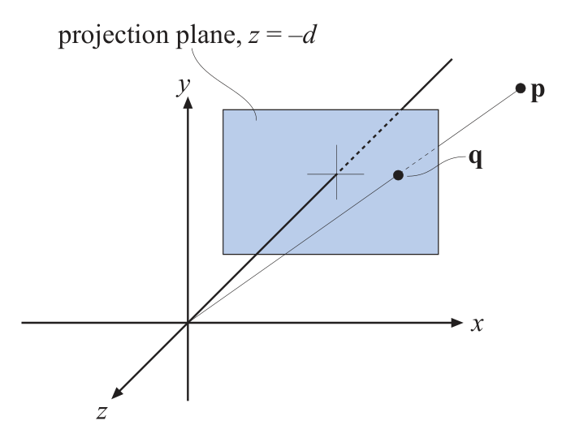
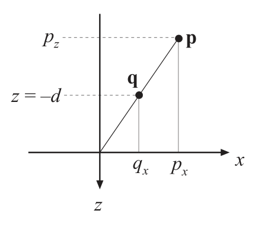
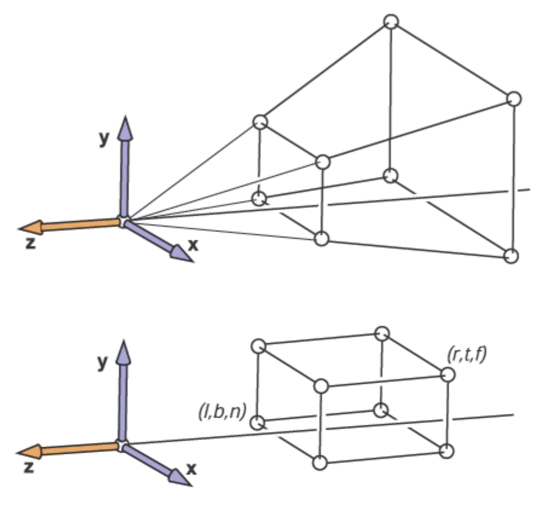

alias:: 透视投影

- In this type of [projection]([[projection stage]]), the farther away an object lies from the camera, the smaller it appears after projection. 
  id:: 64fa6aac-3d65-4ccf-808c-b047e2c0594f
  In addition, parallel lines may *converge* at the horizon. The perspective transform
  thus mimics the way we perceive objects’ size. 
  Geometrically, the [[view volume]] in [[perspective projection]], called a [[view frustum]]. 
  The *frustum* is [[transformed]] into the [[unit cube]] as well.
- ## 一般透视投影
  id:: 65038f9c-74b1-43ca-81ce-e1b79e5ef58e
	- 如下图所示：
	  {:width 692/2, :height 545/2}
	  我们将点 $\bold p$ 投影到 [[投影平面]] $z=-d$ 上生成 $\bold q$ 点 .
	  如下图所示:
	  {:width 430/2, :height 383/2}
	  根据相似三角形性质，我们能够推导出 $q_x$ 的值：
	  $$
	  \begin{aligned}\frac{q_x}{p_x}=\frac{-d}{p_z}\quad\Longleftrightarrow\quad q_x=-d\frac{p_x}{p_z}\end{aligned} \tag 1
	  $$
	  同理可推导出 $q_y=-dp_y/p_z$, $q_z=-d$ . 结合起来我们就能能到[[投影矩阵]]: 
	  $$
	  \boldsymbol M_p=\left(\begin{array}{cccc}1&0&0&0\\0&1&0&0\\0&0&1&0\\0&0&-\frac{1}{d}&0\end{array}\right) \tag 2
	  $$
	  $$
	  \bold {q}=\boldsymbol{M}_{p}\mathbf{p}=\left(\begin{array}{cccc}1&0&0&0\\0&1&0&0\\0&0&1&0\\0&0&-1/d&0\end{array}\right)\begin{pmatrix}p_x\\p_y\\p_z\\1\end{pmatrix}=\begin{pmatrix}p_x\\p_y\\p_z\\-p_z/d\end{pmatrix}\Rightarrow\begin{pmatrix}-dp_x/p_z\\-dp_y/p_z\\-d\\1\end{pmatrix} \tag 3
	  $$
	  最后一步称作[[透视除法]]，是把整个向量除以 $w$ 分量, $-p_z/d$, 从而让 $w=1$. 因为我的投影平面是 $z=-d$, 所以结果 $z$ 值永远 $-d$ 。
- # 透视投影
	- 通常使用的[[透视投影]]是如下图所示，把[[近平面]] $z=n$ 作为[[投影平面]]，其上的 *点* 保持位置不变； [[远平面]] $z=f$ 上的 *点* $z$ *分量* 保持不变的同时，将 $x$ 和 $y$ 的值缩小至和[[近平面]]相同大小的范围内。 
	  {:width 884/2, :height 844/2}
	- 根据公式 $(2)$， 可以求得此时的投影矩阵 $\boldsymbol P_p$ 为：
	  $$\boldsymbol{M}_p=
	  \begin{bmatrix}n&0&0&0\\0&n&0&0\\0&0&n+f&-fn\\0&0&1&0\end{bmatrix} \tag 4
	  $$
	  $$
	  \boldsymbol{M}_p\begin{bmatrix}x\\y\\z\\1\end{bmatrix}=\begin{bmatrix}nx\\ny\\(n+f)z-fn\\z\end{bmatrix}\sim\begin{bmatrix}\frac{nx}{z}\\\frac{ny}{z}\\n+f-\frac{fn}{z}\\1\end{bmatrix} \tag 5
	  $$
	  第一，二，三列是通过公式 $(1)$ 获得的，第三列通过带入 $z=n$ 上的 *点* 和 $z=f$ 上的 *点* 来求出：
	  \begin{aligned}
	  \boldsymbol M_{p} \begin{bmatrix}x\\y\\n\\1\end{bmatrix}\sim\begin{bmatrix}\frac{nx}{z}\\\frac{ny}{z}\\n\\1\end{bmatrix} \\
	  \boldsymbol M_{p} \begin{bmatrix}x\\y\\f\\1\end{bmatrix}\sim\begin{bmatrix}\frac{nx}{z}\\\frac{ny}{z}\\f\\1\end{bmatrix}
	  \end{aligned}
	  这种投影相对于 $(1)$ 这种把所有点全部投影到 $z$ 分量相同的同一平面，保留了$z=n$ 与 $z=f$ 间 $z$值的大小关系，允许我们之后做[[深度]]排序。
	- 有时候我们需要从[[screen coordinate]]加上[[深度]] $z$ 变换回[[透视投影]]之前的空间，可以应用$\boldsymbol M_p$ 的[[逆矩阵]]：
	  $$
	  \boldsymbol{M}^{-1}=\begin{bmatrix}f&0&0&0\\0&f&0&0\\0&0&0&fn\\0&0&-1&n+f\end{bmatrix} \tag{6}
	  $$
	- [[view frustum]]在经过[[透视投影矩阵]]变换后变得和[[正交投影]]中的[[view frustum]]一次，所以我们还要对其进行一次[[正交投影]]来变换至[[canonical view volume]]。所以完整的[[透视投影矩阵]]为
	  id:: 6504670f-f472-48ad-922b-36b4b91177d8
	  \begin{aligned}
	  \boldsymbol P_p&=\boldsymbol P_o\boldsymbol M_p \\
	  &=\begin{bmatrix}\frac{2n}{r-l}&0&\frac{l+r}{l-r}&0\\\\0&\frac{2n}{t-b}&\frac{b+t}{b-t}&0\\\\0&0&\frac{f+n}{n-f}&\frac{2fn}{f-n}\\\\0&0&1&0\end{bmatrix}  \tag{7}
	  \end{aligned}
	- 当[[far plane]] $f$ 趋向于无穷远时 ($f\to -\infty$), $(7)$ 式变为
	  \begin{aligned}
	  \boldsymbol P_p=\begin{bmatrix}\frac{2n}{r-l}&0&\frac{l+r}{l-r}&0\\\\0&\frac{2n}{t-b}&\frac{b+t}{b-t}&0\\\\0&0&-1&-2n\\\\0&0&1&0\end{bmatrix}  \tag{8}
	  \end{aligned}
	- 设 [[view frustum]]的 [[vertial field of view]] 为 $\beta$, [[aspect ratio]]为 $a$，
	  根据定义可得 
	  $$\cot\frac{\alpha}{2}=\frac{2n}{t-b}$$
	  即[[filed of view]] 由 [[近平面]]和[[侧平面]]共同决定的。
	  则 $\boldsymbol P_{p}$ 还可以表示为：
	  \begin{aligned}
	  \boldsymbol P_p=\begin{bmatrix}\frac{\cot\frac{\alpha}{2}}{a}&0&\frac{l+r}{l-r}&0\\\\0&\cot\frac{\beta}{2}&\frac{b+t}{b-t}&0\\\\0&0&\frac{f+n}{n-f}&\frac{2fn}{f-n}\\\\0&0&1&0\end{bmatrix} \tag{9}
	  \end{aligned}
-
-