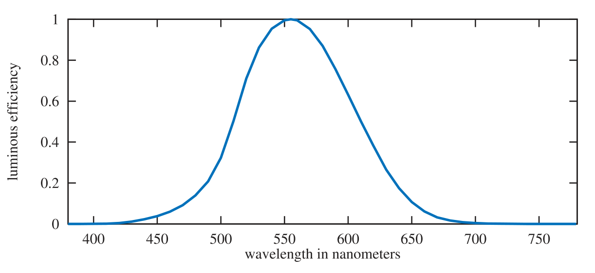

alias:: 光度学, photometric

- [[辐射度学]]只涉及物理量，不考虑人类的感知。
  一个相关的领域，[[光度学]]，与辐射度学类似，但是它将所有的计算结果都根据 *人眼的敏感性* 进行 *加权* 。
  辐射度学计算的结果可以通过乘以[[CIE photometric curve]]来转换为[[光度单位]]。如图所示。这是一个以 $555\mathrm{nm}$ 为中心的钟形曲线，代表了人眼对不同[[光波长]]的响应。
  {:height 287, :width 608}
- [[光度学]]和[[辐射度学]]理论之间的唯一区别是[转换曲线]([[CIE photometric curve]]) 和 *测量单位* 。每个 *辐射度学量* 都有一个等效的 *光度学量* 。下表显示了对应关系。
  |Radiometric Quantity: Units|Photometric Quantity: Units|
  |--|--|
  |[[radiant flux]]: $\mathrm{W}$|[[luminous flux]]: [[lumen]] ($\mathrm{lm}$)|
  |[[irradiance]]: $\mathrm{W/m^2}$|[[illuminance]]: [[lux]] ($\mathrm{lx}$)|
  |[[radiant intensity]]: $\mathrm{W/sr}$|[[luminous intensity]]: [[candela]] ($\mathrm{cd}$)|
  |[[radiance]]: $\mathrm {W/(m^2sr)}$|[[luminance]]: [[nit]]($\mathrm{cd/m^2}$)|
-