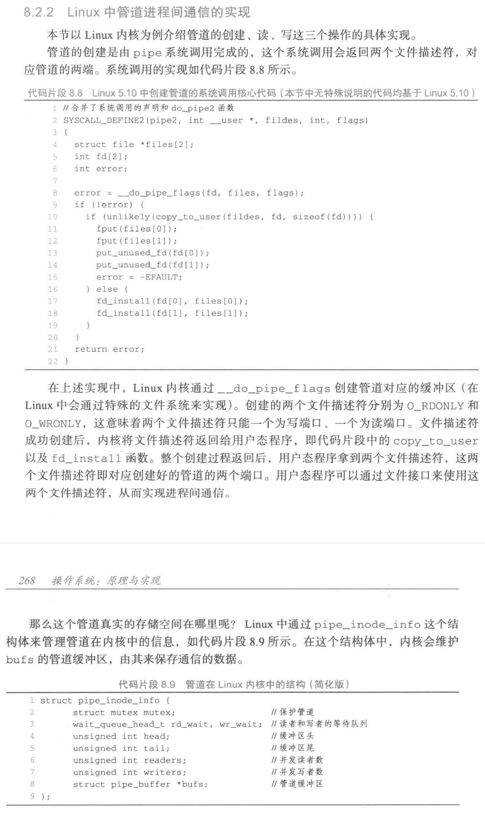
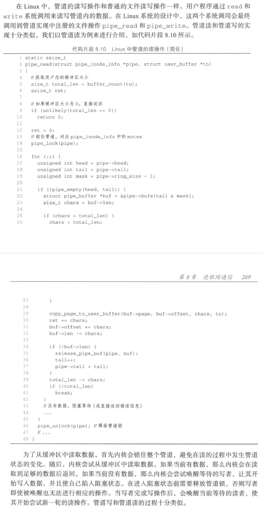

alias:: 管道

- 管道（Pipe）是[[宏内核]]场景下重要的[[进程间通信机制]]。
  id:: 65ef012e-73fa-409a-a160-5d1aae96d1f0
- 顾名思义，^^管道^^是两个[[进程]]间的一条通道，一端负责 投递 ，另一端负责 接收 。
- 举一个简单的例子，我们经常会通过 `ps aux | grep target` 来查看当前是否有关键字 `target` 相关的进程在运行。这里其实是两个命令，通过 shell 的管道符号`|`，将第一个命令的输出投递到一个管道，而管道对应的出口是第二个命令的输入。
  [[shell]]的[[管道符号]]`|`通常是利用 操作系统 提供的[[管道进程间通信机制]]来实现的，如在 Linux 系统中，可以通过[[pipe 系统调用]]让应用创建一个管道，并获取管道两端的 读 和 写 的两个端口。shell 可以通过将两个命令的标准输出（`stdout`）和标准输入（`stdin`）的文件描述符分别配置为管道的两端来实现两个命令的串联，
  如上述的例子中，[[`ps`]]命令的标准输出会被配置为^^管道的写端口^^，而[[`grep`]]命令的标准输入会被配置为^^管道的读端口^^。通过管道这种方式，`ps` 和`grep` 这两个命令对应的进程进行了一次协同合作。
- 管道是[[单向 IPC]]，内核中通常有一定的[[缓冲区]]来缓冲消息。
  而通信的数据是[[字节流]]，需要应用自己对数据进行解析，比如抽象或封装为[[消息]]。
- #+BEGIN_NOTE
  一个管道有且只能有两端，而这两端一定是一个负责输入（发送数据）一个负责输出（接收数据）的。
  #+END_NOTE
- ## Linux 管道使用案例
	- 代码片段 展示了一个Linux手册中给出的管道使用案例。该程序会通过进程[[fork()]]创建一个子进程，父进程会从命令行中读入一个字符串，并通过管道将字符串传递给子进程，而子进程将会从管道中读出该字符串并将内容打印出来。在这个案例中可以看到，在管道通过 `pipe(pipefd)` 创建之后，会得到两个文件描述符，后续对管道的使用和对文件的使用几乎是完全相同的。案例中，父进程通过`write`将数据内容写人管道，而子进程通过`read`将数据从管道中读出。父、子进程都通过`close`来关闭管道端口。
	  id:: 65ef1e51-b175-42ba-b0e5-5e7cd8859584
	  ``` c
	  #include <sys/types.h>
	  #include <sys/wait.h>
	  #include <stdio.h>
	  #include <stdlib.h>
	  #include <unistd.h>
	  #include <string.h>
	  
	  int main(int argc, char *argv [])
	  {
	      int pipefd[2];
	      pid_t cpid;
	    
	      char buf;
	      
	    	if (argc != 2)
	      {
	      	fprintf(stderr, "Usage: %s <string>\n",argv[0]);
	          exit (EXIT_FAILURE);
	      }
	        
	      if (pipe(pipefd) == -1)
	      {  	
	        	(perror("pipe");
	          exit (EXIT_FAILURE);
	      }
	           
	      cpid = fork();
	      if (cpid == -1)
	      {
	           (perror("fork");
	           exit (EXIT_FAILURE);
	      }
	            
	      if (cpid == 0) // 子进程：从管道中读取数据
	      {
	      	close(pipefd[1]);	// 关闭管道写端口
	          while (read(pipefd[0],&buf,1) > 0)
	              write(STDOUT_FILENO,&buf,1);
	          write(STDOUT_FILENO,"\n",1);
	          close(pipefd[0]);
	          _exit (EXIT_SUCCESS);
	      }
	      else	// 父进程从输入中获取一个字符串
	      {
	          close(pipefd[0]); // 关闭管道读端口
	          write(pipefd[1], argv[1], strlen(argv[1]));
	          close(pipefd[1]); // 管道读者会看到 EOF
	          wait (NULL);
	          exit (EXIT_SUCCESS);
	      }
	  }
	  ```
	  该案例显示，在管道中我们可以通过[[文件接口]]来实现进程之间通信的目的。
	- 在具体实现上，管道在[[UNIX]]系列的系统中会被当作一个[[文件]]。内核会为用户态提供代表管道的文件描述符，让其可以通过文件系统相关的系统调用来使用。
	  管道的特殊之处在于，它的创建会返回一组（两个）文件描述符，在上述案例中 pipe 会同时返回两个文件描述符，放在 `pipefd` 中。
	  不过实际上管道并不会使用存储设备，而是使用内存作为数据的缓冲区。
	  这是因为管道本质上是为了实现通信的，一方面对于可持久化没有要求，另一方面还需要保证数据传输的高性能。
	- 管道的行为和[[FIFO 队列]]非常像，最早传入的数据会最先被读出来。一个进程输入数据后，另一个进程可以通过管道读到数据。
	  如果还没有数据写入，拿到输出端的进程就开始尝试读数据，此时有两种情况：
		- 如果系统发现当前没有任何进程有这个管道的写端口，则会看到EOF（End-Of-File）；
		- 否则阻塞在这个系统调用上，等待数据的到来。
	- 这里之所以存在第一种情况（没有任何进程有该管道的写端口），是因为管道的两个端口在UNIX系列的内核中是以两个独立的文件描述符的形式存在的，写端口有可能被进程主动关闭了。在第二种情况下，进程可以通过配置非阻塞选项来避免阻塞。
- ## Linux 中管道进程间通信的实现
	- 
	  
- ## [[命名管道]]和[[匿名管道]]
	- ### 管道的连接是如何建立的？
	  在经典的UNIX实现中，管道通常有两类——命名管道和匿名管道，主要区别在于它们的创建方式。
		- ### [[匿名管道]]
			- ^^匿名管道^^是通过[[pipe 系统调用]]创建的，在创建的同时进程会拿到读写的端口（两个文件描述符）。
			  由于整个管道没有全局的“名字”，因此只能通过这两个文件描述符来使用它。
			  这种情况下，通常要结合[[fork()]]来使用，即**用继承的方式来建立[[父子进程]]间的连接**。
			- 具体过程是，父进程首先通过 `pipe` 创建对应的管道的两端，然后通过 `fork` 创建子进程。由于子进程可以继承[[文件描述符]]，父子进程相当于通过fork的继承完成了一次[[IPC 权限的分发]]。后续父子进程就可以通过管道来进行进程间的通信。
			  要注意的是，在完成继承后，其实父子进程会同时拥有管道的两端，此时需要父子进程**主动关闭多余的端口**，否则可能导致通信出错。这种连接方式对于父子进程等有着创建关系的进程来说比较方便，但是对于两个关系较远的进程就不太适用。
		- ### [[命名管道]]
			- ^^命名管道^^可以解决这个问题。命名管道是由另一个命令[[`mkfifo`]]来创建的。创建过程中会指定一个全局的文件名，由这个文件名（如`/tmp/namedpipe`）来指代一个具体的管道（即[[管道名]]）。通过这种方式，只要两个进程通过一个相同的管道名进行创建（并且都拥有对其的访问权限），就可以实现在任意两个进程间建立管道的通信连接。