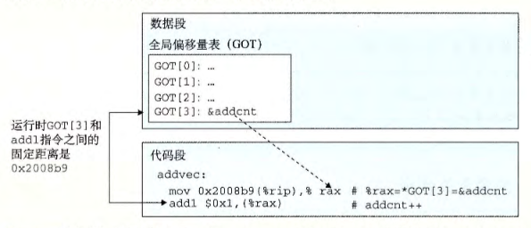

alias:: PIC, 位置无关代码

- #OS
- #+BEGIN_TIP
  [[共享库]]的一个主要目的就是允许多个正在运行的进程共享内存中相同的库代码，因而节约宝贵的内存资源。那么，多个进程是如何共享程序的一个副本的呢？
  #+END_TIP
	- 一种方法是给每个共享库分配一个事先预备的专用的地址空间片，然后要求加载器总是在这个地址加载共享库。虽然这种方法很简单，但是它也造成了一些严重的问题。
	  它对地址空间的使用效率不高，因为即使一个进程不使用这个库，那部分空间还是会被分配出来。
	  它也难以管理。我们必须保证没有片会重叠。每次当一个库修改了之后，我们必须确认已分配给它的片还适合它的大小。如果不适合了，必须找一个新的片。并且，如果创建了一个新的库，我们还必须为它寻找空间。
	  随着时间的进展，假设在一个系统中有了成百个库和库的各个版本库，就很难避免地址空间分裂成大量小的、未使用而又不再能使用的小洞。
	  更糟的是，对每个系统而言，库在内存中的分配都是不同的，这就引起了更多令人头痛的管理问题。
	- 要避免这些问题，现代系统以这样一种方式 *编译* [[共享模块]]的[[代码段]]，使得可以把它们**加载到[[内存]]的任何位置**而**无需 链接器 修改**。使用这种方法，无限多个[[进程]]可以共享一个 共享模块的代码段 的**单一副本**。（当然，每个进程仍然会有它自己的读／写[[数据块]]。）
- 可以加载而无需[[重定位]]的代码称为[[位置无关代码]]。
	- #+BEGIN_PINNED
	  用户对[[GCC]]使用`-fpic`选项指示 GNU编译系统 生成 PIC代码。
	  共享库的编译必须总是使用该选项。
	  #+END_PINNED
- 在一个 x86-64系统 中，对同一个[[目标模块]]中[[符号引用]]是不需要特殊处理来使之成为[[PIC]]。
  可以用[[PC 相对寻址]]来编译这些 引用 ，构造目标文件时由[[静态链接器]][[重定位]]。
- # PIC 数据引用
	- 无论我们在内存中的何处加载一个[[目标模块]]（包括[[共享目标模块]]），[[数据段]]与[[代码段]]的**距离总是保持不变**。因此，[[代码段]]中任何[[指令]]和[[数据段]]中任何[[变量]]之间的 距离 都是一个 *运行时常量* ，与 代码段 和 数据段 的[[绝对内存位置]]是无关的 。
	- 想要生成对[[全局变量]] *PIC 引用* 的[[编译器]]利用了这个事实，它在[[数据段]]开始的地方创建了一个表，叫做[[全局偏移量表]]（GOT）。
		- 在[[GOT]]中，每个被这个 目标模块 引用的 *全局数据目标*（[[过程]]或[[全局变量]]）都有一个 8 字节[[条目]]。编译器还为 GOT 中每个 条目 生成一个[[重定位记录]]。
		  在加载时，[[动态链接器]]会[[重定位]] GOT 中的每个条目，使得它包含目标的**正确的**[[绝对地址]] 。 每个引用 *全局目标* 的[[目标模块]]都有自己的 GOT。
			- 下图展示了示例 `libvector.so` 共享模块 的 GOT 。 `addvec` 例程通过 `GOT[3]` 间接地加载 全局变量`addcnt` 的地址，然后把 addcnt 在内存中加 1 。
			  因为 `addcnt` 是由 `libvector.so` 模块定义的，编译器可以利用 代码段 和 数据段 之间不变的距离，产生对 `addcnt` 的直接 [[PC 相对引用]]，并**增加一个[[重定位]]**，让[[动态链接器]]在构造这个[[共享模块]]时解析它。
			  不过，如果 `addcnt` 是由另一个[[共享模块]]定义的，那么就需要通过[[GOT]]进行 *间接访问* 。在这里，编译器选择采用最通用的解决方案，为所有的引用使用 GOT 。
			  
- # PIC 函数调用
	- 假设程序调用一个由 共享库 定义的[[函数]]。编译器没有办法预测这个函数的 *运行时地址*，因为定义它的共享模块在运行时可以加载到任意位置。
	  正常的方法是为该引用生成一条重定位记录，然后 动态链接器 在程序加载的时候再解析它。
	  不过，这种方法并不是 PIC, 因为它需要链接器修改调用模块的代码段， GNU 编译系统使用了一种很有趣的技术来解决这个问题，称为[[延迟绑定]], 将过程地址的绑定推迟到第一次调用该过程时。使用延迟绑定的动机是对千一个像 libc.so 这样的共享库输出的成百上千个函数中，一个典型的应用程序只会使用其中很少的一部分 。 把函数地址的解析推迟到它实际被调用的地方，能避免动态链接器在加载时进行成百上千个其实并不需要的重定位。第一次调用过程的运行时开销很大，但是其后的每次调用都只会花费 一 条指令和一个间接的内存引用。延迟绑定是通过两个数据结构之间简洁但又有些复杂的交互来实现的，这两个数据结构是： GOT 和过程链接表 (Procedure Linkage Table, PLT) 。如果一个目标模块调用定义在共享库中的任何函数，那么它就有自己的 GOT 和 PLT 。 GOT 是数据段的一部分，而 PLT 是代码段的一部分。图 7-19 展示的是 PLT 和 GOT 如何协作在运行时解析函数的地址。首先，让我们检查一下这两个表的内容。@• 过程链接表 (PLT) 。 PLT 是一个数组，其中每个条目是 16 字节代码。 PLT[O] 是一个特殊条目，它跳转到动态链接器中。每个被可执行程序调用的库函数都有它自己的 PLT 条目。每个条目都负责调用一个具体的函数。 PLT[l]( 图中未显示）调用系统启动函数(——巨 be — start —main), 它初始化执行环境，调用 main 函数并处理其返回值。从 PLT[2] 开始的条目调用用户代码调用的函数。在我们的例子中， PLT[2] 调用 addvec, PLT[3]( 图中未显示）调用 print£ 。• 全局偏移量表 (GOT) 。正如我们看到的， GOT 是一个数组，其中每个条目是 8 字节地址。和 PLT 联合使用时， GOT [OJ 和 GOT[l] 包含动态链接器在解析函数地址时会使用的信息。 GOT[2] 是动态链接器在 ld-linux.so 模块中的入口点。其余的每个条目对应千一个被调用的函数，其地址需要在运行时被解析。每个条目都有 一 个相匹配的 PLT 条目。例如， GOT[4] 和 PLT[2] 对应于 addvec 。初始时，每个 GOT条目都指向对应 PLT 条目的第二条指令