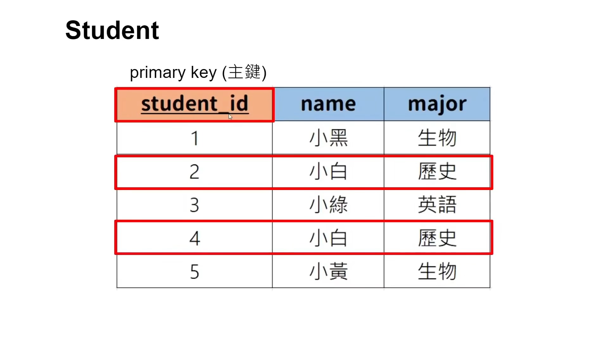
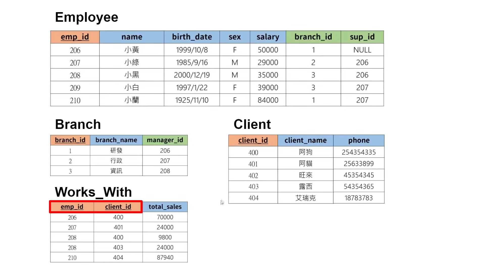

alias:: 主键

- 在关系数据库中，主键（Primary Key）是一个或多个字段的组合，用于唯一标识表中的每行记录。主键的主要目的是确保表中每个记录的唯一性，以及作为其他表引用的目标（通过外键）。主键字段不允许有重复的值，也不允许有空值。
	- {:height 368, :width 640}
- ### 主键的主要特征和作用
	- **唯一性**：
	  logseq.order-list-type:: number
		- 主键的值必须是唯一的，这意味着每个记录都可以通过其主键值被唯一标识。
	- **不可变性**：
	  logseq.order-list-type:: number
		- 一旦定义，主键字段的值通常不应更改。主键的不变性有助于保持数据的一致性和完整性。
	- **索引**：
	  logseq.order-list-type:: number
		- 数据库自动为主键创建索引，以加快数据访问速度。索引使得查找、排序和数据操作更加高效。
	- **引用完整性**：
	  logseq.order-list-type:: number
		- 主键是外键关系的基础。其他表可以通过外键引用主键表的记录，从而建立表与表之间的关系。
- ### 主键的示例
  考虑一个简单的数据库，包含一个 `Employees` 表，该表用来存储员工信息。可以选择员工的 `EmployeeID` 作为主键：
	- **Employees 表**：
	- EmployeeID (主键)
	- FirstName
	- LastName
	- Email
	- Phone
	  每个员工都有一个唯一的 `EmployeeID`，这个 `EmployeeID` 用来标识不同的员工记录。
- ### SQL 创建主键
  创建带有主键的表的 SQL 语句示例：
  ```sql
  CREATE TABLE Employees (
  EmployeeID int NOT NULL,
  FirstName varchar(255),
  LastName varchar(255),
  Email varchar(255),
  Phone varchar(255),
  PRIMARY KEY (EmployeeID)
  );
  ```
  在这个例子中，`EmployeeID` 列被定义为主键，这保证了 `Employees` 表中每行都可以通过一个唯一的 `EmployeeID` 来识别。
- ### [[复合主键]]
  当单一字段不足以唯一标识表中的记录时，可以使用由多个字段组成的复合主键。例如，在一个订单详情表中，可能需要使用 `OrderID` 和 `ProductID` 的组合作为主键，因为单独的 `OrderID` 或 `ProductID` 并不能唯一标识表中的记录。
  ```sql
  CREATE TABLE OrderDetails (
  OrderID int,
  ProductID int,
  Quantity int,
  PRIMARY KEY (OrderID, ProductID)
  );
  ```
  在这个例子中，`OrderID` 和 `ProductID` 一起作为复合主键，唯一地标识了订单详情表中的每一行。
	- 
-
-