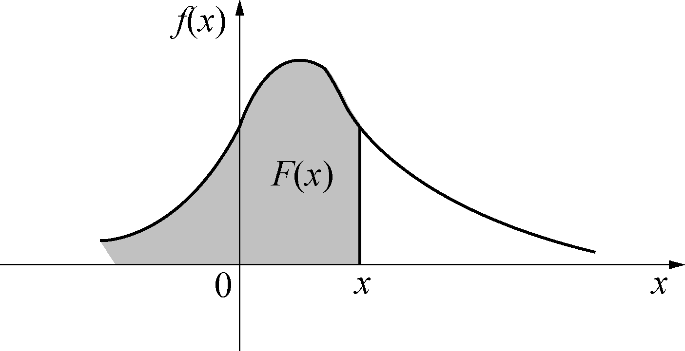

alias:: PDF, 概率密度函数, 密度函数

- # Definition
	- 设 $E$ 是[[随机试验]] , $Ω$ 是相应的[[样本空间]] , $X$ 是 $Ω$ 上的[[随
	  logseq.order-list-type:: number
	  id:: 650a7315-d823-4dae-ad5e-d13b3125762a
	  机变量]], $F(x)$ 是 $X$ 的[[分布函数]]若存在[[非负函数]] $f(x)$ 使得
	  $$F(x)=\int^x_{-\infty}f(t)\mathrm d t$$
	  则称 $X$ 为 *一维*[[连续型随机变量]], $f(x)$ 称为 $X$ 的[[概率密度函数]], 满足
		- [[非负性]]
		  logseq.order-list-type:: number
		  $$f(x)\ge 0,-\infty<x<+\infty$$
		- [[规范性]]
		  logseq.order-list-type:: number
		  $$\int^{+\infty}_{-\infty}f(x)\mathrm{d}x=1$$
	- > [[概率密度函数]] $f(x)$ 与[[分布函数]] $F(x)$ 之间的关系如图所示：
	  {:width 1407/4, :height 721/4}
- # Theorem
	- [[连续型随机变量]]具有如下性质：
	  logseq.order-list-type:: number
		- [[分布函数]] $F(x)$ 是[[连续函数]] 在 $f(x)$ 的[[连续点]]处
		  logseq.order-list-type:: number
		  $$F'(x)=f(x)$$
		- 对任意一个 *常数* $c$，
		  logseq.order-list-type:: number
		  $$P(X=c)=0, -\infty <c<+\infty$$
		  所以, 在[[事件]] $\{a\le X\le b\}$ 中剔除 $X=a$ 或 剔除 $X = b$, 都不影响[[概率]]的大小，即
		  $$
		  P(a\le X\le b)=P(a<X\le b)=P(a\le X<b)=P(a<X<b)
		  $$