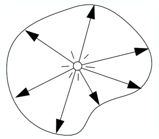
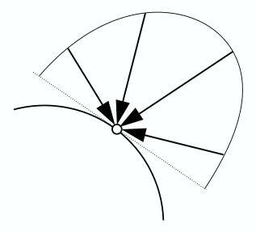
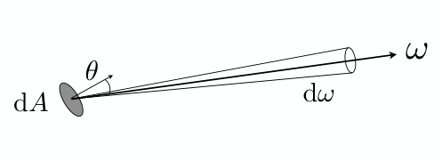

alias:: 辐射度量学, 辐射度学

- # Definition
	- [[Radiometry]]研究的是电磁辐射的测量。
	  logseq.order-list-type:: number
- id:: 65052dfe-9907-414e-abb8-aac2036d2839
  |物理量|符号|单位|定义|公式|示意图|
  |--|--|--|--|--|--|
  |辐射能([[radiant energy]])|$Q$|焦耳（[[joule]])$\mathrm{J}$|*电磁辐射* 的[[能量]]|||
  |辐射通量([[radiant flux]])|$\Phi$|瓦特([[watt]])$\mathrm{W}$|单位时间的[[辐射能]]|$\phi=\frac{\mathrm{d}Q}{\mathrm{d}t}$||
  |辐射强度([[radiant intensity]])|$I$|瓦特每球面度(watt per [[steradian]])$\mathrm{W/sr}$ or $\mathrm{\frac{lm}{sr}}$|每单位[[立体角]]的[[辐射通量]]|$I=\frac{\mathrm{d}\Phi}{\mathrm{d}\omega}$|  |
  |辐照度([[irradiance]])|$E$|瓦特每平方米$\mathrm{W/m^2}$|表面点上单位[[面积]]的[[辐射通量]]|$$E=\frac{\mathrm{d}\Phi}{\mathrm{d}{A}}$$|  |
  |辐射率([[radiance]])|$L$|$\mathrm{W/({sr}^2\cdot m^2)}$|单位[[立体角]]单位[[投影面积]]的[[辐射通量]]|$L=\frac{\mathrm{d}^2\Phi}{\mathrm{d}A\ \cos\theta\mathrm{d}\omega}$|  |
-
-