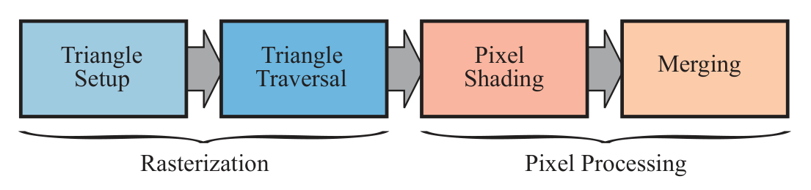

alias:: rasterization stage, 光栅化阶段, rasterizer stage, scan conversion

- #RenderingPipelineStage
- The [[rasterization stage]] typically takes as input *three [[vertices]], forming a [[triangle]], and finds all [[pixels]] that are considered inside that *triangle*, then forwards these to the next stage.
  It is processed entirely on the [[GPU]].
- Given the [[transformed]] and [[projected]] [[vertices]] with their associated [[shading data]] (all from [[geometry processing]]), **the goal of the next stage is to find all [[pixels]] that are inside the [[primitive]]**.
  We call this process [[rasterization]], and it is split up into two functional *substages*: [[triangle setup]] and [[triangle traversal]]. 
  
- [[Rasterization]] is thus the conversion from *two-dimensional vertices* in [[screen space]]—each with a [[z-value]] and various *shading information* associated with each *vertex*—into [[pixels]] on the *screen*.
- [[Rasterization]] can also be thought of as a *synchronization point* between [[geometry processing]] and [[pixel processing]].
- ### Point Sampling
  id:: 64d80cee-1d81-45d7-ba95-a3470af0d480
	- Whether the *triangle* is considered to *overlap* the *pixel* **depends** on how you have set up the *GPU’s pipeline*. 
	  For example, you may use [[point sampling]] to determine “insideness.”
	- The simplest case uses a *single point sample* in the *center* of each *pixel*, and so if that *center point* is **inside** the *triangle* then the corresponding *pixel* is considered **inside** the *triangle* as well.
	- You may also use **more than one sample per pixel** using [[supersampling]] or [[multisampling antialiasing]] techniques.
	- Yet another way is to use [[conservative rasterization]], where the definition is that a *pixel* is *inside* the triangle if **at least part of the pixel overlaps with the triangle**.
-
-