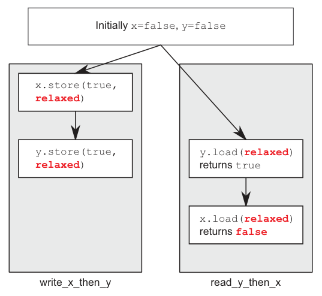
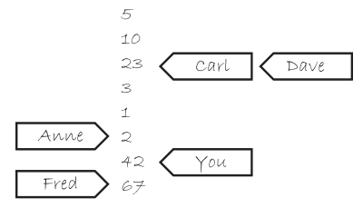

alias:: 宽松排序, 宽松内存排序

- 使用宽松排序执行的原子类型操作不参与[[synchronizes-with]]关系。在**单个线程**内对同一变量的操作仍遵循[[happens-before]] 关系，但相对于其他线程几乎没有任何排序要求。唯一的要求是，**同一线程对单个原子变量的访问不能被重新排序**；一旦给定线程看到原子变量的特定值，该线程的后续读取不能检索到该变量的较早值。没有任何额外的同步，每个 原子变量 的修改顺序是使用[[memory_order_relaxed]]的线程之间唯一共享的东西。
- ## 例子
  id:: 65e081ad-38df-4c9c-a7da-fc775968d6b4
  为了演示宽松操作可以有多宽松，你只需要两个线程，如下面的列表所示。
  ``` cpp
  #include <atomic>
  #include <thread>
  #include <assert.h>
  std::atomic<bool> x,y;
  std::atomic<int> z;
  void write_x_then_y()
  {
  	x.store(true,std::memory_order_relaxed); // 1
  	y.store(true,std::memory_order_relaxed); // 2
  }
  void read_y_then_x()
  {
  	while(!y.load(std::memory_order_relaxed)); // 3
  	if(x.load(std::memory_order_relaxed)) // 4
  		++z;
  }
  int main()
  {
      x=false;
      y=false;
      z=0;
      std::thread a(write_x_then_y);
      std::thread b(read_y_then_x);
      a.join();
      b.join();
      assert(z.load()!=0); // 5
  }
  ```
  断言5 可以触发，因为即使加载y （3）读取为真并且 存储x（1）发生在 存储y（2）之前，**加载x 也可以读取为假** 。**x 和 y 是不同的变量，因此没有关于由各自的操作产生的值的[可见性]([[内存可见性]])的排序保证**。
  > 某些情况下可能测不出来这个结果，但理论上，由于 不同 CPU 的[[缓存]]不一致 等原因，4 看到的x值不一定是 1 写过之后的值。
- **对不同变量的宽松操作可以自由地[[重新排序]]，只要它们遵守它们所受约束的[[happens-before 关系]]（例如，在同一线程内，不是[[inter-thread happens-before]] ），它们不引入 [[synchronizes-with 关系]]（虽然使用[[原子操作]]，但内存排序类型为 [[memory_order_relaxed]] ）**。
- 上述代码中的[[happens-before 关系]]如下图所示，连同一个可能的结果。尽管存储操作和加载操作之间有发生于关系，但在任何存储和加载之间都没有发生于关系，因此加载可以看到存储操作的顺序是乱序的。
  
- ## 举例
	- 理解宽松排序
	- 为了理解这是如何工作的，想象每个变量是一个坐在隔间里的人，手里有一个记事本。在他的记事本上有一个值的列表。你可以给他打电话，要求他给你一个值，或者你可以告诉他写下一个新值。如果你让他写下一个新值，他会把它写在列表的底部。如果你要求他给你一个值，他会从列表中读给你一个数字。
	- 第一次你和这个人交谈，如果你要求他给你一个值，他可能会给你他那时记事本上列表中的任何一个值。如果你随后再要求他给你另一个值，他可能会再次给你同一个值，或者列表中更下面的一个值。他永远不会给你列表上面的一个值。如果你让他写下一个数字，然后随后要求他给你一个值，他会给你你让他写下的那个数字，或者列表上那个数字下面的一个数字。
	- 假设一下，他的列表开始时包含值5, 10, 23, 3, 1和2。如果你要求一个值，你可以得到这些中的任何一个。如果他给了你10，那么下次你要求时，他可以再给你10，或者是后面的任何一个，但不是5。如果你打了五次电话，他可能会说“10, 10, 1, 2, 2”，例如。如果你让他写下42，他会把它加到列表的末尾。如果你再次要求他给你一个数字，他会一直告诉你“42”，直到他的列表上有了另一个数字，而且他愿意告诉你。
	- 现在，想象你的朋友Carl也有这个人的号码。Carl也可以给他打电话，要么让他写下一个数字，要么要求一个数字，他对Carl的规则和对你一样。他只有一个电话，所以他一次只能处理你们中的一个人，所以他记事本上的列表是一个很好的直接列表。但是，仅仅因为你让他写下一个新的数字并不意味着他必须告诉Carl，反之亦然。如果Carl要求他给一个数字并被告知“23”，那么仅仅因为你要求这个人写下42并不意味着他下次就会告诉Carl。他可能会告诉Carl任何数字23, 3, 1, 2, 42，甚至是Fred在你打电话之后让他写下的67。他完全可以告诉Carl“23, 3, 3, 1, 67”，而不会与他告诉你的内容不一致。这就像他用一个小的可移动便利贴为每个人跟踪他告诉了谁哪个数字，如图所示。
	  
	- 现在想象不仅仅是一个坐在隔间里的人，而是一整个隔间农场，有很多带电话和记事本的人。这些都是我们的原子变量。每个变量都有自己的修改顺序（记事本上的值列表），但它们之间完全没有关系。如果每个打电话的人（你，Carl，Anne，Dave和Fred）是一个线程，那么当每个操作都使用memory_order_relaxed时，你就会得到这个结果。
	- 隔间里的人还可以告诉你一些额外的事情，比如“写下这个数字，并告诉我列表底部是什么”（[[exchange]]）和 “如果列表底部的数字是那个，就写下这个数字；否则告诉我我应该猜什么”（[[compare_exchange_strong]]），但这不影响一般原则。
	- 如果你考虑[例子](((65e081ad-38df-4c9c-a7da-fc775968d6b4)))中的程序逻辑，那么write_x_then_y就像是某个人给隔间x里的人打电话，让他写真，然后给隔间y里的人打电话，让他写真。运行read_y_then_x的线程反复给隔间y里的人打电话要求一个值，直到他说真，然后给隔间x的人打电话要求一个值。隔间x里的人**没有义务给你列表上的任何特定值，并且完全有权说假**。
- 这使得处理宽松的原子操作变得困难。它们**必须与具有更强排序语义的原子操作结合使用**，以便用于线程间同步。
  id:: 65e16cd6-c3c4-4dc5-9bfa-6582e0c36bbe
  我强烈建议除非绝对必要，否则避免使用宽松的原子操作，并且即使使用也要极其小心。
- 一种在不增加 完全顺序一致性 开销的情况下实现额外同步的方法是使用[[获取-释放排序]]。