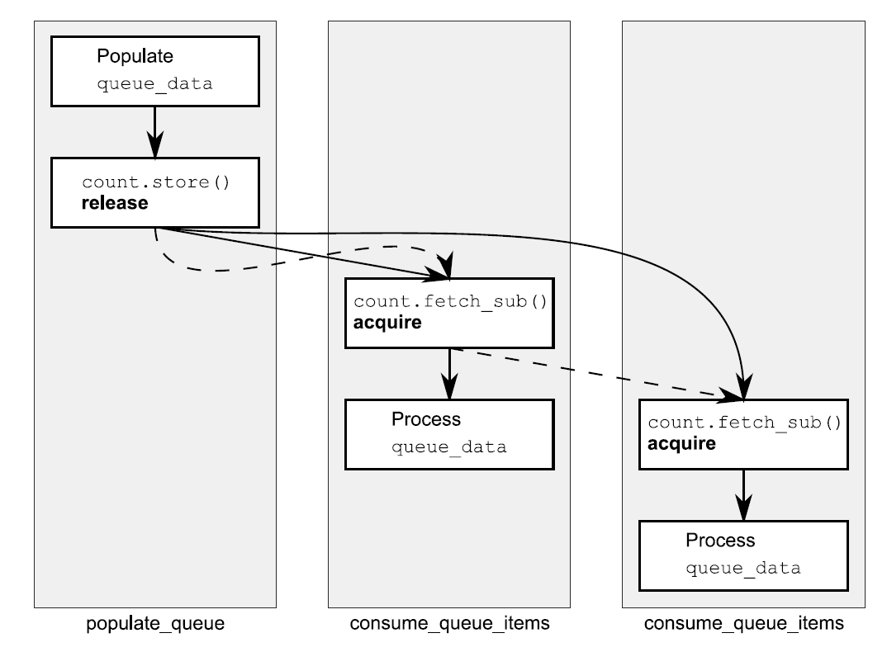

alias:: 释放序列, 释放队列

- ## 释放序列
  在原子对象 `M` 上执行[[释放操作]] `A` 后，**`M` 的修改**顺序中的最长连续子序列，其中包含以下内容：
	- #untilC++20 由执行 `A` 的**同一线程进行的写操作**。
	  logseq.order-list-type:: number
	- 由**任何线程**对 `M` 进行的[[原子读-修改-写操作]]。
	  logseq.order-list-type:: number
	  这个子序列被称为由 `A` 引领的^^释放序列^^。
- ## 释放序列和[[synchronizes-with 关系]]
	- 你可以在一个原子变量的存储操作和另一个线程对该原子变量的加载操作之间获得一个 synchronizes-with 关系，即使在存储和加载之间有一系列的[[读-修改-写操作]]，只要所有操作都适当地标记了。
	  id:: 65e490a6-f622-4015-b22d-5821320020eb
	- 如果[[存储操作]]被标记为`memory_order_release`、`memory_order_acq_rel`或`memory_order_seq_cst`，并且[[加载操作]]被标记为`memory_order_consume`、`memory_order_acquire`或`memory_order_seq_cst`，每个链中的操作 加载由前一个操作写入的值，那么操作链构成一个^^释放序列^^，且 *初始存储* [[synchronizes-with]] （对于`memory_order_acquire`或`memory_order_seq_cst`）或是[[dependency-ordered-before]]（对于`memory_order_consume`）*最终加载* 。**链中的任何[[原子读-修改-写操作]]可以具有任何内存排序（甚至`memory_order_relaxed`）**。
	- 为了看到这意味着什么以及为什么它很重要，考虑使用`atomic<int>`作为[[共享队列]]中项目数量的计数，如下面的清单所示。
	  ``` cpp
	  #include <atomic>
	  #include <thread>
	  std::vector<int> queue_data;
	  std::atomic<int> count;
	  void populate_queue()
	  {
	      unsigned const number_of_items=20;
	      queue_data.clear();
	      for(unsigned i=0;i<number_of_items;++i)
	      {
	        	queue_data.push_back(i);
	      }
	      count.store(number_of_items,std::memory_order_release); // 1 初始化存储
	  }
	  void consume_queue_items()
	  {
	      while(true)
	      {
	          int item_index;
	          if((item_index=count.fetch_sub(1,std::memory_order_acquire))<=0) // 2 一个“读-改-写”操作
	          {
	              wait_for_more_items(); // 3 等待更多元素
	              continue;
	          }
	      	process(queue_data[item_index-1]); // 4 安全读取queue_data
	      }
	  }
	  int main()
	  {
	      std::thread a(populate_queue);
	      std::thread b(consume_queue_items);
	      std::thread c(consume_queue_items);
	      a.join();
	      b.join();
	      c.join();
	  }
	  ```
	- 处理这种情况的一种方式可能是让生成数据的线程将 `items` 存储在[[共享缓冲区]]中，然后执行`count.store(number_of_items, memory_order_release)`来让其他线程知道数据可用。消费队列项目的线程可能会执行`count.fetch_sub(1, memory_order_acquire)`来从队列中索取一个 `item` ，然后再读取[[共享缓冲区]]。一旦 `count` 变为零，就没有更多的 `item` 了，线程必须等待。
	  id:: 65e4964c-dd07-493d-a182-1fa7a336da0a
	- 如果有一个消费者线程，这样做是可以的；[[fetch_sub()]]是具有[[memory_order_acquire]]语义的读取，而存储具有[[memory_order_release]]语义，因此存储 synchronizes with 加载，线程可以从缓冲区读取 `item` 。
	- 如果有两个线程读取，第二个`fetch_sub()`将会看到第一个写入的值，而不是 `store` 写入的值。如果没有关于[[释放序列]]的规则，这第二个线程将不会与第一个线程有 happens-before关系，除非第一个`fetch_sub()`也具有`memory_order_release`语义，否则从共享缓冲区读取是不安全的，这将在两个消费者线程之间引入不必要的同步。
	  如果没有释放序列规则或`fetch_sub`操作上没有`memory_order_release`，就没有任何要求使得对`queue_data`的存储对第二个消费者可见，你将会遇到数据竞争。值得庆幸的是，第一个`fetch_sub()`确实参与了释放序列，因此`store()`与第二个`fetch_sub()`同步。
	- 在两个消费者线程之间仍然没有 synchronizes-with 关系。这在下图中显示。图中的虚线显示了释放序列，实线显示了 happens-before 关系。
	  {:height 539, :width 722}
	- 链条中可以有任意数量的环节，但只要它们都是像`fetch_sub()`这样的读-修改-写操作，存储操作仍然会与每一个被标记为`memory_order_acquire`的操作同步。在这个例子中，所有的环节都是相同的，并且都是获取操作，**但它们可以是具有不同内存排序语义的不同操作的混合**。
	- 尽管大部分同步关系来自于应用于原子变量操作的内存排序语义，也可以通过使用[[fence]]来引入额外的[[排序约束]]。
	  id:: 65e4964c-c262-43ec-b963-260ec6a2efcc
- ## 总结
	- 释放操作之后的只要是[[原子读-修改-写操作]]，无论它们的内存排序语义是什么，只要其中至少有一个是[[获取操作]]的一种，则所有这些 RMW 操作间会自动同步，链成一个序列。