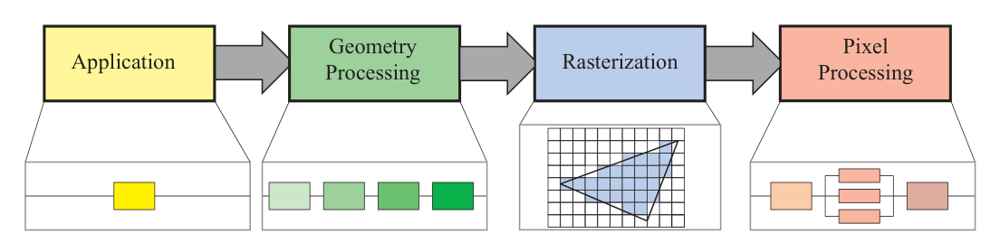

alias:: 渲染流水线, pipeline, graphics pipeline, render pipeline, render pipelines

- The [[pipeline]] *stages* execute in [[parallel]], with each *stage* **dependent upon** the result of the *previous stage*.
- The basic construction of the [[rendering pipeline]] consists of *four stages*: [[application]], [[geometry processing]], [[rasterization]], and [[pixel processing]].
  
-
	- https://en.wikipedia.org/wiki/File:3D-Pipeline.svg