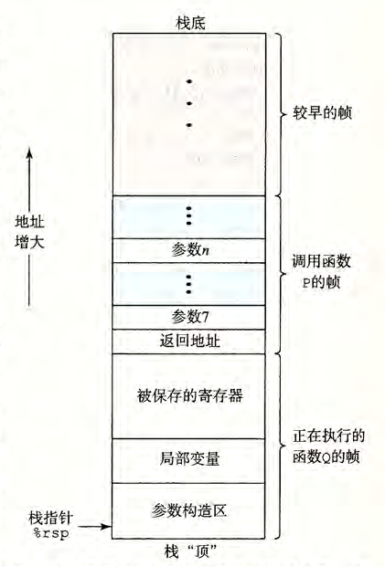

alias:: 运行时栈, Stack
id:: 65522487-423a-4569-9661-e4e74c18a276

- [[Stack]]是由于[[函数]]运行而**临时占用**的[[内存]]区域。
- [[C 程序]]使用 run-time stack 存放[[局部变量]]、[[函数参数]]和[[返回地址]]。
- 当 X86-64 过程 需要的存储空间超出[[寄存器]]能够存放的大小时，就会在 栈 上分配空间。这个部分称为[[过程]]的[[栈帧]]。
	- **大多数**过程的[[栈帧]]都是**定长**的，在过程的开始就分配好了。但是有些过程需要变长的帧。
	- 实际上，许多 函数 **甚至根本不需要**[[栈帧]]。当所有的局部变量都可以保存在寄存器中，而且该函数不会调用任何其他函数（有时称之为[[叶子过程]]，此时把过程调用看做树结构）时，就可以这样处理。
	- 
	  id:: 65572e30-eb7f-45cd-b346-42285071d651
-