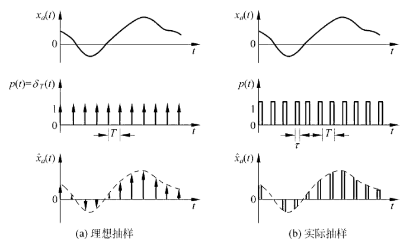
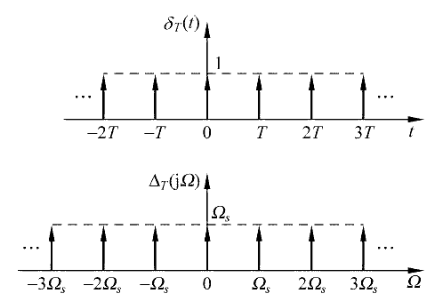
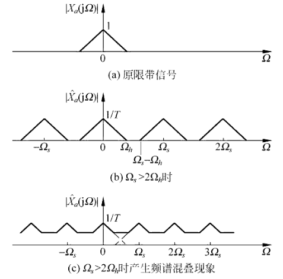

alias:: 采样, 抽样, 采样信号

- ## 理想采样信号
- 设  $x_{a}(t)$  为[[模拟信号]],  $\hat{x}_{a}(t)$  为[[理想采样信号]], 则有
  $$\hat{x}_{a}(t)=x_{a}(t) \cdot p(t)=x_{a}(t) \cdot \delta_{T}(t) \tag{1}$$
  其中, 采样信号 $p(t)$  就是周期性的[[单位冲激信号]]  $\delta_{T}(t)$
  $$\delta_{T}(t)=\sum_{n=-\infty}^{\infty} \delta(t-n T)\tag{2}$$
  因而有[[采样信号]]的公式：
  \begin{aligned}
  \hat{x}_{a}(t) & =x_{a}(t) \sum_{n=-\infty}^{\infty} \delta(t-n T)=\sum_{n=-\infty}^{\infty} x_{a}(t) \delta(t-n T) \\
  & =\sum_{n=-\infty}^{\infty} x_{a}(n T) \delta(t-n T)\tag{3}
  \end{aligned}
  其中  $T$  **为[[采样周期]]**,  $f_{s}=1 / T$  为[[采样频率]],  $\Omega_{s}=2 \pi f_{s}=2 \pi / T$  为[[采样角频率]]。
  
- 以下用 $\mathrm{FT}  [\cdot  ]$ 表示[[连续时间傅里叶变换]], 设
  $$\left.\begin{array}{l}
  X_{a}(\mathrm{j} \Omega)=\operatorname{FT}\left[x_{a}(t)\right] \\
  \Delta_{T}(\mathrm{j} \Omega)=\operatorname{FT}\left[\delta_{T}(t)\right] \\
  \hat{X}_{a}(\mathrm{j} \Omega)=\operatorname{FT}\left[\hat{x}_{a}(t)\right]
  \end{array}\right\}\tag{4}$$
  时域相乘, 则傅里叶变换域 (频域) 为[[卷积运算]], 因而对 $(3)$ 式两端取[[傅里叶变换]], 有
  $$\hat{X}_{a}(\mathrm{j} \Omega)=\frac{1}{2 \pi}\left[\Delta_{T}(\mathrm{j} \Omega) * X_{a}(\mathrm{j} \Omega)\right]\tag{5}$$
- 现在要求  $\Delta_{T}(\mathrm{j} \Omega)$ ,由于  $\delta_{T}(t)$  是[[周期函数]],可表示成[[傅里叶级数]], 即
  $$\delta_{T}(t)=\sum_{k=-\infty}^{\infty} A_{k} \mathrm{e}^{\mathrm{j} k \Omega_{s} t}\tag{6}$$
  其中级数的系数  $A_{k}$  可表示成（将 $(2)$ 式代入）
  \begin{aligned}
  A_{k} & =\frac{1}{T} \int_{-T / 2}^{T / 2} \delta_{T}(t) \mathrm{e}^{-\mathrm{j} k \Omega_{s} t} \mathrm{~d} t=\frac{1}{T} \int_{-T / 2}^{T / 2} \sum_{n=-\infty}^{\infty} \delta_{T}(t-n T) \mathrm{e}^{-\mathrm{j} k \Omega_{s} t} \mathrm{~d} t \\
  & =\frac{1}{T} \int_{-T / 2}^{T / 2} \delta(t) \mathrm{e}^{-\mathrm{j} k \Omega_{s} t} \mathrm{~d} t=\frac{1}{T} \tag{7}
  \end{aligned}
  这里已考虑到在  $|t|<T / 2$  区间内, 只有  $n=0$  时间一个冲激  $\delta(t)$ , 且利用了
  $$f(0)=\int_{-\infty}^{\infty} f(t) \delta(t) \mathrm{d} t \tag{8}$$
- 将 $(7)$ 式代入 $(6)$ 式可得
  $$\delta_{T}(t) = \frac{1}{T} \sum_{k=-\infty}^{\infty} \mathrm{e}^{\mathrm{j} k \Omega_{s} t} \tag{9}$$
  其中 采样角频率
  $$\Omega_{s}=2 \pi f_{s}=2 \pi / T\tag{10}$$
- 于是有
  \begin{aligned}
  \Delta_{T}(\mathrm{j} \Omega) & =\mathrm{FT}\left[\delta_{T}(t)\right]=\mathrm{FT}\left[\frac{1}{T} \sum_{k=-\infty}^{\infty} \mathrm{e}^{\mathrm{j} k \Omega_{s} t}\right]=\frac{1}{T} \sum_{k=-\infty}^{\infty} \mathrm{FT}\left[\mathrm{e}^{\mathrm{j} k \Omega_{s} t}\right] \\
  & =\frac{2 \pi}{T_{k}} \sum_{=-\infty}^{\infty} \delta\left(\Omega-k \Omega_{s}\right)=\Omega_{s} \sum_{k=-\infty}^{\infty} \delta\left(\Omega-k \Omega_{s}\right) \tag{11}
  \end{aligned}
  此式推导中利用了以下[公式](((65d9fdb4-a52e-4e85-93ea-ba084da0be18)))
  $$\mathrm{FT}\left[\mathrm{e}^{\mathrm{j} k \Omega_{s} t}\right]=2 \pi \delta\left(\Omega-k \Omega_{s}\right) \tag{12}$$
- 下图表示了  $\delta_{T}(t)$  与 $\Delta_{T}(\mathrm{j} \Omega)$  。
  
- 将 $(11)$ 式代入 $(5)$ 式可得
  \begin{aligned}
  \hat{X}_{a}(\mathrm{j} \Omega) & =\frac{1}{2 \pi}\left[\left(\frac{2 \pi}{T} \sum_{n=-\infty}^{\infty} \delta\left(\Omega-n \Omega_{s}\right)\right) * X_{a}(\mathrm{j} \Omega)\right] \\
  & =\frac{1}{T} \int_{-\infty}^{\infty} X_{a}(\mathrm{j} \theta) \cdot \sum_{n=-\infty}^{\infty} \delta\left(\Omega-n \Omega_{s}-\theta\right) \mathrm{d} \theta \\
  & =\frac{1}{T} \sum_{n=-\infty}^{\infty} \int_{-\infty}^{\infty} X_{a}(\mathrm{j} \theta) \delta\left(\Omega-n \Omega_{s}-\theta\right) \mathrm{d} \theta \\
  & =\frac{1}{T} \sum_{n=-\infty}^{\infty} X_{a}\left[\mathrm{j}\left(\Omega-n \Omega_{s}\right)\right] \\
  &=\frac{1}{T} \sum_{n=-\infty}^{\infty} X_{a}\left[\mathrm{j}\left(\Omega-n \frac{2 \pi}{T}\right)\right]\tag{13}
  \end{aligned}
- 由此看出, [[理想采样信号的频谱]]  $\hat{X}_{a}(\mathrm{j} \Omega)$  是被采样的模拟信号的频谱  $X_{a}(\mathrm{j} \Omega)$  的[[周期延拓]], 在[[模拟角频率]]  $\Omega$  轴上其延拓周期为
  $$\Omega_{s}=\frac{2 \pi}{T}=2 \pi f_{s}$$
  即频率轴  $f$  上以[[抽样频率]]  $f_{s}$  为周期而周期延拓, 见下图。
  
  但是要注意:
	- $X_{a}(\mathrm{j} \Omega  )$ 是复数, 故周期延拓时, [[幅度]]和[[相角]] (或实部与虚部) 都要作[[周期延拓]], 上图只画了幅度的延拓关系。
	  logseq.order-list-type:: number
	- 周期延拓后频谱函数的幅度是  $\frac{1}{T}=\frac{\Omega_{s}}{2 \pi}=f_{s}$  的加权, 即[[幅度]]随[[抽样频率]]  $f_{s}$  而改变,因而在实际应用中 ([[信号重建]]中) 要消除这一影响。
	  logseq.order-list-type:: number
- ## 时域采样定理
	- 从 $(13)$ 式看出, 如果模拟信号是[[带限信号]] (频带有限信号), 信号的 *最高频率分量* 为  $f_{h}$ , 设[[采样频率]]为  $f_{s}$ , 由于采样后信号的[[频谱]]等于[[模拟信号频谱]]按采样频率  $f_{s}$  作[[周期延拓]], 
	  id:: 65db5563-2f63-490b-b79b-b55b68f0d670
	  由上图可知, 只有当
	  $$f_{h} \leqslant \frac{f_{s}}{2}$$
	  时, 周期延拓的频谱分量才不会产生交叠, 当信号最高频率分量  $f_{h}$  超过  $f_{s} / 2$  时, 产生周期延拓频谱分量的交叠, 就如同以  $f_{s} / 2$  作为镜子, 把频谱折叠回来, 折叠后造成[[延拓频谱]]的[[低频]]分量与原信号谱的[[高频]]分量相混叠, 而且是以复数方式相混叠, 形成[[混叠失真]]。因而称 采样频率之半   $f_{s} / 2$  为[[折叠频率]]。即
	  $$\frac{f_{s}}{2}=\frac{1}{2 T} \text { 或 } \quad \frac{\Omega_{s}}{2}=\frac{\pi}{T}$$
	- ### [[奈奎斯特采样定理]]
		- 若  $x_{a}(t)$  是频带宽度有限的信号 (称[[带限信号]]), 要想抽样后的信号能够不[[失真]]地还原出原信号, 则必须[[采样频率]]  $f_{s}$  大于或等于信号[[最高频率]]分量  $f_{h}$  的两倍, 
		  或说信号的[[最高频率]]不得大于[[折叠频率]]  $f_{s} / 2$ , 即
		  $$f_{s} \geqslant 2 f_{h}$$
			- >$x_{a}(t)$  也可能不是带限信号, 因此为了避免频率响应的[[混叠]], 一般都在采样器前加入一个保护性的[[前置低通预滤波器]], 称为[[防混叠滤波器]], 其截止频率为  $f_{s} / 2$ , 以便滤除  $x_{a}(t)$  中高于  $f_{s} / 2$  的频率分量。
			- 有时, 也将满足[[采样定理]]的[[采样频率]]称为[[奈奎斯特采样速率]], 将  $f_{s} / 2$  也称为[[奈奎斯特频率]]。
- ## 数字域频率与模拟域频率的关系
	- 数字频率  $\omega$  与模拟角频率  $\Omega$ , 模拟频率  $f$  的关系为
	  $$\omega=\Omega T=\frac{\Omega}{f_{s}}=\frac{2 \pi f}{f_{s}}=2 \pi f T$$
	  [前面](((65dee8ce-44b5-4191-a058-04009c03bff7)))已说过, 数字频率  $\omega$  是模拟角频率对采样频率  $f_{s}$  的归一化频率, 因而采样频率  $f_{s}$  所对应的[[数字域采样频率]]为
	  $$\omega_{s}=\Omega_{s} T=2 \pi f_{s} / f_{s}=2 \pi$$
		- [[数字域采样频率]]  $\omega_{s}$  就等于  $2 \pi$ , 也就是  $\hat{X}_{a}(\mathrm{j} \omega / T)=\left.\hat{X}_{a}(\mathrm{j} \Omega)\right|_{\Omega=\frac{\omega}{T}}$  **的[[延拓周期]]为**  $2 \pi$  。
		  logseq.order-list-type:: number
		- [[折叠频率]]  $f_{s} / 2$  所对应的[[数字域采样频率]]为
		  logseq.order-list-type:: number
		  $$\frac{\omega_{s}}{2}=\pi$$
	- 因而按照[[采样定理]], [[信号最高频率]]  $f_{h}$  要满足  $f_{h} \leqslant f_{s} / 2$ , 故[[数字域最高频率]]应满足
	  $$\omega_{h}=2 \pi f_{h} / f_{s}=\Omega_{h} / f_{s}<\frac{\omega_{s}}{2}=\pi$$
	  所以信号的低频分量在  $\omega=0$  附近, 信号的高频率分量在  $\omega=\pi$  附近, 而信号的最高频率分量在  $\omega=\pi$  处。
	- |名称|符号|公式|单位|
	  |--|--|--|--|
	  |[[模拟频率]]|$f$|$f=\frac{1}{T}$|$\mathrm{Hz}$|
	  |[[模拟角频率]]|$\Omega$|$\Omega=2\pi f$|$\mathrm{rad/s}$|
	  |[[采样频率]]|$f_s$|$f_s=\frac{1}{T_s}$|$\mathrm{Hz}$|
	  |[[采样角频率]]|$\Omega_s$|$\Omega_s=2\pi f_s$|$\mathrm{rad/s}$|
	  |[[数字频率]]|$\omega$|$\omega=2\pi\frac{f}{f_s}=2 \pi f T_{\mathrm{s}}=\Omega T_{\mathrm{s}}=\frac{\Omega} {f_{\mathrm{s}}}$|$\mathrm{rad/s}$|
	  |[[数字采样频率]]|$\omega_s$|$\omega_{s}=\Omega_{s} T=2 \pi f_{s} / f_{s}=2 \pi$|$\mathrm{rad/s}$|