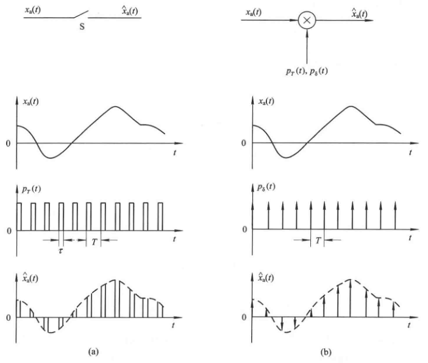

alias:: 采样, 抽样

- 对具有[[连续定义域]]进行[[抽样]]可获得[[离散信号]].
- 对[[模拟信号]]进行 *采样* 可以看做一个模拟信号通过一个电子开关  $\mathrm{S}$  。设电子开关每隔周期  $T$  合上一次, 每次合上的时间为  $\tau(\tau \ll T)$ , 在电子开关输出端得到其[[采样信号]]  $\hat{x}_{\mathrm{a}}(t)$  。
  该电子开关的作用等效成一宽度为  $\tau$ , 周期为  $T$  的[[矩形脉冲串]]  $p_{T}(t)$ , 采样信号  $\hat{x}_{\mathrm{n}}(t)$  就是  $x_{\mathrm{a}}(t)$  与  $p_{T}(t)$  相乘的结果。采样过程如图中 $(a)$ 所示。
  
- 如果让电子开关合上的时间 $\tau \rightarrow 0$ , 则形成[[理想采样]], 此时上面的脉冲串变成[[单位冲激串]], 用  $p_{\delta}(t)$  表示。  
  $p_{8}(t)$  中每个 单位冲激处 在 采样点 上, 强度为 $1$ , 理想采样则是  $x_{a}(t)$  与  $p_{\delta}(t)$  相乘的结果, 采样过程如图 $(b)$ 所示。用公式表示为
  $$
  p_{\delta}(t)=\sum_{n=-\infty}^{\infty} \delta(t-n T) \tag{1}$$
  $$\hat{x}_{\mathrm{a}}(t)=x_{\mathrm{n}}(t) p_{\mathrm{\delta}}(t)=\sum_{n=-\infty}^{\infty} x_{\mathrm{n}}(t) \delta(t-n T) 
  $$
  上式中  $\delta(t)$  是[[单位冲激信号]], 在上式中只有当  $t=n T$  时, 才可能有非零值, 因此写成下式:
  $$\hat{x}_{\mathrm{a}}(t)=\sum_{n=-\infty}^{\infty} x_{\mathrm{a}}(n T) \delta(t-n T) \tag{2}$$
- 下面研究理想采样前后信号[[频谱]]的变化, 从而找出为了使采样信号能不失真地恢复原模拟信号, 采样速率  $F_{\mathrm{s}}\left(F_{\mathrm{s}}=T^{-1}\right)$  与模拟信号最高频率  $f_{\mathrm{c}}$  之间的关系。
- 我们知道在[[傅里叶变换]]中, 两信号在[[时域]]乘积的傅里叶变换等于两个信号分别的傅里叶变换的[[卷积]], 按照 $(2)$ 式, 推导如下:
  设
  \begin{array}{l}
  X_{\mathrm{a}}(\mathrm{j} \Omega)=\operatorname{FT}\left[x_{\mathrm{a}}(t)\right] \\
  \hat{X}_{\mathrm{a}}(\mathrm{j} \Omega)=\operatorname{FT}\left[\hat{x}_{\mathrm{n}}(t)\right] \\
  P_{\mathrm{\delta}}(\mathrm{j} \Omega)=\operatorname{FT}\left[p_{\delta}(t)\right]
  \end{array}
- 对 $(1)$ 式进行傅里叶变换, 得到 
  $$P_{\delta}(\mathrm{j} \Omega)=\sum_{k=-\infty}^{\infty} 2 \pi a_{k} \delta\left(\Omega-k \Omega_{\mathrm{s}}\right)$$
  式中,  $\Omega_{\mathrm{s}}=2 \pi / T$ , 称为采样角频率, 单位是  $\mathrm{rad} / \mathrm{s}$  。
  $$a_{k}=\frac{1}{T} \int_{-T / 2}^{T / 2} \delta(t) \mathrm{e}^{-\mathrm{j} k \Omega_{\mathrm{s}} t} \mathrm{~d} t=\frac{1}{T}$$
  因此
  \begin{array}{c}
  P_{\delta}(\mathrm{j} \Omega)=\frac{2 \pi}{T} \sum_{k=-\infty}^{\infty} \delta\left(\Omega-k \Omega_{\mathrm{s}}\right) \\
  \hat{X}_{\mathrm{a}}(\mathrm{j} \Omega)=\frac{1}{2 \pi} X_{\mathrm{a}}(\mathrm{j} \Omega) * P_{\mathrm{\delta}}(\mathrm{j} \Omega) \\
  =\frac{1}{2 \pi} \cdot \frac{2 \pi}{T} \int_{-\infty}^{\infty} X_{\mathrm{a}}(\mathrm{j} \theta) \sum_{k=-\infty}^{\infty} \delta\left(\Omega-k \Omega_{\mathrm{s}}-\theta\right) \mathrm{d} \theta \\
  =\frac{1}{T} \sum_{k=-\infty}^{\infty} \int_{-\infty}^{\infty} X_{\mathrm{n}}(\mathrm{j} \theta) \delta\left(\Omega-k \Omega_{\mathrm{s}}-\theta\right) \mathrm{d} \theta \\
  =\frac{1}{T} \sum_{k=-\infty}^{\infty} X_{\mathrm{a}}\left(\mathrm{j} \Omega-\mathrm{j} k \Omega_{\mathrm{s}}\right)
  \end{array}
  上式表明理想采样信号的频谱是原模拟信号的频谱沿频率轴, 每间隔采样角频率  \Omega \mathrm{s}  重复出现一次, 并叠加形成的周期函数。或者说, 理想采样信号的频谱是原模拟信号的频谱以  \Omega , 为周期, 进行周期性延拓而成的。