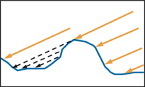
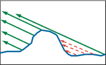
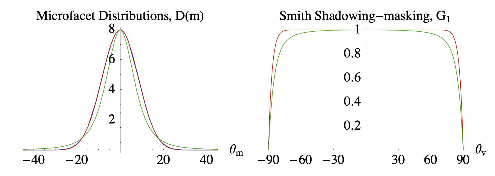

alias:: geometry term

- 引入 [[geometry term]]是考虑了[[microfacet]]的[[self-occlusion]]。
- [[light direction]]的[[自遮挡]]叫做[[Shadowing]]； 
  [[view direction]]的[[自遮挡]]叫作[[masking]]。
   
- 没有 geometry term 的话，方向在接近[[grazing angle]]的范围会**过亮**。
- [[Smith shadowing-masking term]]是一个常用的 shadowing-masking term，它解耦了[[shadowing]]和[[masking]]：
  $$
  G(\bold{i},\bold{o},\bold{m})\approx G_1(\bold{i},\bold{m})G_1(\bold{o},\bold{m})
  $$
  
- [[Schlick-GGX]]是[[GGX]]与Schlick-Beckmann近似的结合体
-