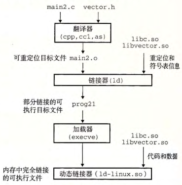

alias:: 共享库

- # [[静态库]]的缺点
  id:: 65636720-f9e9-46a4-90ec-00bccc6469dc
	- 静态库需要定期 维护 和 更新 。如果应用程序员想要使用一个库的最新版本，他们必须以某种方式了解到该库的更新情况，然后显式地将他们的程序与更新了的库**重新链接**。
	  logseq.order-list-type:: number
	- 几乎每个 C 程序都使用标准 I/O 函数，比如 `printf` 和 `scanf` 。在运行时，这些函数的代码会被复制到每个运行[[进程]]的[[文本段]]中。在一个运行上百个进程的典型系统上，这将是对稀缺的内存系统资源的极大浪费。
	  logseq.order-list-type:: number
	  #+BEGIN_TIP
	  内存的一个有趣属性就是不论系统的内存有多大，它总是一种稀缺资源。磁盘空间和厨房的垃圾桶同样有这种属性。
	  #+END_TIP
- # 共享库
	- [[共享库]]是致力于解决[静态库的缺陷](((65636720-f9e9-46a4-90ec-00bccc6469dc)))。共享库是一个[[目标模块]]，在运行或加载时，可以加载到**任意的**[[内存地址]]，并和一个在内存中的程序链接起来 。这个过程称为[[动态链接]], 是由一个叫做[[动态链接器]]的程序来执行的 。
	- [[共享库]]也称为[[共享目标]], 在[[Linux]]系统中通常用[[.so]]后缀来表示。[[微软]]的操作系统大量地使用了共享库，它们称为[[DLL]]。
	- 共享库是以两种不同的方式来”共享“的。
		- 首先，在任何给定的[[文件系统]]中，对于一个 共享库 只有一个[[.so]]文件。所有引用该库的[[可执行目标文件]]共享这个 .so 文件中的 代码 和 数据 ，而不是像[[静态库]]的内容那样被复制和嵌入到引用它们的[[可执行文件]]中 。
		- 其次，在内存中，一个 共享库 的[[.text 节]]的一个 *副本* 可以被不同的正在运行的[[进程]]共享。（[[虚拟内存]]中继续讨论#TODO）
- # 加载和链接共享库
	- 基本的思路是当创建[[可执行文件]]时，静态执行一些链接，然后在**程序加载时**，动态完成链接过程。
	  认识到这一点是很重要的：此时，没有任何[[共享库]]的 代码 和 数据 节真的被复制到 可执行文件 中。
	  反之，链接器复制了一些[[重定位]]和[[符号表]]信息，它们使得运行时可以解析对 动态库 中代码和数据的引用。
	- 当[[加载器]]**加载[[部分链接的可执行文件]]**后，加载器 注意到该文件包含一个[[.interp 节]]，这一节包含[[动态链接器]]的 *路径名* ，[[动态链接器]]本身就是一个[[共享目标]]（如在[[Linux]]系统上的[[ld-linux.so]]), 加载器不会像它通常所做地那样将控制传递给应用，而是加载和运行这个[[动态链接器]]。然后，动态链接器通过执行下面的[[重定位]]完成链接任务：
		- [[重定位]][[共享目标]]的[[文本]]和[[数据]]到另一个[[内存段]]。
		- [[重定位]][[可执行文件]]中所有对由[[动态库]]定义的符号的引用。
	- 最后，[[动态链接器]]将 控制 传递给 应用程序 。从这个时刻开始，[[共享库]]的位置就**固定了**，并且在程序执行的过程中都不会改变。
- # [[应用程序]]加载时加载和链接共享库
	- 基本的思路是当创建[[可执行文件]]时，静态执行一些链接，然后在**程序加载时**，动态完成链接过程。
	  认识到这一点是很重要的：此时，没有任何[[共享库]]的 代码 和 数据 节真的被复制到 可执行文件 中。
	  反之，链接器复制了一些[[重定位]]和[[符号表]]信息，它们使得运行时可以解析对 动态库 中代码和数据的引用。
	- 当[[加载器]]**加载[[部分链接的可执行文件]]**后，加载器 注意到该文件包含一个[[.interp 节]]，这一节包含[[动态链接器]]的 *路径名* ，[[动态链接器]]本身就是一个[[共享目标]]（如在[[Linux]]系统上的[[ld-linux.so]]), 加载器不会像它通常所做地那样将控制传递给应用，而是加载和运行这个[[动态链接器]]。然后，动态链接器通过执行下面的[[重定位]]完成链接任务：
		- [[重定位]][[共享目标]]的[[文本]]和[[数据]]到另一个[[内存段]]。
		- [[重定位]][[可执行文件]]中所有对由[[动态库]]定义的符号的引用。
	- 最后，[[动态链接器]]将 控制 传递给 应用程序 。从这个时刻开始，[[共享库]]的位置就**固定了**，并且在程序执行的过程中都不会改变。
	- #+BEGIN_PINNED
	  为了构造图中示例向量例程的共享库 `libvector.so`,
	  我们调用[[编译器驱动程序]]，给编译器和链接器如下特殊指令：
	  ``` shell
	  linux> gcc -shared -fpie -o libveetor.so addvee.e multvee.e
	  ``` 
	  `-fpic` 选项指示[[编译器]]生成与[[位置无关代码]]。
	  `-shared` 选项指示[[链接器]]创建一个[[共享目标文件]]。一旦创建了这个库，随后就要将它链
	  接到示例程序`main2`中：
	  ``` shell
	  linux> gcc -o prog21 main2.e ./libveetor.so
	  ```
	  这样就创建了一个[[可执行目标文件]] `prog21`, 而此文件的形式使得它在**运行时**可以和 `libvector.so` 链接。
	  
	  #+END_PINNED
- # [[应用程序]]运行时加载和链接共享库
	- 前面我们巳经讨论了在 应用程序**被加载后执行前**时，动态链接器加载和链接共享库的情景。
	  然而，应用程序还可能在它**运行时**要求[[动态链接器]]加载和链接某个 共享库。
	- 下面是一些例子：
		- #+BEGIN_PINNED
		  微软 Windows 应用的开发者常常利用共享库来分发软件更新。他们生成 一个共享库的新版本，然后用户可以下载，并用它替代当前的版本。下 一 次他们运行应用程序时，应用将自动链接和加载新的共享库。
		  #+END_PINNED
		- #+BEGIN_PINNED
		  构建高性能 Web 服务器。许多 Web 服务器生成动态内容，比如个性化的 Web 页面、账户余额和广告标语。早期的 Web 服务器通过使用 fork 和 execve 创建一个子进程，并在该子进程的上下文中运行 CGI 程序来生成动态内容。然而，现代高性能的 Web 服务器可以使用基于动态链接的更有效和完善的方法来生成动态内容。
		  其思路是将每个生成动态内容的函数打包在共享库中。当一个来自Web 浏览器的请求到达时，服务器动态地加载和链接适当的函数，然后直接调用它，而不是使用 fork 和 execve 在子进程的上下文中运行函数。函数会**一直缓存在服务器的地址空间中**，所以只要一个简单的函数调用的开销就可以处理**随后的请求**了。这对一个繁忙的网站来说是有很大影响的。更进一步地说，在运行时**无需停止服务器**，就可以更新已存在的函数，以及添加新的函数。
		  #+END_PINNED
		- #+BEGIN_PINNED
		  [[Linux]]系统为[[动态链接器]]提供了一个简单的接口，允许应用程序在**运行时**加载和链接。
		  ```c
		  #include <dlfcn.h>
		  /*返回：若 成功 则为指向句柄的指针，若出错则为 NULL 。 */
		  void *dlopen(const char *filename, int flag);
		  ame, int flag);
		  ``` 
		  `dlopen` 函数加载和链接共享库 `filename` 。
		  用已用带 `RTLD_GLOBAL` 选项打开了的库解析 `filename` 中的外部符号。
		  如果当前可执行文件是带 `-rdynamic` 选项编译的，那么对符号解析而言，它的全局符号也是可用的。
		  flag 参数必须要么包括 `RTLD_NOW`, 该标志告诉链接器立即解析对外部符号的引用，要么包括 `RTLD_LAZY` 标志，该标志指示链接器**推迟符号解析 直到 执行来自库中的代码**。
		  这两个值中的任意一个都可以和`RTLD_GLOBAL`标志取 或 。
		  ((65639fe1-09eb-4721-b868-cf4f0ee36a86))
		  #+END_PINNED
		- #+BEGIN_PINNED
		  [[Java]]定义了一个标准调用规则，叫做 Java本地接口(Java Native Interface, JNI),它允许 Java程序调用“本地的"C和 C++函数。 JNI的基本思想是将本地 C函数（如 foo)编译到一个共享库中（如 foo.so)。当一个正在运行的 Java程序试图调用函数 foo时， Java解释器利用 dlopen接口（或者与其类似的接口）动态链接和加载 foo.so,然后再调用 foo。
		  #+END_PINNED
			-
	-
-