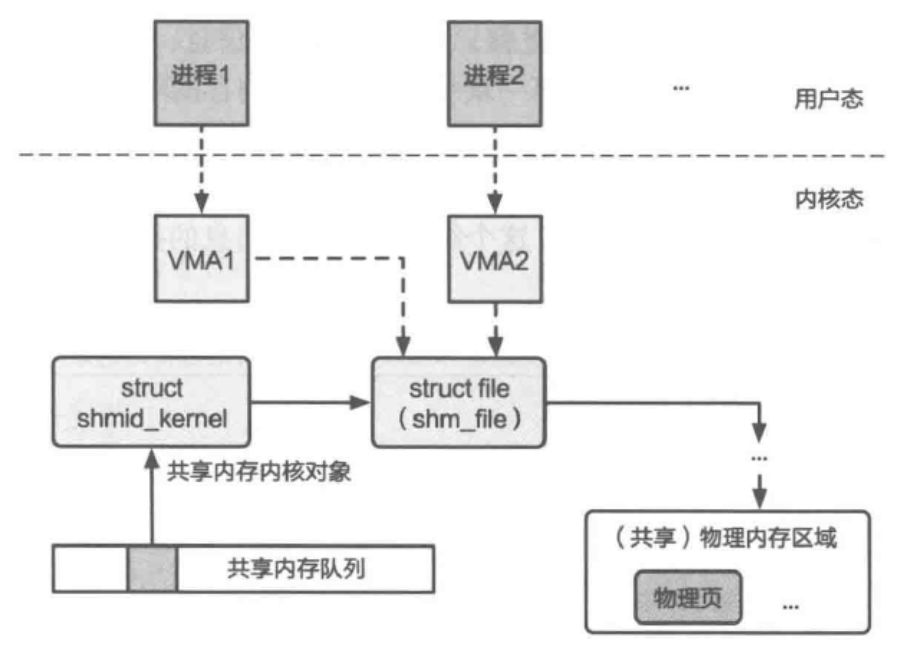

alias:: 共享内存, 共享内存区域

- #+BEGIN_TIP
  为什么需要共享内存？
  使用共享内存的很重要的一个原因是性能。其他进程间通信机制，包括消息队列、管道等，都依赖内核提供完整的缓冲数据、接收消息、发送消息等一系列进程间通信接口。虽然这些完善的抽象方便了用户进程的使用，但其中涉及的数据拷贝和控制流转移等处理逻辑影响了这些抽象的性能。共享内存的思路其实是内核为需要通信的进程建立共享区域。一旦共享区域建立完成，内核基本上不需要参与进程间通信。通信的多方间既可以直接使用共享区域上的数据，也可以将共享区域当成消息缓冲区。
  #+END_TIP
- ^^共享内存^^允许两个或多个[[进程]]在其所在[[虚拟地址空间]]中映射相同的[[物理页]]，从而进行[通信]([[进程间通信]])。
- ## [[System V 共享内存机制]]
	- 本节以 Linux 中的设计为例，来介绍一些细节的设计和实现。
	- ### IPC key 和 共享内存结构体`shmid_kernel`
	  首先，内核会为全局所有的 共享内存 维护一个全局的队列结构，也即图中的[[共享内存队列]]。这个队列的每一项([[shmid_kernel]])都是和一个[[IPC key]]绑定的，这和其他[[System V]]的 IPC 机制 类似。
	  进程可以通过同样的 key 来找到并使用同一段共享内存区域。
	  虽然这样的key是全局唯一的，但是能否使用这段共享内存，是通过[[System V 权限检查机制]]来判断的。只要进程有对应的权限，就能够通过内核接口([[`shmat`]])将一段共享内存的区域映射到自己的虚拟地址空间中。
	- 每段共享内存是由结构^^`shmid_kernel`^^封装的，其包含一个 `file` 类型的结构体。这是因为在 Linux 的系统设计中，将共享内存的机制封装在了一个特殊的文件系统上。这个 `fi1e` 类型的结构体通过文件系统最终指向一段^^共享内存页的集合^^，这些共享内存页就是这段共享内存对应的物理内存。
	- 存在这么多层的封装，除了便于利用 Linux 内核里的现有其他组件的功能（如文件系统）外，也是为了支持共享内存的[[换页]](Swap)和[[按需页面调度]](Demand Paging)。
	- 
	- ### 用户进程 VMA 结构体
	  如图所示，进程 1 和 进程 2 分别对同一个共享内存建立了映射（[[`shmat`]]）之后，内核会为它们分配两个[[VMA]]（Virtual Memory Area）结构体，让它们都指向 `file` 。
	  这里的 VMA 会描述进程的一段虚拟地址空间的映射。建立了这两个 VMA ，内核就能够从 用户进程的虚拟地址 找到对应的 VMA ，从而知道这是一个共享内存的区间。
		- > 虽然图中只有两个进程，但是该机制天然地支持任意数量的进程来共享同一个共享内存区域，只要为它们分配指向 `file` 结构的 VMA 即可。
	- 当进程不再希望共享虚拟内存时，可以将共享的内存从虚拟内存中取消映射（[[`shmdt`]]接口）。这里取消映射的操作（`detach`操作）只影响当前进程的映射，其他仍在使用共享内存的进程是不受影响的。
	  id:: 65f06684-7316-4ace-8240-262dc000c177
- ### 序列化与反序列化
  为了保证通过共享内存传递的[[消息]]在通信的双方有相同的语义，一些 [[IPC]] 设计通常会引入[[序列化]]和[[反序列化]]的操作。
  进程间通信过程中，序列化能够将复杂的结构转化为便于传输的格式，如将链表中的指针地址转化为一个相对的偏移量。
  反序列化是序列化的逆过程，该过程会将传输的格式转化为进程实际使用的结构，如接
  收者进程能够利用接收到的链表数据和其中的偏移量，重新构造对应的元素之间的
  指针。
- ## 基于共享内存的进程间通信
	- ### 生产者－消费者问题
		- 存在两个进程，一个是生产者进程，负责产生新的信息，一个是消费者进程，负责消耗信息。生产者和消费者需要共享一块缓冲区（共享内存的用户态抽象）。
		- 代码片段给出了该问题中基于共享内存通信的数据结构。其中，buffer对应的是共享缓冲区。这里我们给定了缓冲区的大小，即BUFFER_SIZE个元素。缓冲区中的每个元素由一个结构体item表示，这个结构体对应着消息的抽象。
		- ``` c
		  /** 共享数据结构 */
		  #define BUFFER SIZE 10
		  typedef struct
		  {
		  	struct msg_header header;
		    	char data[0];
		  } item;
		  
		  item buffer [BUFFER_SIZE];
		  volatile int buffer_write_cnt 0; // volatile 表示系统总是重新从它所在的内存读取数据
		  volatile int buffer_read_cnt 0;
		  volatile int empty_slot = BUFFER_SIZE;
		  volatile int filled_slot = 0;
		  
		  /** 生产者 */
		  // 生成新的消息
		  int send(item msg)
		  {
		  	while (empty_slot == 0); // 没有空闲缓冲区
		    	empty_slot--;
		  	buffer[buffer_write_cnt]= msg; // msg的类型是 item
		  	buffer_write_cnt = (buffer_write_cnt + 1) % BUFFER_SIZE;
		    	filled_slot++;
		    	...
		  }
		  
		  /** 消费者 */
		  item recv(void)
		  {
		  	,,,// msg的类型是item
		    	while (filled_slot == 0)；∥没有未处理消息
		  	filled_slot--;
		  	// 将一个消息从缓冲区中移出
		  	msg = buffer[buffer_read_cnt];
		  	buffer_read_cnt = (buffer_read_cnt 1) % BUFFER_SIZE;
		    	empty_slot++;
		    	return msg;
		  }
		  ```
		- 有了共享的缓冲区buffer之后，生产者的任务就是在缓冲区上产生新的数据。在代码片段中，`empty_slot` 和 `filled_slot` 分别表示当前在缓冲区上空置的和包含消息的区域的个数。而`buffer_write_cnt` 则表示生产者放置新消息的位置。生产者会首先判断当前是否存在空闲的缓存区域，如果有，则写入一个消息，并且对应地修改empty_slot、filled_slot和buffer_write_cnt。注意，这里只考虑单个生产者和单个消费者的情况，先**不考虑多线程等情况**。
		  id:: 65f06b7d-090f-457f-81f5-9243c3da4424
		- 消费者的任务是从缓冲区中获取数据。类似地，在代码片段中，通过检查filled_slot的值，消费者可以判断是否有未处理的消息。对于消费者而言，使用另一个变量buffer_read_cnt来表示下一个可以读取消息的位置。recv函数会从缓冲区中取出下一个未处理的消息，并对应地修改filled_slot、empty_slot和buffer_read_cnt的值。