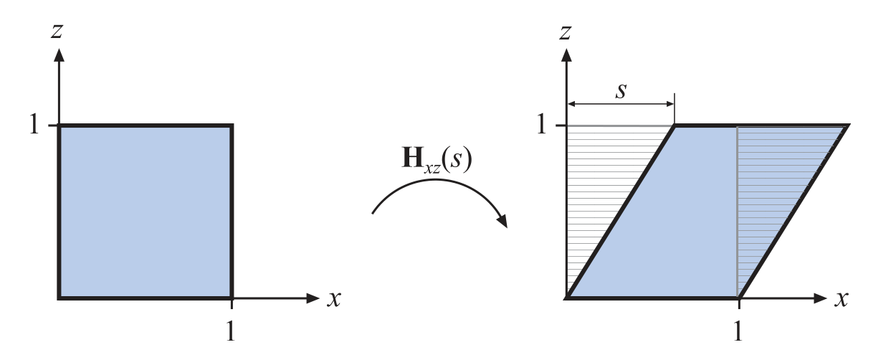

alias:: shear, shear matrix, shear matrices, shear transform, 错切, 错切矩阵, 错切变换

- [[错切矩阵]] $\bold{H}_{xz}(s)$ 
  $$
  \left(\begin{array}{cccc}1&0&s&0\\0&1&0&0\\0&0&1&0\\0&0&0&1\end{array}\right)
  $$
  应用到一个点$\bold p(x, y, z)$ 的效果是，$x$ 和 $y$ 分量都没有被改变，$x$ 分量变成
  $x+sz$，即变成 $(x+sz,y,z)$ 。
  应到到 *单位正方体* 上的效果如下图：
  
  因为[[错切变换]]的[[行列式]] $\vert\bold H\vert = 1$, 所以是保持[[体积]]不变的变换。
- 另一种[[错切矩阵]]是像:
  $$
  \bold{H}_{xy}^{\prime}(s,t)=
  \left(\begin{array}{cccc}1&0&s&0\\0&1&t&0\\0&0&1&0\\0&0&0&1\end{array}\right)
  $$
  和之前的变换的关系为：
  $$
  \mathbf{H}_{ij}^{\prime}(s,t)=\mathbf{H}_{ik}(s)\mathbf{H}_{jk}(t)
  $$
-