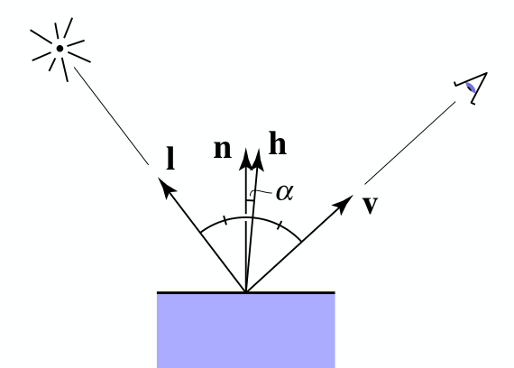

alias:: 高光反射, specular, specularly reflected light, 高光, specular term

- In [[Phong reflection model]]:
  $$
  L_s=k_{s}\left(I/r^{2}\right)\max(0,\bold{v}\cdot\bold{r})^{p}
  $$
  where $L_s$ is the [[specularly reflected light]],
  $k_s$ is the [[specular coefficint]]
  $p$ represents the [[gloss]], it's a *cosine power*, increasing $p$ narrows the [[relection lobe]],
  $\bold{r}$ is the [[reflection direction]] .
- For [[Blinn-Phong highlighting]] :
  $$L_s=k_{s}\left(I/r^{2}\right)\max(0,\bold{n}\cdot\bold{h})^{p}$$
  $$\bold{h}=\operatorname{bisector}(\bold{v},\bold{l})=\frac{\bold{v}+\bold{l}}{|\bold{v}+\bold{l}|}$$
  where $h$ is the [[half vector]] of $\bold{v}$ and $\bold{l}$
  
- id:: 64f2a169-3493-4de7-addd-635935bf7bfe
  > $\bold{n}$ 和 $\bold{h}$ 间夹角是$\bold{v}$ 和 $\bold{r}$ 间夹角的一半,
   所以 $\bold{n}\cdot\bold{h}>\bold{v}\cdot\bold{r}$
-